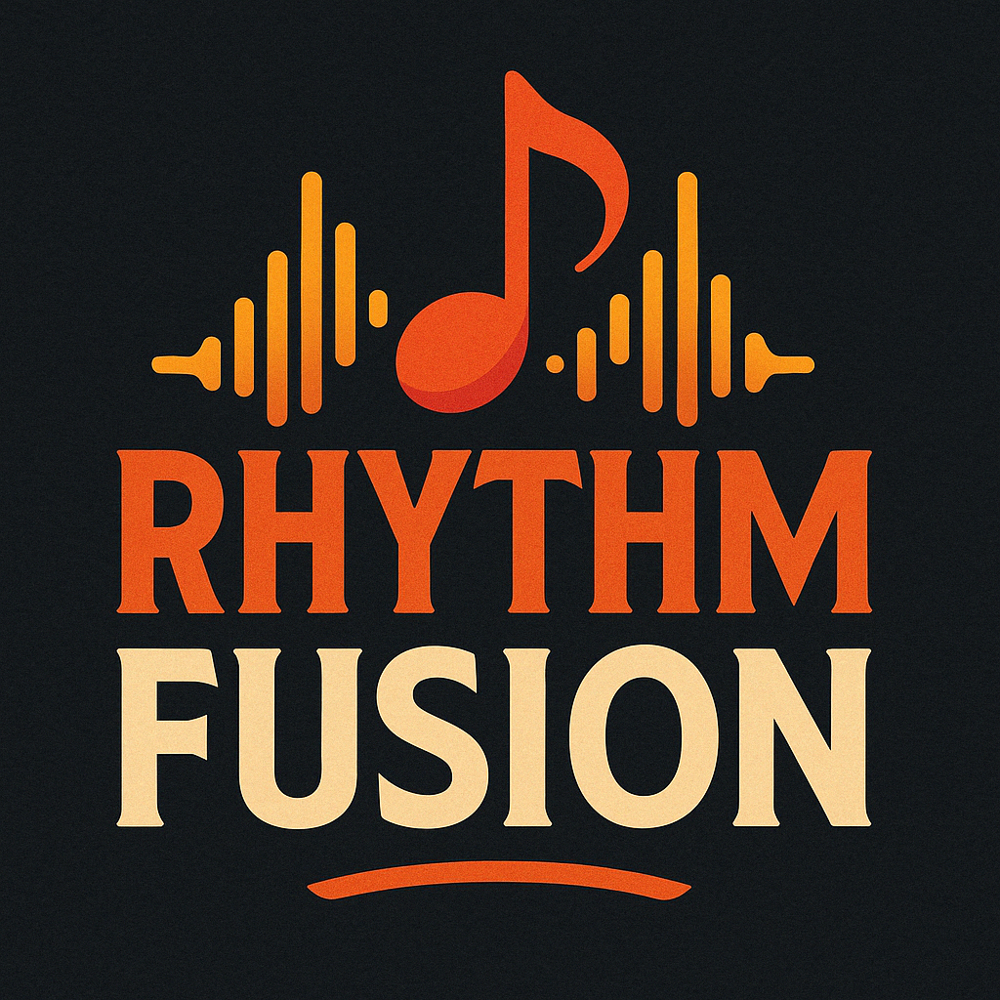

# RhythmFusion Music Recommendation System

[中文文档](README_zh.md)

<div align="center">
  
  <h3>Intelligent Music Discovery & Recommendation Platform</h3>
  <p>Built with Vue 3 + TypeScript + Django + AI Recommendation Engine</p>
</div>

## Description

RhythmFusion is a modern music recommendation platform that provides personalized music discovery through an intelligent hybrid recommendation system. The platform combines collaborative filtering algorithms with content-based analysis to create a tailored music experience for each user.

Built with a Vue.js frontend and Django backend, RhythmFusion offers a responsive, intuitive interface with powerful recommendation capabilities, making it easy for users to discover new music aligned with their unique preferences.

## Core Features

### User Experience

- **Personalized Recommendations**: Intelligent music suggestions based on listening history and preferences
- **Interactive Playlist Management**: Create, edit, and share custom music collections
- **Advanced Music Player**: Smooth playback with controls for volume, shuffle, repeat
- **Genre Exploration**: Discover music across multiple genres with curated recommendations
- **Responsive Design**: Full functionality across desktop and mobile devices

### Technical Highlights

- **Hybrid Recommendation Engine**: Combining collaborative filtering and content-based analysis
- **Real-time State Management**: Reactive interface with Pinia state management
- **Secure Authentication**: JWT-based secure user authentication system
- **RESTful API Architecture**: Well-structured backend with comprehensive API endpoints
- **TypeScript Integration**: Type-safe frontend development with enhanced IDE support

## Architecture Overview

RhythmFusion follows a modern, modular architecture:


### Technology Stack

#### Frontend

- **Framework**: Vue 3.5.13 with Composition API
- **Language**: TypeScript
- **Build Tool**: Vite 6.2.1
- **State Management**: Pinia
- **HTTP Client**: Axios
- **Styling**: SCSS, Element Plus UI components

#### Backend

- **Framework**: Django 5.0.2
- **API**: Django REST Framework
- **Database**: SQLite (development), MySQL (production)
- **Authentication**: JWT with token refresh
- **Recommendation**: Custom hybrid algorithm (SVD + content-based)

## Getting Started

### Prerequisites

- Python 3.8+
- Node.js 16+
- npm or pnpm package manager

### Backend Setup

```bash
# Clone repository
git clone https://github.com/SOV710/RhythmFusion.git
cd RhythmFusion/backend

# Create and activate virtual environment
python -m venv venv
source venv/bin/activate  # On Windows: venv\Scripts\activate

# Install dependencies
pip install -r requirements.txt

# Run migrations
python manage.py migrate

# Create superuser (optional)
python manage.py createsuperuser

# Start backend server
python manage.py runserver
```

### Frontend Setup

```bash
# Navigate to frontend directory
cd ../frontend

# Install dependencies
pnpm install  # or npm install

# Start development server
pnpm dev  # or npm run dev
```

## Project Structure

```
RhythmFusion/
├── backend/               # Django backend application
│   ├── backend/           # Project configuration
│   ├── user/              # User authentication and profiles
│   ├── music/             # Music data and metadata
│   ├── playlist/          # Playlist management
│   ├── recommender/       # Recommendation engine
│   └── manage.py          # Django management script
├── frontend/              # Vue.js frontend application
│   ├── src/
│   │   ├── api/           # API client and modules
│   │   ├── assets/        # Static assets
│   │   ├── components/    # Vue components
│   │   ├── composables/   # Vue composables
│   │   ├── pages/         # Page components
│   │   ├── router/        # Vue Router configuration
│   │   ├── stores/        # Pinia state stores
│   │   ├── styles/        # Global SCSS styles
│   │   └── types/         # TypeScript type definitions
│   └── public/            # Public static files
└── docs/                  # Project documentation
    ├── backend/           # Backend-specific documentation
    ├── frontend/          # Frontend-specific documentation
    ├── architecture.md    # System architecture details
    ├── api_doc.md         # API documentation
    └── user_guide.md      # User manual
```

## Documentation

For comprehensive documentation, please see the [docs directory](docs/index.md), which includes:

- [System Architecture](docs/architecture.md)
- [API Documentation](docs/api_doc.md)
- [Development Guide](docs/development.md)
- [User Guide](docs/user_guide.md)
- [Deployment Guide](docs/deployment.md)
- [Data Preparation Guide](docs/data_preparation.md)

## Contributing

We welcome contributions to RhythmFusion! Please follow these steps:

1. Fork the repository
2. Create your feature branch: `git checkout -b feature/amazing-feature`
3. Commit your changes: `git commit -m 'Add amazing feature'`
4. Push to the branch: `git push origin feature/amazing-feature`
5. Open a Pull Request

For more detailed contribution guidelines, please see our [Development Guide](docs/development.md).

## License

This project is licensed under the GNU General Public License v3.0 - see the [LICENSE](LICENSE) file for details.

## Acknowledgments

- The Vue.js team for their excellent framework
- Django team for the powerful web framework
- All open-source libraries that made this project possible
- Contributors who have helped improve RhythmFusion
