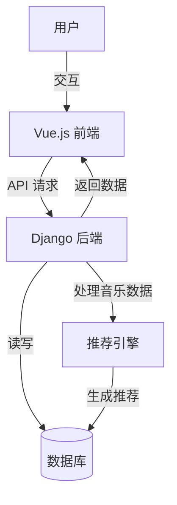

# RhythmFusion 音乐推荐系统

[English Documentation](README.md)

<div align="center">
  
  <h3>智能音乐发现与推荐平台</h3>
  <p>基于 Vue 3 + TypeScript + Django + AI 推荐引擎构建</p>
</div>

## 项目描述

RhythmFusion 是一个现代化的音乐推荐平台，通过智能混合推荐系统提供个性化的音乐发现体验。该平台结合协同过滤算法和基于内容的分析，为每位用户创造量身定制的音乐体验。

项目采用 Vue.js 前端和 Django 后端架构，RhythmFusion 提供响应式、直观的界面和强大的推荐功能，让用户轻松发现符合其独特偏好的新音乐。

## 核心功能

### 用户体验

- **个性化推荐**：基于听歌历史和偏好的智能音乐推荐
- **交互式歌单管理**：创建、编辑和分享自定义音乐集合
- **高级音乐播放器**：流畅播放，支持音量、随机播放、重复等控制
- **音乐流派探索**：通过精选推荐探索多种音乐流派
- **响应式设计**：跨桌面和移动设备的全功能体验

### 技术亮点

- **混合推荐引擎**：结合协同过滤和基于内容分析的创新算法
- **实时状态管理**：基于 Pinia 状态管理的响应式界面
- **安全认证系统**：基于 JWT 的安全用户认证系统
- **RESTful API 架构**：结构良好的后端与全面的 API 端点
- **TypeScript 集成**：类型安全的前端开发，增强 IDE 支持

## 架构概览

RhythmFusion 遵循现代化的模块化架构：



### 技术栈

#### 前端

- **框架**：Vue.js 3.5.13（使用 Composition API）
- **语言**：TypeScript
- **构建工具**：Vite 6.2.1
- **状态管理**：Pinia
- **HTTP 客户端**：Axios
- **样式**：SCSS、Element Plus UI 组件库

#### 后端

- **框架**：Django 5.0.2
- **API**：Django REST Framework
- **数据库**：SQLite（开发）、MySQL（生产）
- **认证**：JWT 令牌认证（带刷新机制）
- **推荐系统**：自定义混合算法（SVD + 内容特征分析）

## 快速开始

### 环境要求

- Python 3.8+
- Node.js 16+
- npm 或 pnpm 包管理器

### 后端环境搭建

```bash
# 克隆代码库
git clone https://github.com/SOV710/RhythmFusion.git
cd RhythmFusion/backend

# 创建并激活虚拟环境
python -m venv venv
source venv/bin/activate  # Windows系统: venv\Scripts\activate

# 安装依赖
pip install -r requirements.txt

# 运行数据库迁移
python manage.py migrate

# 创建超级用户（可选）
python manage.py createsuperuser

# 启动后端服务器
python manage.py runserver
```

### 前端环境搭建

```bash
# 进入前端目录
cd ../frontend

# 安装依赖
pnpm install  # 或 npm install

# 启动开发服务器
pnpm dev  # 或 npm run dev
```

## 项目结构

```
RhythmFusion/
├── backend/               # Django 后端应用
│   ├── backend/           # 项目配置
│   ├── user/              # 用户认证和个人信息
│   ├── music/             # 音乐数据和元数据
│   ├── playlist/          # 歌单管理
│   ├── recommender/       # 推荐引擎
│   └── manage.py          # Django 管理脚本
├── frontend/              # Vue.js 前端应用
│   ├── src/
│   │   ├── api/           # API 客户端和模块
│   │   ├── assets/        # 静态资源
│   │   ├── components/    # Vue 组件
│   │   ├── composables/   # Vue 组合函数
│   │   ├── pages/         # 页面组件
│   │   ├── router/        # Vue Router 配置
│   │   ├── stores/        # Pinia 状态存储
│   │   ├── styles/        # 全局 SCSS 样式
│   │   └── types/         # TypeScript 类型定义
│   └── public/            # 公共静态文件
└── docs/                  # 项目文档
    ├── backend/           # 后端专用文档
    ├── frontend/          # 前端专用文档
    ├── architecture.md    # 系统架构详情
    ├── api_doc.md         # API 文档
    └── user_guide.md      # 用户手册
```

## 文档

完整的项目文档请参阅[文档目录](docs/index.md)，其中包括：

- [系统架构](docs/architecture.md)
- [API 文档](docs/api_doc.md)
- [开发指南](docs/development.md)
- [用户指南](docs/user_guide.md)
- [部署指南](docs/deployment.md)
- [数据准备指南](docs/data_preparation.md)

## 参与贡献

我们欢迎对 RhythmFusion 的贡献！请按照以下步骤操作：

1. Fork 代码仓库
2. 创建功能分支：`git checkout -b feature/amazing-feature`
3. 提交更改：`git commit -m '添加惊人功能'`
4. 推送到分支：`git push origin feature/amazing-feature`
5. 提交 Pull Request

更详细的贡献指南，请参阅我们的[开发指南](docs/development.md)。

## 许可证

本项目采用 GNU 通用公共许可证 v3.0 授权 - 详见 [LICENSE](LICENSE) 文件。

## 致谢

- Vue.js 团队提供的优秀框架
- Django 团队提供的强大 Web 框架
- 所有使本项目成为可能的开源库
- 所有帮助改进 RhythmFusion 的贡献者
