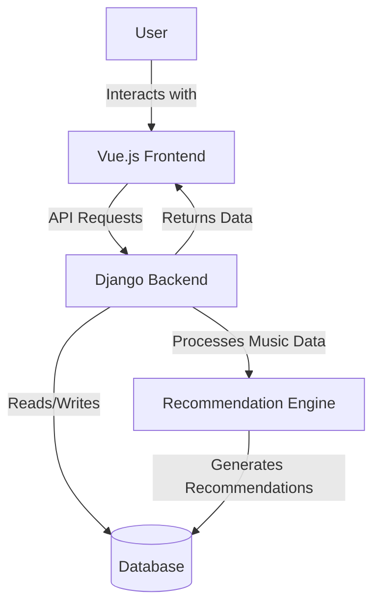
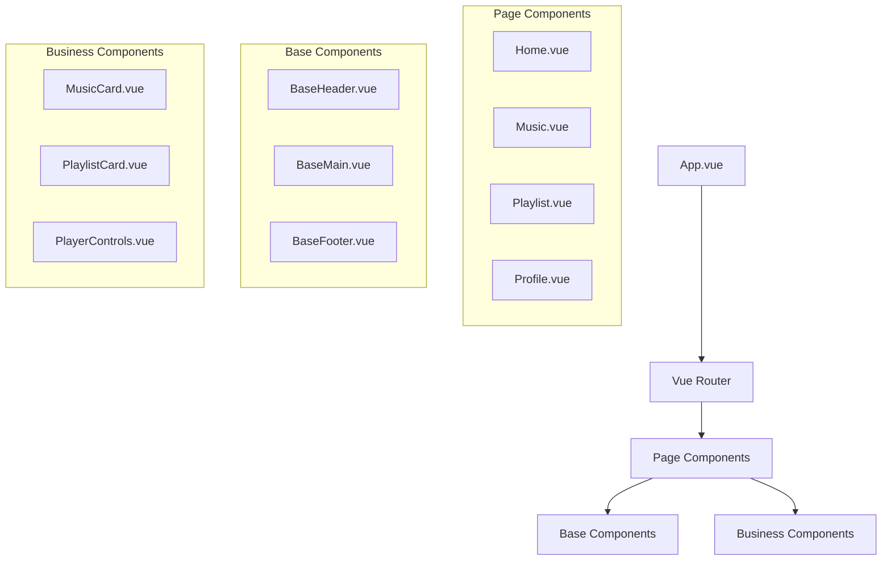
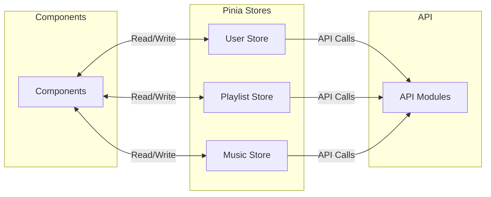
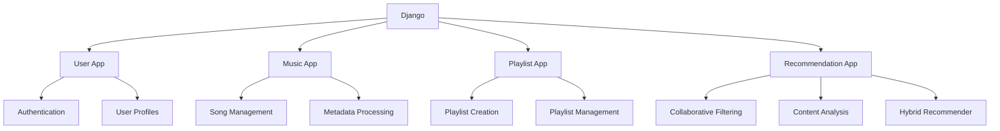
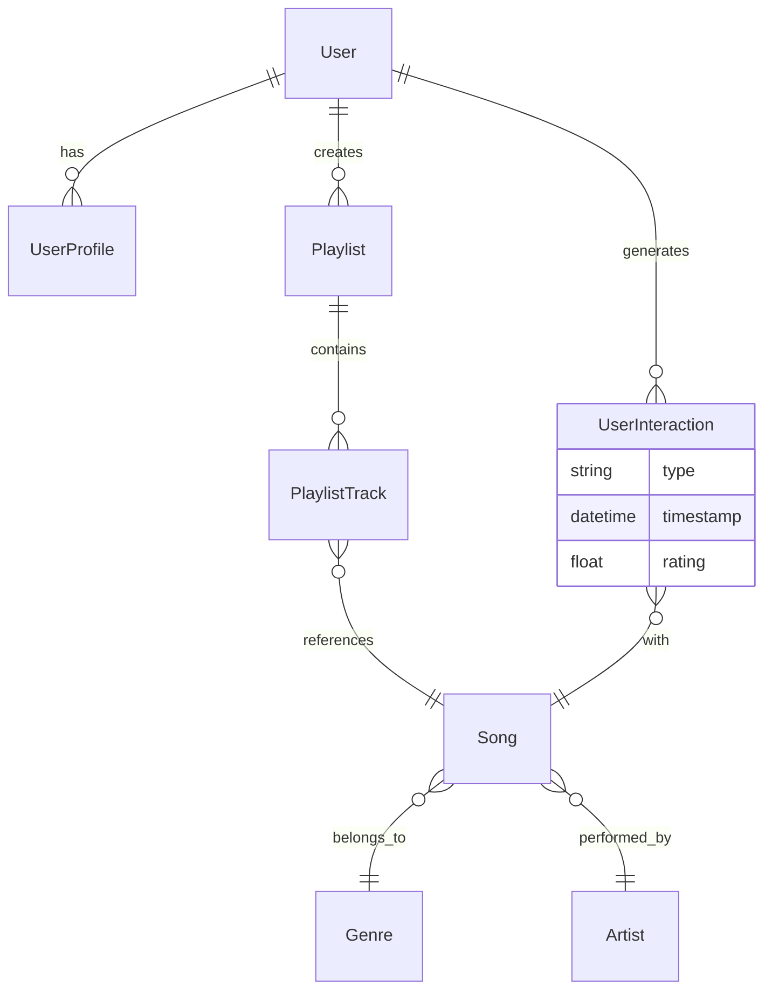
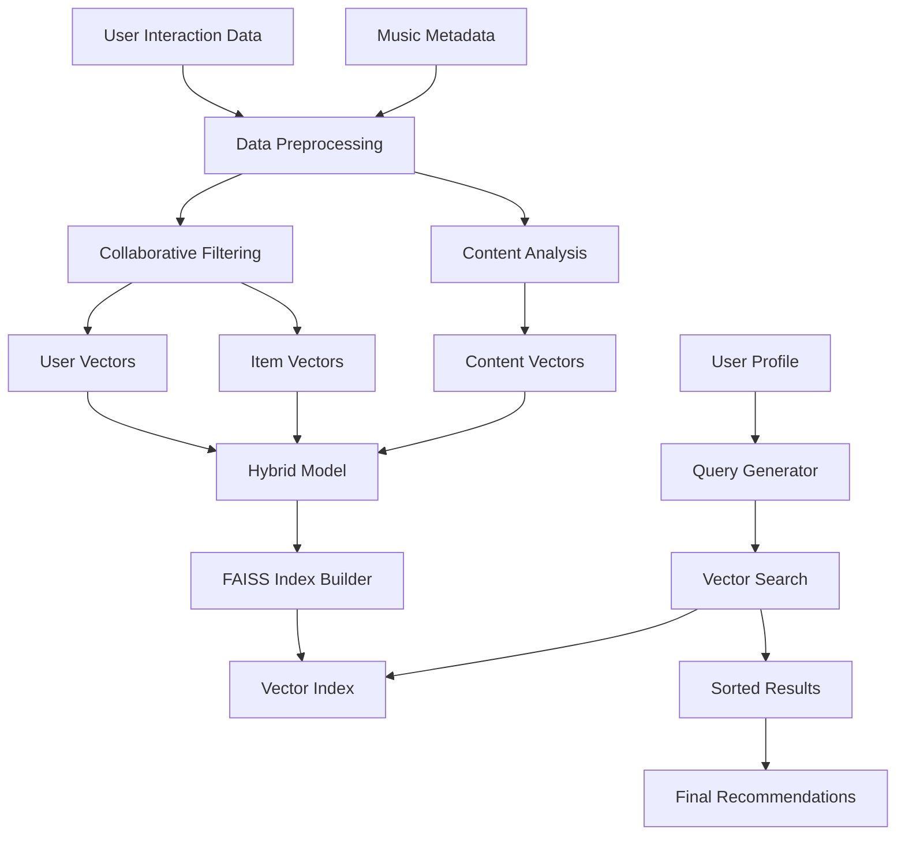
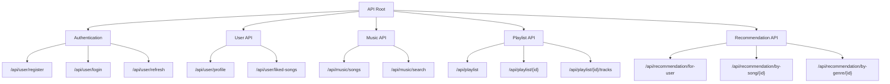
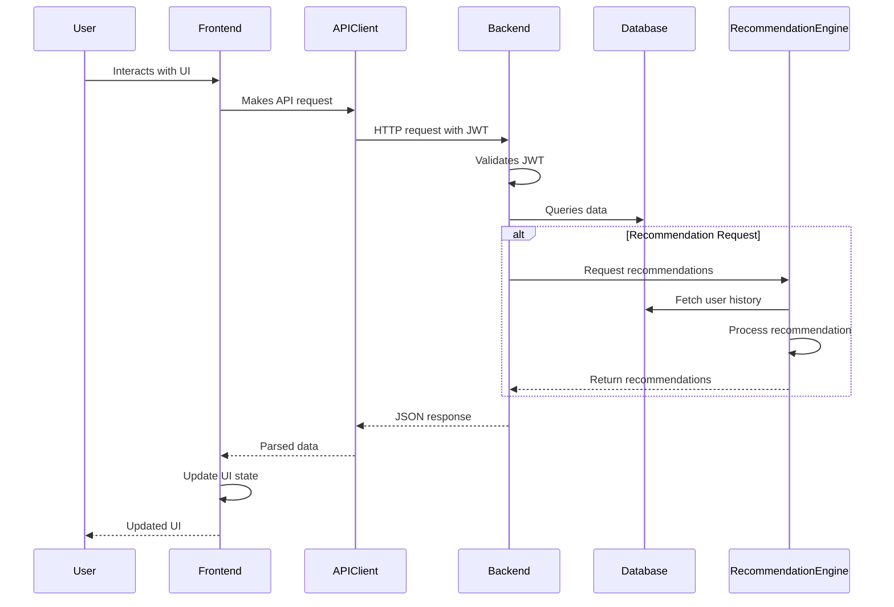
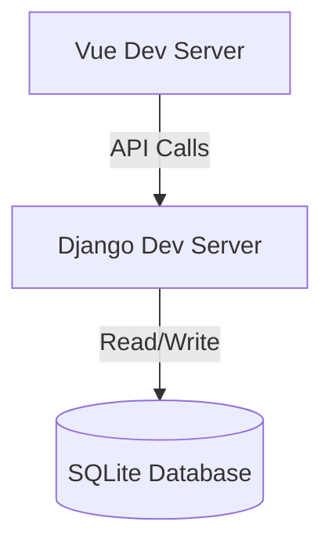
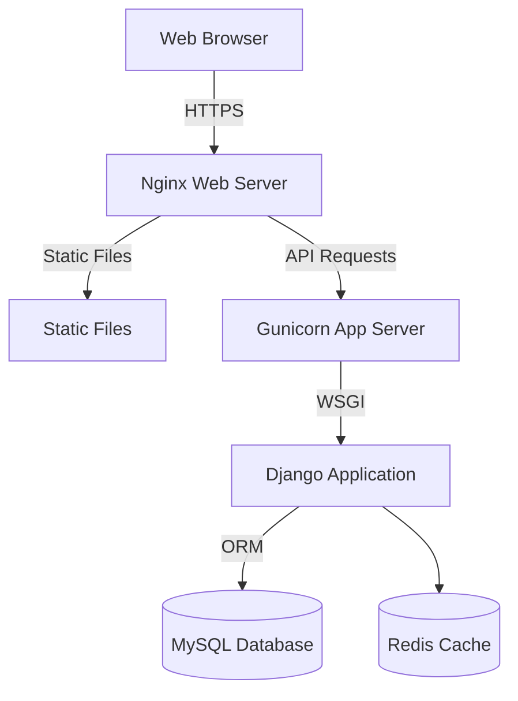

# RhythmFusion System Architecture

This document provides a comprehensive overview of the RhythmFusion music recommendation system's architecture, covering both high-level system design and detailed component interactions.

## System Overview

RhythmFusion is built as a modern web application with a clear separation between frontend and backend components. The architecture follows industry best practices for scalability, maintainability, and performance.



## Architectural Principles

RhythmFusion's architecture is guided by the following principles:

1. **Separation of Concerns**: Clear boundaries between frontend, backend, and recommendation systems
2. **RESTful Design**: Standardized API design following REST principles
3. **Component-Based UI**: Modular, reusable UI components
4. **Reactive State Management**: Centralized, reactive state management
5. **Hybrid Recommendation Strategy**: Combining collaborative filtering with content-based approaches
6. **Scalable Data Processing**: Efficient processing of music metadata and user interactions

## Frontend Architecture

The frontend is built with Vue.js 3, utilizing the Composition API and TypeScript for maintainable, type-safe code.

### Frontend Component Hierarchy



### Frontend Directories Structure

```
frontend/
├── src/
│   ├── api/              # API client and modules
│   │   ├── client.ts     # Base Axios configuration
│   │   ├── modules/      # API modules by feature
│   │   └── types.d.ts    # API type definitions
│   ├── assets/           # Static assets
│   ├── components/       # Vue components
│   │   ├── base/         # Base UI components
│   │   └── business/     # Business-specific components
│   ├── composables/      # Reusable composition functions
│   ├── pages/            # Page components
│   ├── router/           # Vue Router configuration
│   ├── stores/           # Pinia state stores
│   ├── styles/           # Global SCSS styles
│   └── types/            # TypeScript type definitions
```

### State Management

State management is implemented using Pinia, the official Vue state management library. Stores are organized by domain:



## Backend Architecture

The backend is built with Django and Django REST Framework, structured as a collection of apps each handling specific business domains.

### Backend Modules



### Database Schema Design

The core data model establishes relationships between users, songs, playlists, and user interactions:



## Recommendation System Architecture

The recommendation system is a key component of RhythmFusion, providing personalized music recommendations through a hybrid approach.

### Recommendation Workflow



### Recommendation Algorithms

The system uses multiple algorithms working together:

1. **Collaborative Filtering**: Using Singular Value Decomposition (SVD) to identify patterns in user-item interactions
2. **Content-Based Analysis**: Extracting features from music metadata (genres, artists, acoustic features)
3. **Hybrid Approach**: Combining both methods with weighted vectors
4. **Fast Similarity Search**: Using FAISS for efficient nearest-neighbor search in high-dimensional spaces

## API Architecture

The API follows RESTful design principles and is secured with JWT authentication.

### API Endpoints Structure



## Request Flow

The following diagram illustrates the flow of a typical request through the system:



## Deployment Architecture

RhythmFusion supports multiple deployment configurations:

### Development Environment



### Production Environment



## Security Architecture

Security is built into each layer of the application:

1. **Frontend Security**:

   - CSRF protection
   - Content Security Policy
   - Input validation
2. **API Security**:

   - JWT authentication
   - Permission-based access control
   - Rate limiting
3. **Backend Security**:

   - Password hashing with bcrypt
   - Database query parameterization
   - Sensitive data encryption
4. **Infrastructure Security**:

   - HTTPS/TLS encryption
   - Firewall rules
   - Regular security updates

## Performance Considerations

The architecture is designed for optimal performance through:

1. **Frontend Optimizations**:

   - Code splitting and lazy loading
   - Asset optimization
   - Client-side caching
2. **Backend Optimizations**:

   - Database query optimization
   - Response caching
   - Asynchronous task processing
3. **Recommendation System Optimizations**:

   - Efficient vector operations
   - Indexed similarity search
   - Background model updates

## Conclusion

RhythmFusion's architecture is designed to provide a robust, scalable platform for music recommendation. The separation of concerns, modular design, and focus on performance create a system that delivers personalized music experiences while remaining maintainable and extensible.

The hybrid recommendation approach balances the strengths of collaborative filtering and content-based analysis, providing recommendations that combine user preference patterns with music content characteristics.

For more detailed information on specific components, please refer to the relevant documentation sections:

- [Frontend Documentation](frontend/index.md)
- [Backend Documentation](backend/index.md)
- [Recommendation System](backend/recommendation.md)
- [API Documentation](api_doc.md)
