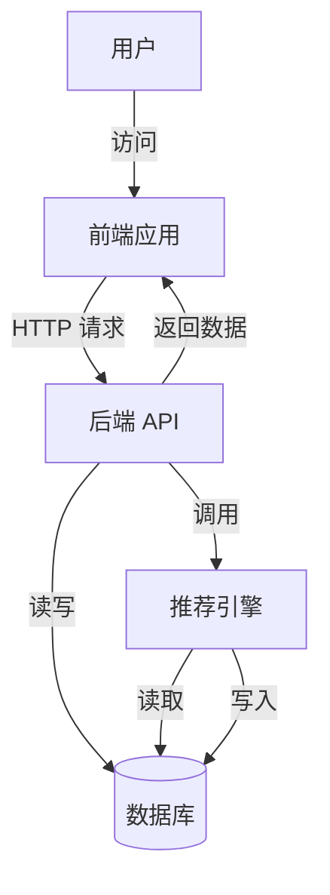
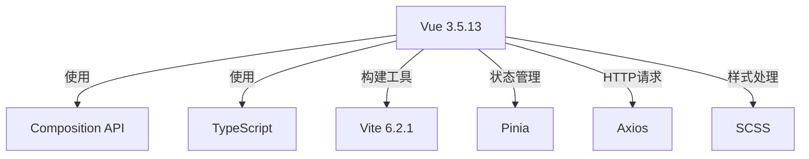
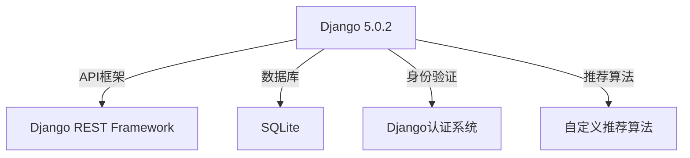
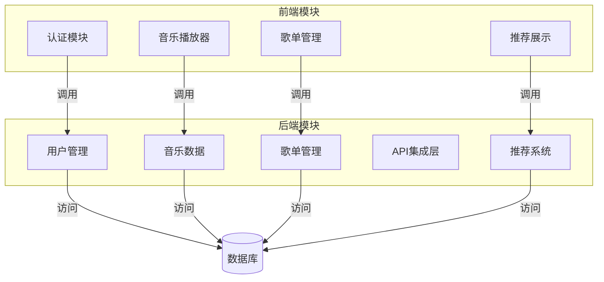
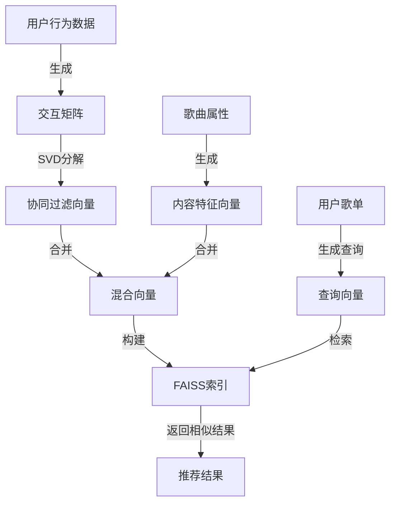
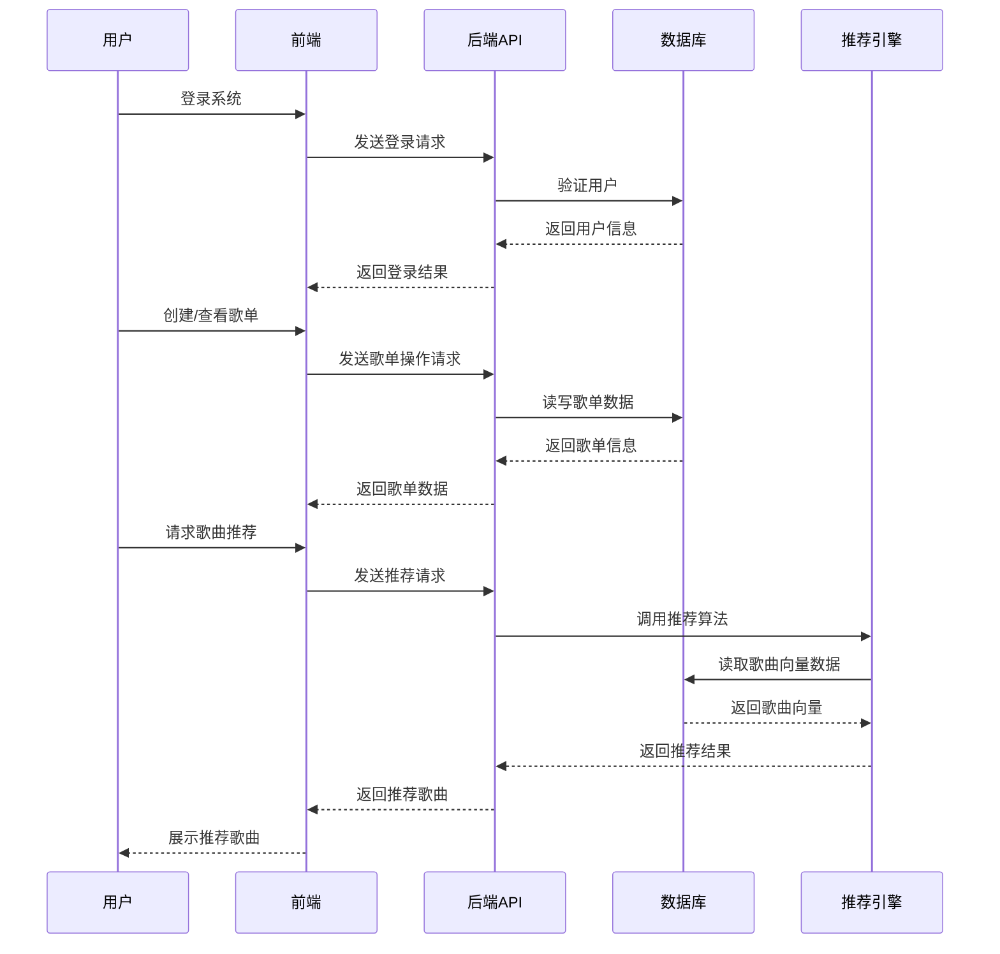
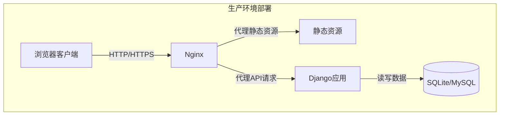

# RhythmFusion 系统架构

本文档描述了 RhythmFusion 音乐推荐系统的整体架构设计，包括组件关系、数据流和技术选型等方面。

## 系统架构概览

RhythmFusion 采用前后端分离的架构，前端使用 Vue.js 开发，后端使用 Django 和 Django REST Framework 构建 API 服务。系统主要分为前端、后端API和推荐引擎三大部分。

## 技术栈组成

### 前端技术栈

### 后端技术栈

## 系统模块构成

RhythmFusion 系统由以下主要模块组成：

## 推荐系统架构

RhythmFusion 的核心是其混合推荐算法，结合了协同过滤和内容特征推荐。

## 数据流程图

下图展示了从用户操作到获取推荐的完整数据流程：

## 部署架构

RhythmFusion 支持多种部署方式，以下是推荐的部署架构：

## 技术细节

- **前端**: Vue 3 基于 Composition API 的响应式开发
- **后端**: Django REST Framework 提供 RESTful API
- **推荐算法**: 混合模型，结合协同过滤 (SVD) 和内容特征
- **搜索引擎**: FAISS 向量检索支持高效相似度搜索
- **数据存储**: 支持 SQLite（开发），可配置为 MySQL（生产）

## 扩展性考虑

系统设计考虑了以下扩展性因素：

1. 模块化的推荐算法，可替换或增强算法
2. 标准化的数据接口，支持多种音乐元数据来源
3. 前后端分离架构，便于独立扩展
4. API 版本控制，支持渐进式升级
