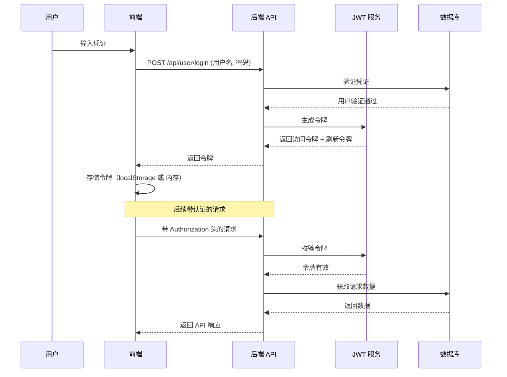
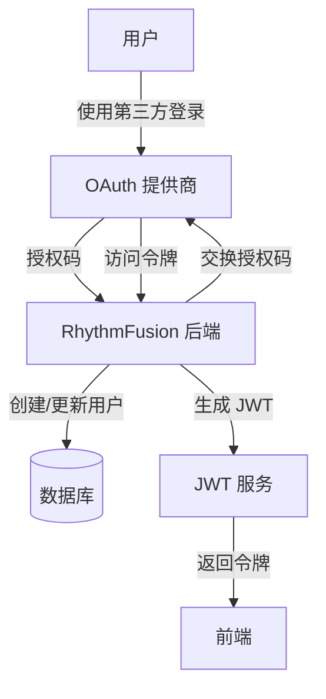

# 认证系统

本文档详细介绍了 RhythmFusion 中实现的认证与授权系统，重点说明基于 JWT 的认证机制、安全注意事项以及具体实现细节。

## 概览

RhythmFusion 使用基于 JSON Web Token（JWT）的安全认证系统，为 RESTful API 提供无状态认证。该方案具有以下优势：

* **无状态**：无需在服务器端存储会话信息
* **可伸缩**：适用于分布式环境和微服务架构
* **跨域**：支持跨域请求
* **移动友好**：同时适用于 Web 和移动端应用

## 认证流程

认证流程遵循标准的 JWT 签发与验证流程：



## 令牌结构

RhythmFusion 使用两种令牌：

### 访问令牌

短期有效（5 分钟）用于 API 访问：

```json
{
  "header": {
    "alg": "HS256",
    "typ": "JWT"
  },
  "payload": {
    "user_id": 123,
    "username": "user_example",
    "exp": 1645554285,
    "iat": 1645553985,
    "jti": "ae982ff1-8c15-4cdd-87c7-b0e4f99d8f99"
  }
}
```

### 刷新令牌

长期有效（24 小时）用于获取新访问令牌：

```json
{
  "header": {
    "alg": "HS256",
    "typ": "JWT"
  },
  "payload": {
    "user_id": 123,
    "exp": 1645640385,
    "iat": 1645553985,
    "jti": "ce45fa3d-7b44-4ada-83c5-665ca2412578",
    "token_type": "refresh"
  }
}
```

## 接口列表

认证系统对外暴露以下端点：

| 端点                    | 方法   | 描述        | 请求体字段                           | 响应        |
| --------------------- | ---- | --------- | ------------------------------- | --------- |
| `/api/user/register/` | POST | 注册新用户     | `username`, `email`, `password` | 用户信息 + 令牌 |
| `/api/user/login/`    | POST | 登录并获取令牌   | `username`, `password`          | 令牌        |
| `/api/user/refresh/`  | POST | 刷新访问令牌    | `refresh`                       | 新访问令牌     |
| `/api/user/logout/`   | POST | 注销并使令牌失效  | `refresh`                       | 成功消息      |
| `/api/user/profile/`  | GET  | 获取已认证用户资料 | -                               | 用户资料数据    |

## 后端实现

### 设置与配置

```python
# settings.py
INSTALLED_APPS = [
    # …
    'rest_framework',
    'rest_framework_simplejwt',
    # …
]

REST_FRAMEWORK = {
    'DEFAULT_AUTHENTICATION_CLASSES': (
        'rest_framework_simplejwt.authentication.JWTAuthentication',
    ),
}

SIMPLE_JWT = {
    'ACCESS_TOKEN_LIFETIME': timedelta(minutes=5),    # 访问令牌有效期 5 分钟
    'REFRESH_TOKEN_LIFETIME': timedelta(days=1),      # 刷新令牌有效期 1 天
    'ROTATE_REFRESH_TOKENS': True,                    # 刷新时轮换令牌
    'BLACKLIST_AFTER_ROTATION': True,                 # 轮换后将旧令牌加入黑名单
    'ALGORITHM': 'HS256',
    'SIGNING_KEY': SECRET_KEY,
    'AUTH_HEADER_TYPES': ('Bearer',),
    'USER_ID_FIELD': 'id',
    'USER_ID_CLAIM': 'user_id',
}
```

### 用户模型扩展

```python
# user/models.py
from django.contrib.auth.models import AbstractUser
from django.db import models

class User(AbstractUser):
    """扩展用户模型，添加额外字段"""
    email = models.EmailField(unique=True)
    avatar = models.ImageField(upload_to='avatars/', null=True, blank=True)
    bio = models.TextField(blank=True)
    date_joined = models.DateTimeField(auto_now_add=True)
    
    # JWT 认证所需字段
    USERNAME_FIELD = 'username'
    EMAIL_FIELD = 'email'
    REQUIRED_FIELDS = ['email']
    
    def __str__(self):
        return self.username
```

### 认证视图

```python
# user/views.py
from rest_framework import status, permissions
from rest_framework.response import Response
from rest_framework.views import APIView
from rest_framework_simplejwt.views import TokenObtainPairView
from rest_framework_simplejwt.tokens import RefreshToken
from .serializers import UserSerializer, TokenObtainPairSerializer

class RegisterView(APIView):
    """注册新用户并返回令牌"""
    permission_classes = [permissions.AllowAny]
    
    def post(self, request):
        serializer = UserSerializer(data=request.data)
        if serializer.is_valid():
            user = serializer.save()
            refresh = RefreshToken.for_user(user)
            return Response({
                'user': serializer.data,
                'refresh': str(refresh),
                'access': str(refresh.access_token),
            }, status=status.HTTP_201_CREATED)
        return Response(serializer.errors, status=status.HTTP_400_BAD_REQUEST)

class CustomTokenObtainPairView(TokenObtainPairView):
    """自定义令牌获取视图，返回额外用户数据"""
    serializer_class = TokenObtainPairSerializer

class LogoutView(APIView):
    """注销用户，加入刷新令牌黑名单"""
    permission_classes = [permissions.IsAuthenticated]
    
    def post(self, request):
        try:
            refresh_token = request.data["refresh"]
            token = RefreshToken(refresh_token)
            token.blacklist()
            return Response(status=status.HTTP_205_RESET_CONTENT)
        except Exception:
            return Response(status=status.HTTP_400_BAD_REQUEST)
```

## 前端集成

### Axios 客户端配置

```typescript
// api/client.ts
import axios from 'axios'
import { useUserStore } from '@/stores/user'

const apiClient = axios.create({
  baseURL: '/api',
  headers: {
    'Content-Type': 'application/json',
  },
})

// 请求拦截：添加访问令牌
apiClient.interceptors.request.use(
  (config) => {
    const userStore = useUserStore()
    if (userStore.accessToken) {
      config.headers.Authorization = `Bearer ${userStore.accessToken}`
    }
    return config
  },
  (error) => Promise.reject(error)
)

// 响应拦截：处理令牌刷新
apiClient.interceptors.response.use(
  (response) => response,
  async (error) => {
    const userStore = useUserStore()
    const originalRequest = error.config
    
    if (error.response.status === 401 && !originalRequest._retry && userStore.refreshToken) {
      originalRequest._retry = true
      try {
        // 尝试刷新访问令牌
        const response = await axios.post('/api/user/refresh/', {
          refresh: userStore.refreshToken
        })
        const { access } = response.data
        userStore.setAccessToken(access)
        // 重试原请求
        originalRequest.headers.Authorization = `Bearer ${access}`
        return axios(originalRequest)
      } catch (refreshError) {
        userStore.handleLogout()
        return Promise.reject(refreshError)
      }
    }
    return Promise.reject(error)
  }
)

export default apiClient
```

### Pinia 用户存储

```typescript
// stores/user.ts
import { defineStore } from 'pinia'
import * as userApi from '@/api/modules/user'

export const useUserStore = defineStore('user', {
  state: () => ({
    user: null,
    accessToken: localStorage.getItem('accessToken') || null,
    refreshToken: localStorage.getItem('refreshToken') || null,
    loginLoading: false,
    registerLoading: false,
    loginForm: {
      username: '',
      password: '',
    },
    registerForm: {
      username: '',
      email: '',
      password: '',
    },
  }),
  
  getters: {
    isAuthenticated: (state) => !!state.accessToken,
    userProfile: (state) => state.user,
  },
  
  actions: {
    setTokens(access, refresh) {
      this.accessToken = access
      this.refreshToken = refresh
      localStorage.setItem('accessToken', access)
      localStorage.setItem('refreshToken', refresh)
    },
    
    setAccessToken(access) {
      this.accessToken = access
      localStorage.setItem('accessToken', access)
    },
    
    async handleLogin(credentials) {
      this.loginLoading = true
      try {
        const response = await userApi.login(credentials)
        const { access, refresh, user } = response
        this.setTokens(access, refresh)
        this.user = user
        return user
      } finally {
        this.loginLoading = false
      }
    },
    
    async handleRegister(userData) {
      this.registerLoading = true
      try {
        const response = await userApi.register(userData)
        const { access, refresh, user } = response
        this.setTokens(access, refresh)
        this.user = user
        return user
      } finally {
        this.registerLoading = false
      }
    },
    
    async handleLogout() {
      if (this.refreshToken) {
        try {
          await userApi.logout(this.refreshToken)
        } catch (error) {
          console.error('注销出错：', error)
        }
      }
      // 清理状态和本地存储
      this.user = null
      this.accessToken = null
      this.refreshToken = null
      localStorage.removeItem('accessToken')
      localStorage.removeItem('refreshToken')
    },
    
    async fetchUserProfile() {
      if (!this.isAuthenticated) return null      
      try {
        const user = await userApi.getUserProfile()
        this.user = user
        return user
      } catch (error) {
        console.error('获取用户资料出错：', error)
        if (error.response?.status === 401) {
          this.handleLogout()
        }
        return null
      }
    },
  },
})
```

## 路由鉴权

```typescript
// router/index.ts
import { createRouter, createWebHistory } from 'vue-router'
import { useUserStore } from '@/stores/user'

const routes = [
  { path: '/', component: () => import('@/pages/home.vue'), meta: { requiresAuth: false } },
  { path: '/music', component: () => import('@/pages/music.vue'), meta: { requiresAuth: false } },
  { path: '/user/profile', component: () => import('@/pages/profile.vue'), meta: { requiresAuth: true } },
  { path: '/user/liked', component: () => import('@/pages/liked-songs.vue'), meta: { requiresAuth: true } },
  // …其他路由
]

const router = createRouter({
  history: createWebHistory(),
  routes
})

router.beforeEach(async (to, from, next) => {
  const userStore = useUserStore()
  if (to.meta.requiresAuth) {
    if (userStore.isAuthenticated) {
      if (!userStore.user) {
        await userStore.fetchUserProfile()
      }
      next()
    } else {
      next({ path: '/', query: { login: 'true' } })
    }
  } else {
    next()
  }
})

export default router
```

## 安全考量

### 令牌安全

1. **短期访问令牌**：令牌有效期仅 5 分钟，降低被盗风险
2. **令牌轮换**：每次使用刷新令牌均生成新令牌，防止重放攻击
3. **黑名单机制**：使用后的刷新令牌将被加入黑名单

### 密码安全

1. **密码哈希**：使用 Django 默认的 PBKDF2+SHA256 算法
2. **密码校验**：强制密码复杂度（最小长度、多样字符）

### API 安全

1. **HTTPS**：所有认证流量均通过 HTTPS 加密
2. **CSRF 保护**：对基于 Cookie 的会话启用 CSRF 防护
3. **限流**：对登录尝试进行速率限制，防止暴力破解

## 测试认证功能

```bash
# 注册新用户
curl -X POST http://localhost:8000/api/user/register/ \
  -H "Content-Type: application/json" \
  -d '{"username":"testuser","email":"test@example.com","password":"securepassword123"}'

# 登录获取令牌
curl -X POST http://localhost:8000/api/user/login/ \
  -H "Content-Type: application/json" \
  -d '{"username":"testuser","password":"securepassword123"}'

# 访问受保护接口
curl -X GET http://localhost:8000/api/user/profile/ \
  -H "Authorization: Bearer <access_token>"

# 刷新令牌
curl -X POST http://localhost:8000/api/user/refresh/ \
  -H "Content-Type: application/json" \
  -d '{"refresh":"<refresh_token>"}'

# 注销（使令牌失效）
curl -X POST http://localhost:8000/api/user/logout/ \
  -H "Content-Type: application/json" \
  -d '{"refresh":"<refresh_token>"}'
```

## 常见问题与解决

| 问题                    | 可能原因   | 解决方案          |
| --------------------- | ------ | ------------- |
| 401 Unauthorized      | 访问令牌过期 | 使用刷新令牌获取新访问令牌 |
| 401 Unauthorized      | 令牌无效   | 重新登录          |
| 403 Forbidden         | 权限不足   | 检查用户权限        |
| 400 Bad Request（刷新失效） | 刷新令牌无效 | 重新登录          |
| 登录失败                  | 凭证错误   | 核对用户名和密码      |

## 第三方认证集成（可选）

未来可扩展支持 OAuth2 等第三方登录：



## 结论

RhythmFusion 的认证系统提供了安全、无状态的用户认证方案，在兼顾安全性的同时兼容 Web 和移动端。基于 JWT 的实现具备灵活扩展性，并遵循最佳安全实践。

如需更多帮助，请参阅《[开发指南](../development.md)》或在项目 GitHub 仓库提交 Issue。
