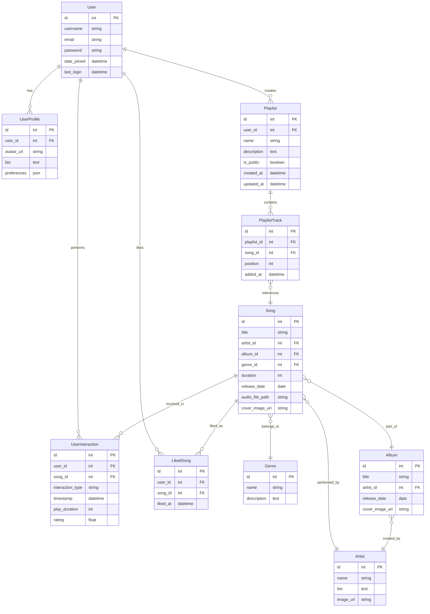

# 数据库设计与优化

本文档详细说明了 RhythmFusion 音乐推荐系统的数据库设计、查询优化技术及性能考量。

## 数据库模式

RhythmFusion 使用关系型数据库存储用户数据、音乐元数据、歌单和交互信息。该模式在保证数据完整性的同时，对读写操作进行了优化。

### 实体关系图

下图展示了核心数据库模式：



## Django 模型定义

以下模式使用 Django ORM 实现。

### 用户模型

```python
# user/models.py
from django.contrib.auth.models import AbstractUser
from django.db import models

class User(AbstractUser):
    """扩展用户模型，添加邮箱和注册时间"""
    email = models.EmailField(unique=True)
    date_joined = models.DateTimeField(auto_now_add=True)

    class Meta:
        indexes = [
            models.Index(fields=['username']),  # 用户名索引
            models.Index(fields=['email']),     # 邮箱索引
        ]

    def __str__(self):
        return self.username

class UserProfile(models.Model):
    """用户个人资料，附加信息"""
    user = models.OneToOneField(User, on_delete=models.CASCADE, related_name='profile')
    avatar = models.ImageField(upload_to='avatars/', null=True, blank=True)
    bio = models.TextField(blank=True)
    preferences = models.JSONField(default=dict)  # 用户偏好配置

    def __str__(self):
        return f"Profile of {self.user.username}"
```

### 音乐相关模型

```python
# music/models.py
from django.db import models

class Genre(models.Model):
    """音乐流派"""
    name = models.CharField(max_length=100, unique=True)
    description = models.TextField(blank=True)

    def __str__(self):
        return self.name

class Artist(models.Model):
    """音乐艺术家"""
    name = models.CharField(max_length=255)
    bio = models.TextField(blank=True)
    image = models.ImageField(upload_to='artists/', null=True, blank=True)

    class Meta:
        indexes = [
            models.Index(fields=['name']),  # 艺术家姓名索引
        ]

    def __str__(self):
        return self.name

class Album(models.Model):
    """音乐专辑"""
    title = models.CharField(max_length=255)
    artist = models.ForeignKey(Artist, on_delete=models.CASCADE, related_name='albums')
    release_date = models.DateField(null=True, blank=True)
    cover_image = models.ImageField(upload_to='albums/', null=True, blank=True)

    class Meta:
        indexes = [
            models.Index(fields=['title']),                # 专辑标题索引
            models.Index(fields=['artist', 'title']),      # 艺术家+标题联合索引
        ]

    def __str__(self):
        return f"{self.title} by {self.artist.name}"

class Song(models.Model):
    """音乐曲目"""
    title = models.CharField(max_length=255)
    artist = models.ForeignKey(Artist, on_delete=models.CASCADE, related_name='songs')
    album = models.ForeignKey(Album, on_delete=models.CASCADE, related_name='songs', null=True, blank=True)
    genre = models.ForeignKey(Genre, on_delete=models.SET_NULL, related_name='songs', null=True)
    duration = models.IntegerField(default=0)  # 时长（秒）
    release_date = models.DateField(null=True, blank=True)
    audio_file = models.FileField(upload_to='songs/', null=True, blank=True)
    cover_image = models.ImageField(upload_to='song_covers/', null=True, blank=True)

    class Meta:
        indexes = [
            models.Index(fields=['title']),        # 曲目标题索引
            models.Index(fields=['artist']),       # 艺术家索引
            models.Index(fields=['genre']),        # 流派索引
            models.Index(fields=['release_date']), # 发布日期索引
        ]

    def __str__(self):
        return f"{self.title} by {self.artist.name}"
```

### 歌单模型

```python
# playlist/models.py
from django.db import models
from django.conf import settings
from music.models import Song

class Playlist(models.Model):
    """用户歌单"""
    user = models.ForeignKey(settings.AUTH_USER_MODEL, on_delete=models.CASCADE, related_name='playlists')
    name = models.CharField(max_length=255)
    description = models.TextField(blank=True)
    is_public = models.BooleanField(default=True)
    created_at = models.DateTimeField(auto_now_add=True)
    updated_at = models.DateTimeField(auto_now=True)

    class Meta:
        indexes = [
            models.Index(fields=['user']),      # 用户索引
            models.Index(fields=['is_public']),# 是否公开索引
        ]

    def __str__(self):
        return f"{self.name} by {self.user.username}"

class PlaylistTrack(models.Model):
    """歌单与曲目关联，包含顺序信息"""
    playlist = models.ForeignKey(Playlist, on_delete=models.CASCADE, related_name='tracks')
    song = models.ForeignKey(Song, on_delete=models.CASCADE)
    position = models.PositiveIntegerField(default=0)  # 在歌单中的位置
    added_at = models.DateTimeField(auto_now_add=True)

    class Meta:
        unique_together = ('playlist', 'song')         # 唯一约束：同一歌单不可重复同一曲目
        ordering = ['position']                        # 默认按 position 排序
        indexes = [
            models.Index(fields=['playlist']),                   # 歌单索引
            models.Index(fields=['playlist', 'position']),      # 联合索引提升排序性能
        ]

    def __str__(self):
        return f"{self.song.title} in {self.playlist.name}"
```

### 用户交互模型

```python
# recommender/models.py
from django.db import models
from django.conf import settings
from music.models import Song

class UserInteraction(models.Model):
    """用户与曲目的交互记录"""
    INTERACTION_TYPES = (
        ('play', 'Play'),
        ('skip', 'Skip'),
        ('like', 'Like'),
        ('dislike', 'Dislike'),
    )

    user = models.ForeignKey(settings.AUTH_USER_MODEL, on_delete=models.CASCADE, related_name='interactions')
    song = models.ForeignKey(Song, on_delete=models.CASCADE, related_name='interactions')
    interaction_type = models.CharField(max_length=10, choices=INTERACTION_TYPES)  # 交互类型
    timestamp = models.DateTimeField(auto_now_add=True)                            # 时间戳
    play_duration = models.IntegerField(null=True, blank=True)                     # 播放时长（仅对 play 有效）
    rating = models.FloatField(null=True, blank=True)                              # 可选评分

    class Meta:
        indexes = [
            models.Index(fields=['user']),
            models.Index(fields=['song']),
            models.Index(fields=['interaction_type']),
            models.Index(fields=['timestamp']),
            models.Index(fields=['user', 'song']),  # 联合索引
        ]

    def __str__(self):
        return f"{self.user.username} {self.interaction_type} {self.song.title}"

class LikedSong(models.Model):
    """用户点赞曲目，用于快速访问"""
    user = models.ForeignKey(settings.AUTH_USER_MODEL, on_delete=models.CASCADE, related_name='liked_songs')
    song = models.ForeignKey(Song, on_delete=models.CASCADE, related_name='liked_by')
    liked_at = models.DateTimeField(auto_now_add=True)  # 点赞时间

    class Meta:
        unique_together = ('user', 'song')
        indexes = [
            models.Index(fields=['user']),
            models.Index(fields=['liked_at']),
        ]

    def __str__(self):
        return f"{self.user.username} likes {self.song.title}"
```

## 索引策略

### 主键索引

所有表的 `id` 字段默认为主键并建立索引。

### 外键索引

常用外键字段均建立索引以提升连接查询性能，例如 `user_id`、`song_id`、`artist_id`、`album_id`、`genre_id`、`playlist_id` 等。

### 次要索引

对频繁用于 `WHERE` 或 `ORDER BY` 的字段添加单列索引，如：

* 用户表的 `username`、`email`
* 艺术家、流派、歌单表的 `name`
* 曲目表的 `title`
* 交互记录表的 `interaction_type`、`timestamp`
* 歌单轨迹表的 `position`

### 复合索引

对多字段联合过滤的场景使用复合索引，例如：

* `(playlist_id, position)` 在 `PlaylistTrack`
* `(user_id, song_id)` 在 `UserInteraction`
* `(artist_id, title)` 在 `Album`

## 查询优化技术

### 1. QuerySet 优化

```python
# 使用 select_related 避免 N+1 查询
songs = Song.objects.select_related('artist', 'genre').all()

# 使用 prefetch_related 批量预取关联对象
playlists = Playlist.objects.prefetch_related('tracks__song').filter(user=request.user)

# 仅获取需要字段
song_titles = Song.objects.filter(genre__name='Rock').values('id', 'title')
```

### 2. 数据库专属优化

#### SQLite（开发环境）

```python
# settings.py 中的 SQLite 配置
DATABASES = {
    'default': {
        'ENGINE': 'django.db.backends.sqlite3',
        'NAME': BASE_DIR / 'db.sqlite3',
        'ATOMIC_REQUESTS': True,
        'PRAGMA': {
            'journal_mode': 'WAL',
            'cache_size': -1 * 64000,  # 64MB 缓存
            'foreign_keys': 'ON',
            'ignore_check_constraints': 0,
            'synchronous': 1,
        }
    }
}
```

#### MySQL（生产环境）

```python
# settings.py 中的 MySQL 配置
DATABASES = {
    'default': {
        'ENGINE': 'django.db.backends.mysql',
        'NAME': 'rhythmfusion',
        'USER': 'dbuser',
        'PASSWORD': '********',
        'HOST': 'localhost',
        'PORT': '3306',
        'OPTIONS': {
            'charset': 'utf8mb4',
            'sql_mode': 'STRICT_TRANS_TABLES',
        },
        'ATOMIC_REQUESTS': True,
        'CONN_MAX_AGE': 60,  # 持久连接 60 秒
    }
}
```

### 3. 查询缓存

```python
# settings.py 缓存配置
CACHES = {
    'default': {
        'BACKEND': 'django.core.cache.backends.redis.RedisCache',
        'LOCATION': 'redis://127.0.0.1:6379/1',
        'TIMEOUT': 300,  # 缓存 5 分钟
        'OPTIONS': {
            'CLIENT_CLASS': 'django_redis.client.DefaultClient',
        }
    }
}

# 在视图中使用页面缓存
from django.views.decorators.cache import cache_page

@cache_page(60 * 15)  # 缓存 15 分钟
def genre_songs_view(request, genre_id):
    # ...
    return render(request, 'genre_songs.html', {...})

# 手动缓存示例
def get_user_recommendations(user_id):
    cache_key = f'user_recommendations_{user_id}'
    recommendations = cache.get(cache_key)
    if recommendations is None:
        recommendations = generate_recommendations(user_id)
        cache.set(cache_key, recommendations, 3600)  # 缓存 1 小时
    return recommendations
```

## 数据库迁移

```bash
# 模型变更后生成迁移
python manage.py makemigrations

# 应用迁移更新数据库
python manage.py migrate

# 查看迁移状态
python manage.py showmigrations

# 合并迁移
python manage.py squashmigrations <app_name> 0001 0004
```

**最佳实践：**

1. 在低流量时段运行迁移
2. 迁移前备份数据库
3. 在开发/预发布环境测试迁移
4. 使用原子事务保证安全
5. 定期合并旧迁移减少执行时间

## 性能监控

### Django Debug Toolbar

```python
# settings.py
INSTALLED_APPS += ['debug_toolbar']
MIDDLEWARE += ['debug_toolbar.middleware.DebugToolbarMiddleware']
INTERNAL_IPS = ['127.0.0.1']
```

### 查询日志

```python
# settings.py
LOGGING = {
    'version': 1,
    'handlers': {
        'file': {
            'class': 'logging.FileHandler',
            'filename': '/path/to/django/debug.log',
            'level': 'DEBUG',
        },
    },
    'loggers': {
        'django.db.backends': {
            'handlers': ['file'],
            'level': 'DEBUG',
            'propagate': True,
        },
    },
}
```

## 连接池配置

```python
# settings.py
DATABASES['default']['CONN_MAX_AGE'] = 60  # 连接保持 60 秒
```

## 批量操作

```python
# 批量创建
Song.objects.bulk_create([
    Song(title='Song 1', artist_id=1),
    Song(title='Song 2', artist_id=1),
    Song(title='Song 3', artist_id=2),
], batch_size=100)

# 批量更新
songs = list(Song.objects.filter(artist_id=1))
for song in songs:
    song.duration = 240
Song.objects.bulk_update(songs, ['duration'], batch_size=100)

# 批量删除
UserInteraction.objects.filter(timestamp__lt=one_year_ago).delete()
```

## 数据库扩展策略

### 读副本

```python
# settings.py
DATABASES = {
    'default': { ... },   # 主库
    'replica': { ... },   # 只读副本
}
DATABASE_ROUTERS = ['path.to.ReadReplicaRouter']
```

```python
# routers.py
class ReadReplicaRouter:
    """读请求走副本，写请求走主库"""

    def db_for_read(self, model, **hints):
        return 'replica'

    def db_for_write(self, model, **hints):
        return 'default'

    def allow_relation(self, obj1, obj2, **hints):
        return True

    def allow_migrate(self, db, app_label, model_name=None, **hints):
        return db == 'default'
```

### 分片（Sharding）

```python
# 分片路由示例（伪代码）
def get_user_shard(user_id):
    return f"shard_{user_id % NUM_SHARDS}"
```

## 备份与恢复

### 定期备份

```bash
# SQLite 备份
cp db.sqlite3 db.sqlite3.bak

# MySQL 备份
mysqldump -u username -p rhythmfusion > rhythmfusion_backup.sql

# 自动化每日备份（crontab）
0 2 * * * mysqldump -u username -p rhythmfusion | gzip > /backups/rhythmfusion_$(date +\%Y\%m\%d).sql.gz
```

### 时间点恢复

在 MySQL 中启用二进制日志以支持时间点恢复：

```sql
-- MySQL 配置
SET GLOBAL binlog_format = 'ROW';
SET GLOBAL expire_logs_days = 7;
```

## 结论

RhythmFusion 的数据库设计以高性能、数据完整性和可扩展性为核心。通过合理的索引策略、查询优化和缓存机制，实现了高效的读写数据模式。随着系统增长，可进一步引入读副本、分片等扩展方案，以满足更大规模的访问需求。

更多参考资料请见：

* [Django ORM 文档](https://docs.djangoproject.com/en/stable/topics/db/)
* [后端架构](index.md)
* [推荐系统](recommendation.md)
* [API 文档](../api_doc.md)
