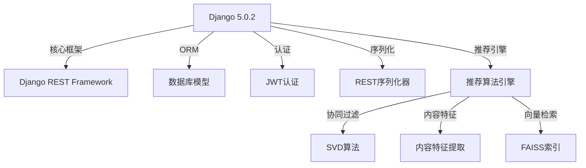
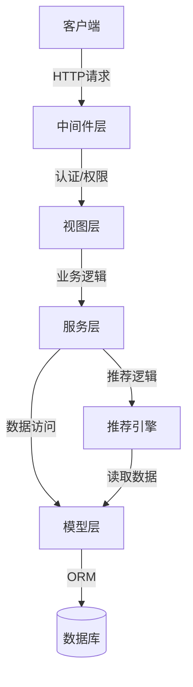
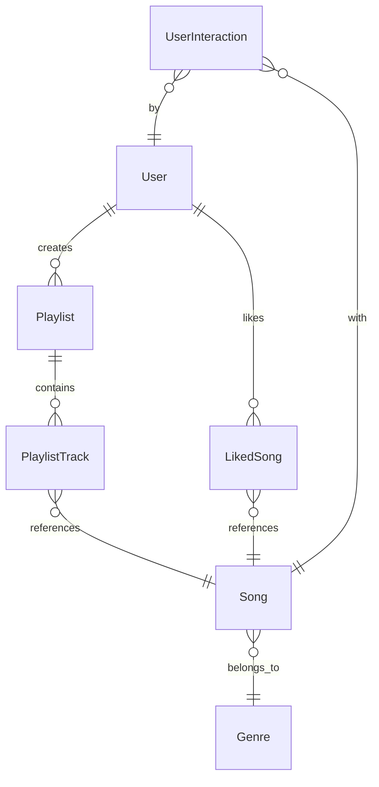
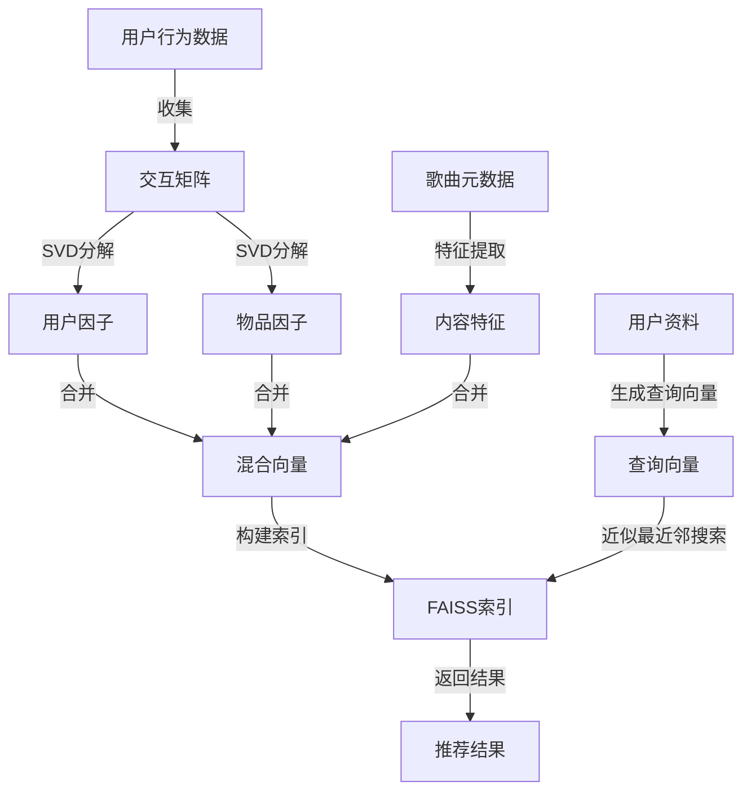
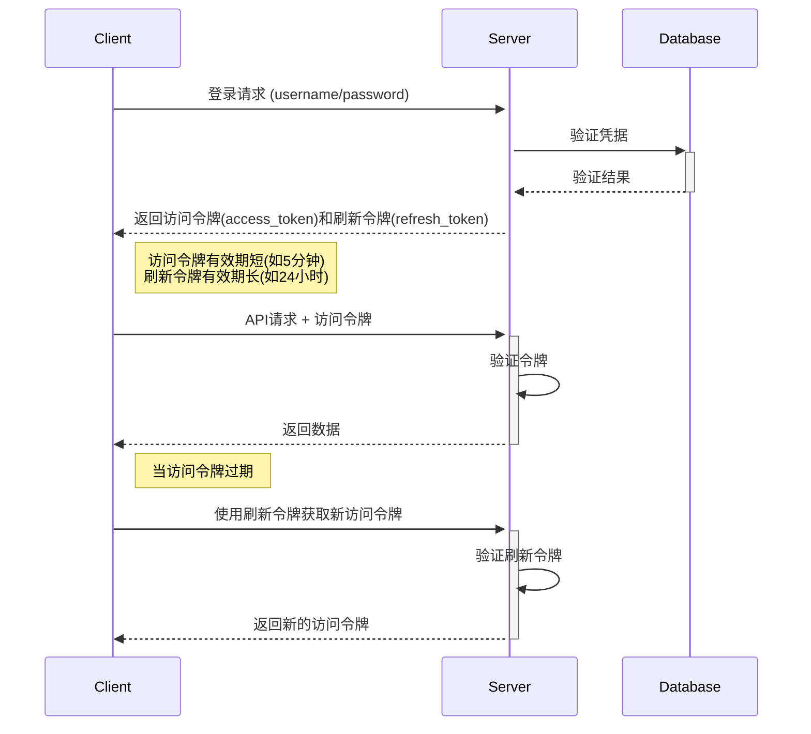
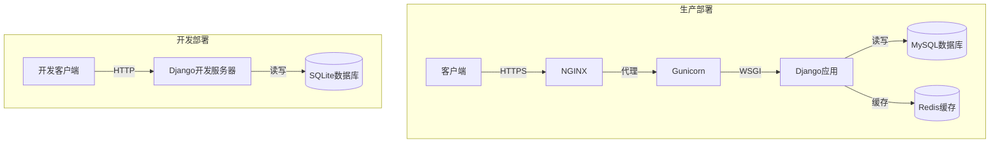

# RhythmFusion 后端架构文档

本文档详细介绍 RhythmFusion 后端系统的架构设计、技术选型和开发指南，帮助开发者理解并参与后端开发工作。

## 后端技术栈

RhythmFusion 后端采用 Django 框架，结合多种技术实现完整的音乐推荐系统：



### 核心技术说明

| 技术 | 版本 | 用途 |
|------|------|------|
| Django | 5.0.2 | Web应用框架 |
| Django REST Framework | 3.14.0 | RESTful API框架 |
| PyJWT | 2.8.0 | JWT认证 |
| SQLite | 3.x | 开发环境数据库 |
| MySQL | 5.7+ | 生产环境数据库 |
| NumPy | 1.24.x | 数值计算库 |
| SciPy | 1.11.x | 科学计算库 |
| FAISS | 1.7.x | 高效相似度搜索库 |
| Surprise | 1.1.x | 推荐系统算法库 |

## 目录结构

RhythmFusion 后端采用Django的应用模式组织代码，实现模块化管理：

```
backend/
├── backend/               # 项目配置目录
│   ├── __init__.py        # 包初始化文件
│   ├── asgi.py            # ASGI配置
│   ├── settings.py        # 项目设置
│   ├── urls.py            # 主URL配置
│   └── wsgi.py            # WSGI配置
├── user/                  # 用户管理应用
│   ├── migrations/        # 数据库迁移文件
│   ├── __init__.py        # 包初始化文件
│   ├── admin.py           # 管理界面配置
│   ├── apps.py            # 应用配置
│   ├── models.py          # 数据模型
│   ├── serializers.py     # 序列化器
│   ├── urls.py            # URL配置
│   └── views.py           # 视图函数
├── music/                 # 音乐数据应用
│   ├── migrations/        # 数据库迁移文件
│   ├── __init__.py        # 包初始化文件
│   ├── admin.py           # 管理界面配置
│   ├── apps.py            # 应用配置
│   ├── models.py          # 数据模型
│   ├── serializers.py     # 序列化器
│   ├── pagination.py      # 分页配置
│   ├── urls.py            # URL配置
│   └── views.py           # 视图函数
├── playlist/              # 歌单管理应用
│   ├── migrations/        # 数据库迁移文件
│   ├── __init__.py        # 包初始化文件
│   ├── admin.py           # 管理界面配置
│   ├── apps.py            # 应用配置
│   ├── models.py          # 数据模型
│   ├── serializers.py     # 序列化器
│   ├── urls.py            # URL配置
│   └── views.py           # 视图函数
├── recommender/           # 推荐系统应用
│   ├── migrations/        # 数据库迁移文件
│   ├── management/        # 管理命令
│   │   └── commands/      # 自定义命令
│   │       ├── build_faiss_index.py      # 构建FAISS索引
│   │       ├── build_interaction_matrix.py # 构建交互矩阵
│   │       ├── generate_content_vectors.py # 生成内容特征向量
│   │       ├── generate_hybrid_vectors.py  # 生成混合向量
│   │       └── train_cf_model.py           # 训练协同过滤模型
│   ├── data/              # 模型和向量数据
│   ├── __init__.py        # 包初始化文件
│   ├── admin.py           # 管理界面配置
│   ├── apps.py            # 应用配置
│   ├── models.py          # 数据模型
│   ├── utils.py           # 工具函数
│   ├── vector_engine.py   # 向量引擎
│   └── recommendation.py  # 推荐算法
├── media/                 # 媒体文件
│   └── avatars/           # 用户头像
├── static/                # 静态文件
├── templates/             # 模板文件
├── requirements.txt       # 依赖项
└── manage.py              # Django管理脚本
```

## 后端架构设计

RhythmFusion 后端采用现代化的 Django REST Framework 架构，主要特点包括：

### 整体架构



### 应用划分

后端系统被划分为多个专注于特定功能的 Django 应用：

1. **user**: 用户认证、授权和个人资料管理
2. **music**: 音乐数据管理和搜索功能
3. **playlist**: 歌单创建、编辑和管理
4. **recommender**: 推荐算法和个性化推荐

## 数据模型设计

RhythmFusion 的核心数据模型及其关系如下：



详细的数据模型设计和字段说明请参考[数据模型文档](models.md)。

## API 设计

RhythmFusion 采用 RESTful API 设计原则，主要 API 端点包括：

### 认证 API

- `POST /api/user/register/` - 用户注册
- `POST /api/user/login/` - 用户登录
- `POST /api/user/refresh/` - 刷新令牌
- `POST /api/user/logout/` - 用户登出

### 用户 API

- `GET /api/user/profile/` - 获取当前用户资料
- `PUT /api/user/profile/` - 更新用户资料
- `GET /api/user/liked-songs/` - 获取喜欢的歌曲

### 音乐 API

- `GET /api/music/songs/` - 获取歌曲列表
- `GET /api/music/songs/{id}/` - 获取歌曲详情
- `GET /api/music/search/` - 搜索歌曲
- `GET /api/music/genre/{genre}/` - 按流派获取歌曲

### 歌单 API

- `GET /api/playlist/` - 获取用户歌单
- `POST /api/playlist/` - 创建歌单
- `GET /api/playlist/{id}/` - 获取歌单详情
- `PUT /api/playlist/{id}/` - 更新歌单
- `DELETE /api/playlist/{id}/` - 删除歌单
- `POST /api/playlist/{id}/tracks/` - 添加歌曲到歌单
- `DELETE /api/playlist/{id}/tracks/{track_id}/` - 从歌单移除歌曲

### 推荐 API

- `GET /api/recommendation/for-user/` - 获取个性化推荐
- `GET /api/recommendation/by-song/{song_id}/` - 获取相似歌曲推荐
- `GET /api/recommendation/by-genre/{genre}/` - 获取基于流派的推荐

详细的 API 规范和使用方法请参考[API文档](../api_doc.md)。

## 推荐系统设计

推荐系统是 RhythmFusion 的核心功能，采用混合推荐策略。

### 推荐引擎架构



### 推荐算法流程

1. **数据收集**: 收集用户交互数据（播放、收藏等）
2. **交互矩阵构建**: 构建用户-物品交互矩阵
3. **协同过滤**: 使用SVD分解生成用户和物品的隐因子
4. **内容特征提取**: 从歌曲元数据中提取特征向量
5. **混合向量生成**: 结合协同过滤因子和内容特征
6. **向量索引构建**: 使用FAISS构建高效检索索引
7. **个性化推荐**: 根据用户向量查询相似歌曲

详细的推荐系统设计和算法说明请参考[推荐算法文档](recommendation.md)。

## 认证系统

RhythmFusion 采用基于 JWT 的认证系统：



认证系统的详细设计和实现请参考[认证系统文档](auth.md)。

## 数据库设计

RhythmFusion 使用关系型数据库存储应用数据，主要表结构如下：

- **User**: 用户信息
- **Profile**: 用户个人资料
- **Song**: 歌曲信息
- **Genre**: 音乐流派
- **Playlist**: 歌单信息
- **PlaylistTrack**: 歌单-歌曲关联
- **LikedSong**: 用户喜欢的歌曲
- **UserInteraction**: 用户与歌曲的交互记录

数据库优化策略和查询性能分析请参考[数据库优化文档](database.md)。

## 缓存策略

为提高系统性能，RhythmFusion 实施了多层缓存策略：

1. **数据库查询缓存**: 缓存频繁查询结果
2. **推荐结果缓存**: 缓存个性化推荐结果
3. **会话数据缓存**: 缓存用户会话数据
4. **静态资源缓存**: 缓存静态文件和媒体文件

详细的缓存策略和实现方法请参考[缓存策略文档](caching.md)。

## 后端测试

RhythmFusion 后端采用完整的测试策略，确保代码质量和系统可靠性：

- **单元测试**: 测试独立功能单元
- **集成测试**: 测试组件间交互
- **API测试**: 测试API端点功能
- **负载测试**: 测试系统在高负载下的表现

测试策略和测试用例编写指南请参考[测试指南文档](testing.md)。

## 部署架构

RhythmFusion 后端支持多种部署方式：



详细的部署指南和配置说明请参考[部署指南](../deployment.md)。

## 安全措施

RhythmFusion 实施了多项安全措施保护系统和用户数据：

1. **HTTPS加密**: 所有通信使用TLS加密
2. **JWT认证**: 安全的令牌认证机制
3. **CSRF保护**: 防止跨站请求伪造
4. **XSS防护**: 防止跨站脚本攻击
5. **SQL注入防护**: 防止SQL注入攻击
6. **密码加密**: 使用bcrypt算法加密密码
7. **访问控制**: 基于角色的权限系统

## 性能优化

为提高系统性能，RhythmFusion 实施了多项性能优化措施：

1. **数据库索引**: 优化查询性能
2. **查询优化**: 减少不必要的数据库查询
3. **延迟加载**: 按需加载数据
4. **批量处理**: 批量处理大量数据
5. **异步任务**: 使用异步任务处理耗时操作

## 相关文档

请参考以下文档深入了解后端系统的各个方面：

- [数据模型](models.md) - 详细的数据库模型设计
- [视图和序列化器](views.md) - Django视图和序列化器实现
- [认证系统](auth.md) - JWT认证机制和权限控制
- [推荐算法](recommendation.md) - 推荐系统实现细节
- [数据库优化](database.md) - 数据库查询优化和索引设计
- [测试指南](testing.md) - 后端测试策略和测试用例编写
