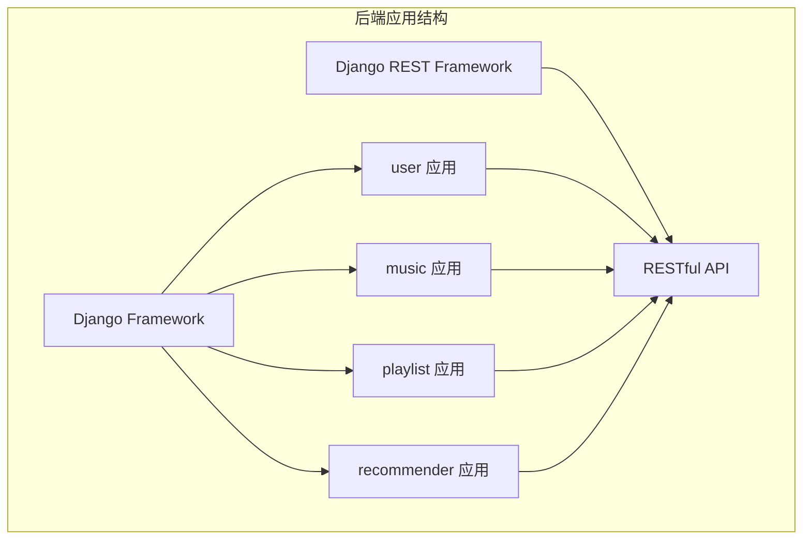
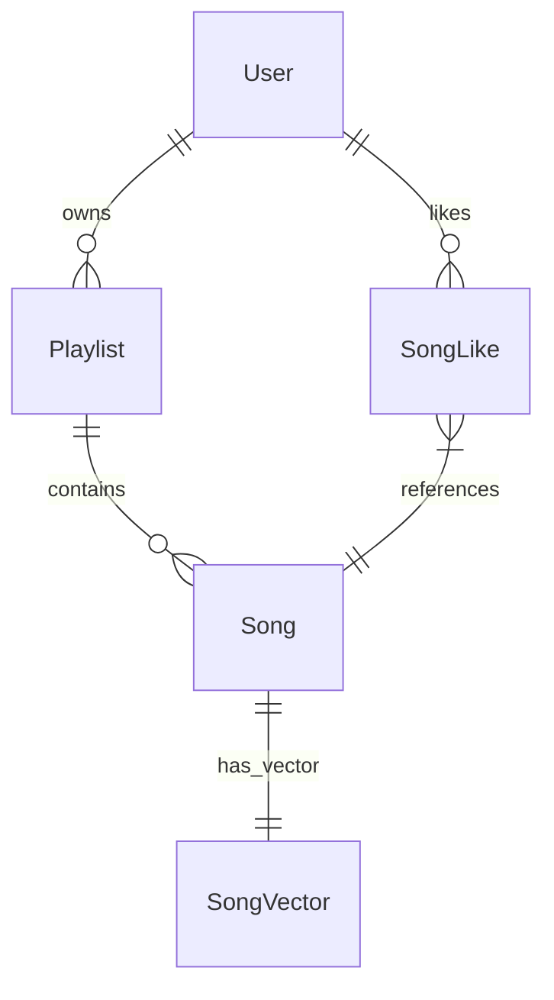

# RhythmFusion 后端文档

本文档详细介绍了 RhythmFusion 音乐推荐系统的后端架构、API 接口设计、数据模型以及推荐算法实现。

## 后端架构概述

RhythmFusion 后端基于 Django 5.0.2 和 Django REST Framework 构建，采用模块化设计，主要包含以下几个应用模块：

- **user**: 用户管理模块，处理用户认证与授权
- **music**: 音乐数据模块，管理歌曲元数据
- **playlist**: 歌单管理模块，实现歌单的增删改查
- **recommender**: 推荐系统模块，实现个性化推荐算法



## 目录结构

后端项目的主要目录结构如下：

```
backend/
├── backend/           # 项目主配置
├── user/              # 用户管理应用
├── music/             # 音乐数据应用
├── playlist/          # 歌单管理应用
├── recommender/       # 推荐系统应用
│   ├── data/          # 向量和索引数据
│   └── management/    # 自定义管理命令
└── manage.py          # Django管理脚本
```

## 核心功能模块

### 1. 用户管理模块

详见 [用户模块文档](user.md)

- 用户注册、登录和认证
- 用户信息管理
- 权限控制

### 2. 音乐数据模块

详见 [音乐模块文档](music.md)

- 歌曲元数据管理
- 歌曲搜索接口
- 数据导入与批处理

### 3. 歌单管理模块

详见 [歌单模块文档](playlist.md)

- 歌单的创建与管理
- 歌曲的添加与删除
- 个性化歌单功能

### 4. 推荐系统模块

详见 [推荐系统文档](recommendation.md)

- 协同过滤算法实现
- 内容特征推荐实现
- 混合推荐策略

## API 接口设计

RhythmFusion 提供了一系列 RESTful API 接口，详细 API 文档请参考 [API 文档](../api_doc.md)。

## 数据模型设计

系统的核心数据模型包括：User、Song、Playlist、SongVector 等。详细模型设计请参考 [数据模型文档](models.md)。



## 推荐算法

RhythmFusion 采用混合推荐算法，结合协同过滤和内容特征推荐。详细算法设计请参考 [推荐算法文档](recommendation.md)。

## 后端开发指南

如果您想参与 RhythmFusion 后端开发，请参考 [后端开发指南](development.md)，其中包含本地开发环境设置、代码规范和贡献流程等信息。 