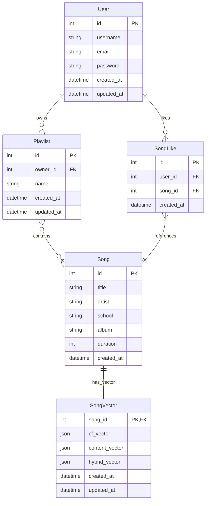

# RhythmFusion 数据模型设计

本文档详细介绍了 RhythmFusion 音乐推荐系统的数据模型设计，包括主要实体、关系以及字段定义。

## 数据库 ER 图

下图展示了系统的实体关系图：



## 核心模型定义

### 1. User 模型

User 模型扩展了 Django 内置的用户模型，添加了额外的用户相关字段。

```python
# user/models.py
from django.db import models
from django.contrib.auth.models import AbstractUser

class User(AbstractUser):
    avatar = models.ImageField(upload_to='avatars/', null=True, blank=True)
    bio = models.TextField(max_length=500, blank=True)
    
    class Meta:
        db_table = 'auth_user'
```

### 2. Song 模型

Song 模型存储歌曲的基本信息，是系统的核心实体之一。

```python
# music/models.py
from django.db import models

class Song(models.Model):
    title = models.CharField(max_length=200)
    artist = models.CharField(max_length=200)
    school = models.CharField(max_length=100, blank=True)
    album = models.CharField(max_length=200, blank=True)
    duration = models.IntegerField(default=0, help_text="Duration in seconds")
    created_at = models.DateTimeField(auto_now_add=True)
    
    class Meta:
        db_table = 'music_song'
        ordering = ['title', 'artist']
        
    def __str__(self):
        return f"{self.title} - {self.artist}"
```

### 3. Playlist 模型

Playlist 模型代表用户创建的歌单，它与用户和歌曲之间形成关联关系。

```python
# playlist/models.py
from django.db import models
from django.conf import settings
from music.models import Song

class Playlist(models.Model):
    name = models.CharField(max_length=200)
    owner = models.ForeignKey(settings.AUTH_USER_MODEL, on_delete=models.CASCADE)
    songs = models.ManyToManyField(Song, related_name='playlists')
    created_at = models.DateTimeField(auto_now_add=True)
    updated_at = models.DateTimeField(auto_now=True)
    
    class Meta:
        db_table = 'playlist_playlist'
        ordering = ['-updated_at']
        
    def __str__(self):
        return f"{self.name} ({self.owner.username})"
```

### 4. SongLike 模型

SongLike 模型记录用户对歌曲的收藏行为，用于构建用户偏好数据。

```python
# music/models.py
class SongLike(models.Model):
    user = models.ForeignKey(settings.AUTH_USER_MODEL, on_delete=models.CASCADE)
    song = models.ForeignKey(Song, on_delete=models.CASCADE)
    created_at = models.DateTimeField(auto_now_add=True)
    
    class Meta:
        db_table = 'music_songlike'
        unique_together = ('user', 'song')
```

### 5. SongVector 模型

SongVector 模型存储歌曲的特征向量，是推荐系统的核心数据结构。

```python
# recommender/models.py
from django.db import models
from music.models import Song

class SongVector(models.Model):
    song = models.OneToOneField(Song, on_delete=models.CASCADE, primary_key=True)
    cf_vector = models.JSONField(blank=True, null=True)
    content_vector = models.JSONField(blank=True, null=True)
    hybrid_vector = models.JSONField(blank=True, null=True)
    created_at = models.DateTimeField(auto_now_add=True)
    updated_at = models.DateTimeField(auto_now=True)
    
    class Meta:
        db_table = "song_vectors"
```

## 模型关系说明

### 1. 用户与歌单关系

- 一个用户可以拥有多个歌单（一对多关系）
- 通过 `Playlist.owner` 外键字段关联

### 2. 歌单与歌曲关系

- 一个歌单可以包含多首歌曲，一首歌曲可以属于多个歌单（多对多关系）
- 通过 `Playlist.songs` 多对多字段关联

### 3. 用户与歌曲喜好关系

- 一个用户可以喜欢多首歌曲，一首歌曲可以被多个用户喜欢（多对多关系）
- 通过 `SongLike` 模型建立关联，并记录时间戳

### 4. 歌曲与向量关系

- 一首歌曲对应唯一一组特征向量（一对一关系）
- 通过 `SongVector.song` 一对一字段关联，使用歌曲 ID 作为主键

## 数据库索引设计

为了提高查询性能，系统在以下字段上创建了索引：

- `User.username`: 用于用户登录和查询
- `Song.title`, `Song.artist`: 用于歌曲搜索
- `Playlist.owner_id`: 用于查询用户的歌单
- `SongLike.user_id`, `SongLike.song_id`: 用于查询用户喜欢的歌曲

## 数据完整性约束

系统实施了以下数据完整性约束：

1. **主键约束**: 所有模型都有唯一主键
2. **外键约束**: 使用级联删除保证引用完整性
3. **唯一约束**: `SongLike` 的 (user, song) 组合必须唯一
4. **非空约束**: 歌曲标题、歌单名称等必填字段

## 模型序列化器

为了支持 API 操作，系统定义了对应的序列化器：

```python
# 用户序列化器
class UserSerializer(serializers.ModelSerializer):
    class Meta:
        model = User
        fields = ('id', 'username', 'email', 'avatar', 'bio')
        read_only_fields = ('id',)

# 歌曲序列化器
class SongSerializer(serializers.ModelSerializer):
    class Meta:
        model = Song
        fields = ('id', 'title', 'artist', 'school', 'album', 'duration')

# 歌单序列化器
class PlaylistSerializer(serializers.ModelSerializer):
    songs = SongSerializer(many=True, read_only=True)
    
    class Meta:
        model = Playlist
        fields = ('id', 'name', 'owner', 'songs', 'created_at', 'updated_at')
        read_only_fields = ('id', 'owner', 'created_at', 'updated_at')
```

## 数据库迁移

系统使用 Django 的迁移系统管理数据库架构变更。开发者可以通过以下命令创建和应用迁移：

```bash
# 创建迁移文件
python manage.py makemigrations

# 应用迁移
python manage.py migrate
```

## 数据导入与初始化

系统支持通过 CSV 文件批量导入歌曲数据。详细流程请参考 [数据导入文档](../data_preparation.md)。 