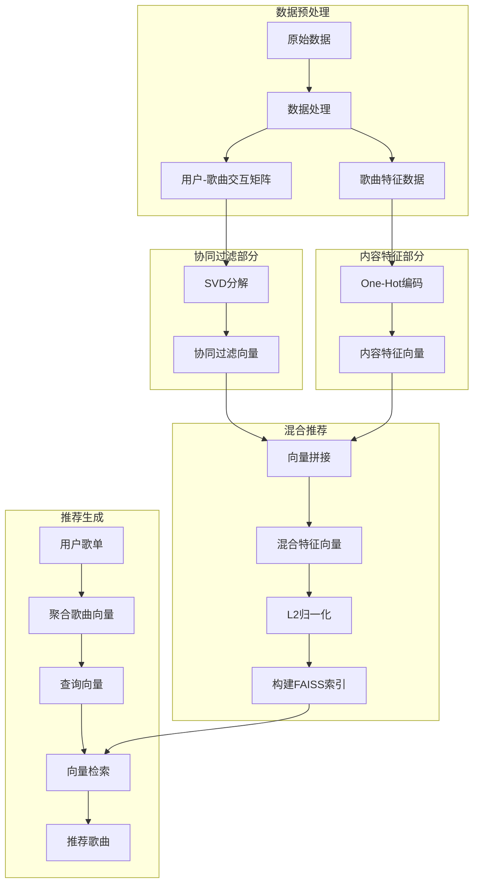

# RhythmFusion 推荐系统

本文档详细介绍了 RhythmFusion 音乐推荐系统的算法原理、实现方式和使用指南。

## 推荐系统架构

RhythmFusion 采用混合推荐算法，结合了协同过滤（Collaborative Filtering）和基于内容的推荐（Content-based Recommendation）两种经典方法，通过向量化表示用户偏好和歌曲特征，实现高效、准确的个性化推荐。



## 推荐算法核心组件

### 1. 协同过滤模块

协同过滤模块基于用户对歌曲的交互行为（如收藏、播放等），通过 SVD（Singular Value Decomposition）算法提取潜在特征空间，生成歌曲的协同过滤向量表示。

#### 核心实现

```python
# SVD分解实现
svd = TruncatedSVD(n_components=K, n_iter=10, random_state=42)
item_factors = svd.fit_transform(csr.T)  # shape = (n_songs, K)

# 写入向量
for idx, song_id in enumerate(song_ids):
    vec = item_factors[idx].tolist()
    SongVector.objects.update_or_create(
        song_id=song_id, defaults={"cf_vector": vec}
    )
```

### 2. 内容特征模块

内容特征模块基于歌曲的元数据属性（如艺术家、流派等），通过 One-Hot 编码生成歌曲的内容特征向量表示。

#### 核心实现

```python
# 构建 One-Hot 索引
artist_idx = {a: i for i, a in enumerate(artists)}
school_idx = {s: i for i, s in enumerate(schools)}
vector_len = len(artists) + len(schools)

# 生成内容向量
for rec in songs:
    song_id = rec["id"]
    vector = [0] * vector_len
    art, sch = rec["artist"], rec["school"]
    if art in artist_idx:
        vector[artist_idx[art]] = 1
    if sch in school_idx:
        vector[len(artists) + school_idx[sch]] = 1
        
    SongVector.objects.update_or_create(
        song_id=song_id, defaults={"content_vector": vector}
    )
```

### 3. 混合向量生成

混合向量模块将协同过滤向量和内容特征向量进行拼接和规范化，形成统一的混合特征表示。

#### 核心实现

```python
# 生成混合向量
for sv in SongVector.objects.all():
    cf = sv.cf_vector or []
    ct = sv.content_vector or []

    # 当 cf 全为空时，hybrid=content
    if not cf:
        hybrid = ct
    # 当 content 全为空时，hybrid=cf
    elif not ct:
        hybrid = cf
    else:
        # cf 或 ct 都是 list of numbers
        cf_arr = np.array(cf, dtype=np.float32)
        ct_arr = np.array(ct, dtype=np.float32)
        hybrid_arr = np.concatenate([cf_arr, ct_arr])
        hybrid = hybrid_arr.tolist()

    SongVector.objects.filter(
        song=sv.song).update(hybrid_vector=hybrid)
```

### 4. FAISS 索引构建

FAISS 索引模块将混合向量构建为高效的向量搜索索引，支持快速的相似性检索。

#### 核心实现

```python
# 收集所有混合向量
entries = SongVector.objects.exclude(hybrid_vector__isnull=True)
song_ids = []
vecs = []
for sv in entries:
    song_ids.append(sv.song_id)
    vecs.append(sv.hybrid_vector)

vecs = np.array(vecs, dtype=np.float32)
# 归一化向量（余弦相似度）
faiss.normalize_L2(vecs)

# 构建 Flat IP 索引（内积即余弦相似度）
d = vecs.shape[1]
index = faiss.IndexFlatIP(d)
index.add(vecs)

# 持久化索引
faiss.write_index(index, INDEX_PATH)
np.save(MAP_PATH, np.array(song_ids, dtype=np.int64))
```

### 5. 推荐生成流程

基于用户歌单内容，生成个性化推荐结果。

#### 核心实现

```python
# 获取歌单中的歌曲向量
vecs = []
for sid in song_ids:
    sv = SongVector.objects.filter(song_id=sid).first()
    if sv and sv.hybrid_vector:
        vecs.append(sv.hybrid_vector)

# 计算平均向量作为查询
arr = np.array(vecs, dtype=np.float32)
faiss.normalize_L2(arr)
query = arr.mean(axis=0, keepdims=True)
faiss.normalize_L2(query)

# 执行向量检索
index, song_map = _load_index()
D, I = index.search(query, 10)
rec_ids = song_map[I[0]].tolist()

# 获取推荐歌曲
songs = Song.objects.filter(id__in=rec_ids)
```

## 推荐系统管理命令

RhythmFusion 提供了一系列 Django 管理命令，用于构建和训练推荐系统：

### 构建交互矩阵

```bash
python manage.py build_interaction_matrix
```

该命令收集用户-歌曲交互数据，构建稀疏矩阵用于协同过滤。

### 训练协同过滤模型

```bash
python manage.py train_cf_model --factors 50
```

该命令使用 SVD 算法训练协同过滤模型，生成歌曲协同过滤向量。

### 生成内容特征向量

```bash
python manage.py generate_content_vectors
```

该命令基于歌曲元数据，生成内容特征向量。

### 生成混合向量

```bash
python manage.py generate_hybrid_vectors
```

该命令将协同过滤向量和内容特征向量合并为混合向量。

### 构建 FAISS 索引

```bash
python manage.py build_faiss_index
```

该命令将混合向量构建为 FAISS 索引，用于高效检索。

## 推荐效果评估

RhythmFusion 推荐系统的性能受多种因素影响：

1. **数据量**: 用户交互数据越丰富，协同过滤效果越好
2. **数据质量**: 歌曲元数据的完整性影响内容特征推荐
3. **算法参数**: SVD 的潜在因子数量（K）影响模型表达能力
4. **混合策略**: 协同过滤和内容特征的结合方式影响最终效果

## 推荐系统扩展方向

RhythmFusion 推荐系统的未来扩展方向包括：

1. **引入深度学习模型**: 如 Neural Collaborative Filtering
2. **考虑时序信息**: 加入用户最近听歌历史的时间衰减因子
3. **多目标优化**: 平衡推荐准确性和多样性
4. **实时更新**: 支持增量式模型更新，而非全量重训
5. **个性化权重**: 根据用户偏好动态调整协同过滤和内容特征的权重

## 总结

RhythmFusion 推荐系统通过融合协同过滤和内容特征推荐，实现了高效、准确的音乐推荐。系统的模块化设计使其易于维护和扩展，为用户提供个性化的音乐体验。 