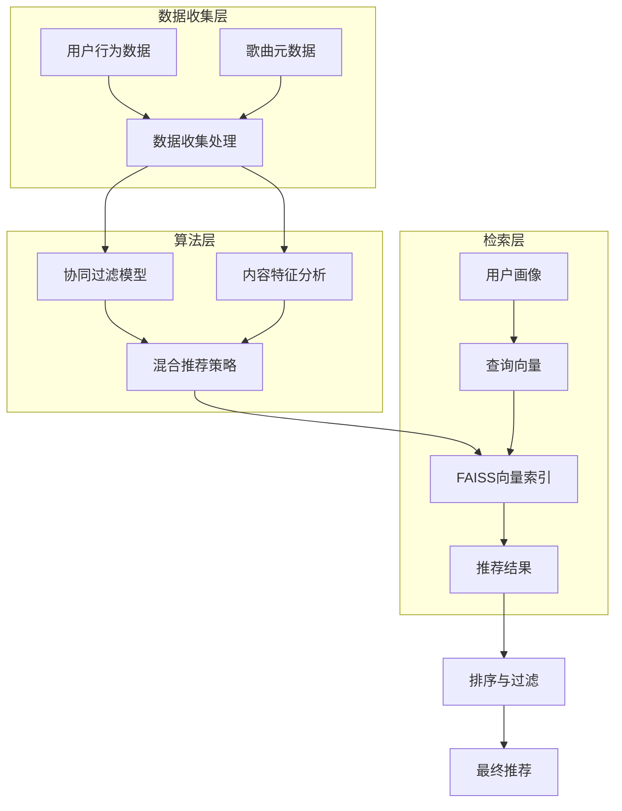
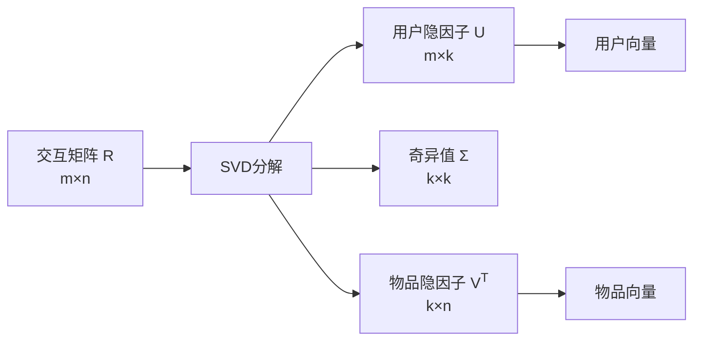
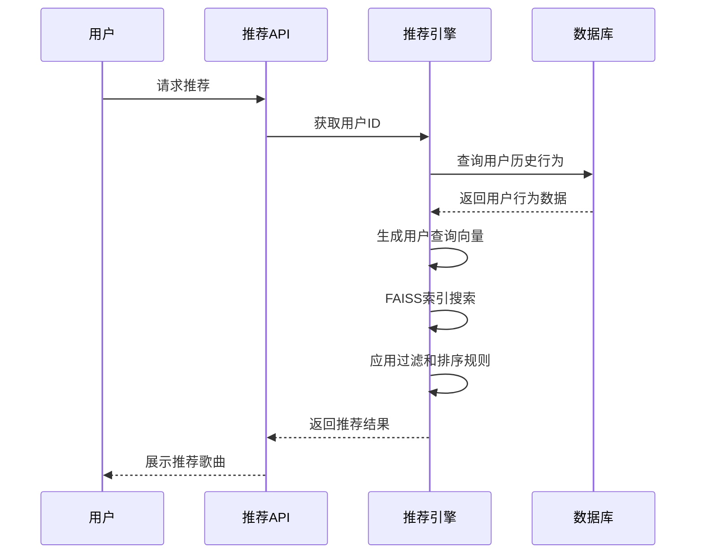
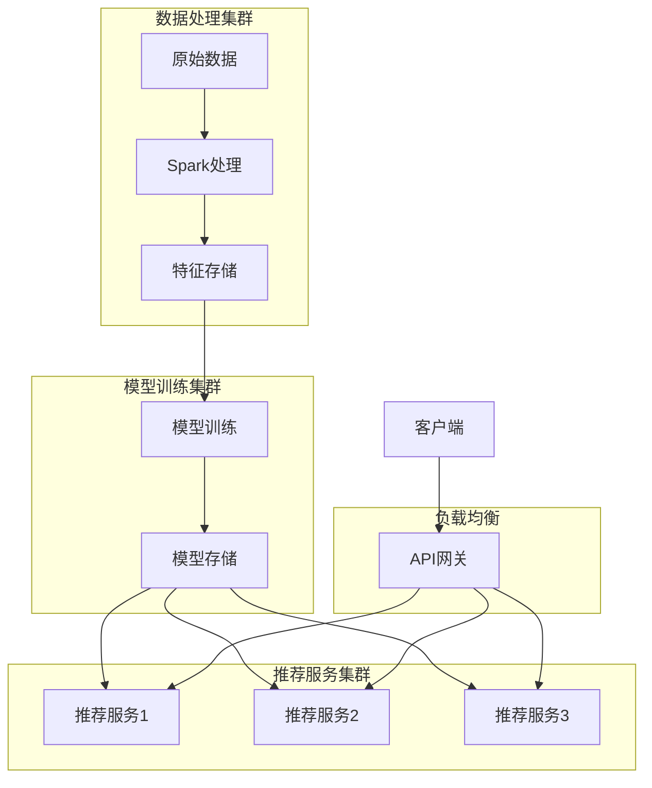

# RhythmFusion 推荐算法设计

本文档详细介绍 RhythmFusion 音乐推荐系统中使用的算法原理、实现方式和工作流程。RhythmFusion 采用混合推荐策略，结合协同过滤和内容特征分析，为用户提供精准的个性化音乐推荐。

## 推荐系统架构

RhythmFusion 的推荐系统建立在混合架构之上，融合了多种算法：



## 数据准备与处理

### 用户-物品交互矩阵

推荐系统的基础是用户-物品交互矩阵，记录用户与歌曲的交互行为：

```python
def build_interaction_matrix():
    """构建用户-歌曲交互矩阵"""
    interactions = UserInteraction.objects.all()
  
    # 初始化交互矩阵
    user_indices = {user.id: i for i, user in enumerate(User.objects.all())}
    item_indices = {song.id: i for i, song in enumerate(Song.objects.all())}
  
    # 构建稀疏矩阵
    rows, cols, data = [], [], []
    for interaction in interactions:
        user_idx = user_indices.get(interaction.user_id)
        item_idx = item_indices.get(interaction.song_id)
        if user_idx is not None and item_idx is not None:
            rows.append(user_idx)
            cols.append(item_idx)
            # 根据交互类型赋予不同权重
            weight = 1.0
            if interaction.interaction_type == 'like':
                weight = 5.0
            elif interaction.interaction_type == 'play':
                weight = 2.0
            data.append(weight)
  
    # 创建scipy稀疏矩阵
    matrix = scipy.sparse.coo_matrix((data, (rows, cols)))
    return matrix, user_indices, item_indices
```

### 内容特征提取

从歌曲元数据中提取特征，构建内容特征向量：

```python
def extract_content_features(song):
    """从歌曲元数据提取内容特征向量"""
    # 提取基本特征
    features = []
  
    # 流派特征 (独热编码)
    genres = Genre.objects.all()
    genre_map = {genre.id: i for i, genre in enumerate(genres)}
    genre_vector = np.zeros(len(genres))
    if song.genre_id in genre_map:
        genre_vector[genre_map[song.genre_id]] = 1.0
    features.append(genre_vector)
  
    # 艺术家特征
    artist_vector = text_to_vector(song.artist, dim=50)
    features.append(artist_vector)
  
    # 歌曲名特征
    title_vector = text_to_vector(song.title, dim=30)
    features.append(title_vector)
  
    # 将所有特征连接成一个向量
    return np.concatenate(features)
```

## 协同过滤模型

### SVD 矩阵分解

我们使用奇异值分解 (SVD) 作为协同过滤的核心算法：

```python
def train_cf_model(interaction_matrix, factors=50):
    """训练协同过滤模型，使用SVD分解用户-物品交互矩阵"""
    # 创建SVD模型
    model = TruncatedSVD(n_components=factors, random_state=42)
  
    # 训练模型
    item_factors = model.fit_transform(interaction_matrix)
    user_factors = model.components_.T
  
    return user_factors, item_factors
```

### 用户和物品隐因子

SVD 分解将交互矩阵分解为用户隐因子和物品隐因子，这些隐因子捕捉了用户偏好和物品特征：



## 混合推荐策略

### 混合向量生成

将协同过滤生成的隐因子与内容特征向量结合，生成混合特征向量：

```python
def generate_hybrid_vectors(cf_item_factors, content_vectors, alpha=0.7):
    """生成混合特征向量，结合协同过滤和内容特征"""
    # 确保向量维度一致
    if cf_item_factors.shape[0] != content_vectors.shape[0]:
        raise ValueError("物品数量不匹配")
  
    # 标准化向量
    cf_norm = sklearn.preprocessing.normalize(cf_item_factors)
    content_norm = sklearn.preprocessing.normalize(content_vectors)
  
    # 加权组合
    hybrid_vectors = alpha * cf_norm + (1 - alpha) * content_norm
  
    # 再次标准化
    return sklearn.preprocessing.normalize(hybrid_vectors)
```

### 冷启动问题解决

对于新用户和新物品的冷启动问题，我们采用不同的策略：

1. **新用户冷启动**：基于人口统计学信息和初始偏好设置
2. **新物品冷启动**：完全基于内容特征的推荐

## FAISS 向量检索

### 索引构建

使用 Facebook AI Similarity Search (FAISS) 构建高效的向量索引：

```python
def build_faiss_index(vectors):
    """构建FAISS索引用于高效相似度搜索"""
    dimension = vectors.shape[1]
  
    # 创建索引
    index = faiss.IndexFlatL2(dimension)  # L2距离
  
    # 添加向量到索引
    index.add(vectors.astype(np.float32))
  
    return index
```

### 最近邻搜索

通过查询向量在 FAISS 索引中搜索相似向量：

```python
def search_similar_items(index, query_vector, k=10):
    """在FAISS索引中搜索最相似的k个物品"""
    query_vector = query_vector.astype(np.float32).reshape(1, -1)
  
    # 执行搜索
    distances, indices = index.search(query_vector, k)
  
    return indices[0], distances[0]
```

## 个性化推荐流程

### 用户向量生成

为每个用户生成查询向量，用于检索相似歌曲：

```python
def generate_user_vector(user_id, user_factors, user_indices):
    """生成用户查询向量"""
    if user_id in user_indices:
        # 对已有用户，使用协同过滤的用户向量
        return user_factors[user_indices[user_id]]
    else:
        # 对新用户，基于初始偏好生成向量
        return generate_default_user_vector()
```

### 推荐生成过程



## 推荐类型

RhythmFusion 提供多种类型的推荐：

### 1. 个性化推荐

基于用户的历史行为和偏好，生成个性化的歌曲推荐：

```python
def get_personalized_recommendations(user_id, count=10):
    """获取个性化推荐"""
    # 生成用户查询向量
    user_vector = generate_user_vector(user_id, user_factors, user_indices)
  
    # 在FAISS索引中搜索相似歌曲
    indices, _ = search_similar_items(faiss_index, user_vector, k=count*2)
  
    # 过滤用户已听过的歌曲
    listened_songs = set(UserInteraction.objects.filter(
        user_id=user_id, interaction_type='play'
    ).values_list('song_id', flat=True))
  
    # 获取推荐结果
    recommended_songs = []
    for idx in indices:
        song_id = item_id_map[idx]
        if song_id not in listened_songs:
            recommended_songs.append(song_id)
            if len(recommended_songs) >= count:
                break
  
    return Song.objects.filter(id__in=recommended_songs)
```

### 2. 基于歌曲的推荐

为特定歌曲查找相似歌曲：

```python
def get_similar_songs(song_id, count=10):
    """获取与指定歌曲相似的歌曲"""
    if song_id not in item_indices:
        return []
  
    # 获取歌曲向量
    song_vector = hybrid_vectors[item_indices[song_id]]
  
    # 搜索相似歌曲
    indices, _ = search_similar_items(faiss_index, song_vector, k=count+1)
  
    # 排除输入歌曲本身
    similar_songs = []
    for idx in indices:
        if item_id_map[idx] != song_id:
            similar_songs.append(item_id_map[idx])
  
    return Song.objects.filter(id__in=similar_songs)
```

### 3. 基于流派的推荐

针对特定音乐流派的推荐：

```python
def get_genre_recommendations(genre_id, count=10):
    """获取特定流派的推荐歌曲"""
    # 获取流派的代表性向量
    genre_songs = Song.objects.filter(genre_id=genre_id)
    if not genre_songs:
        return []
  
    # 计算流派中心向量
    genre_vectors = []
    for song in genre_songs:
        if song.id in item_indices:
            genre_vectors.append(hybrid_vectors[item_indices[song.id]])
  
    if not genre_vectors:
        return []
  
    # 使用流派中心向量作为查询
    genre_center = np.mean(genre_vectors, axis=0)
  
    # 搜索相似歌曲
    indices, _ = search_similar_items(faiss_index, genre_center, k=count*2)
  
    # 选择最相似的歌曲
    return [Song.objects.get(id=item_id_map[idx]) for idx in indices[:count]]
```

## 模型更新与维护

推荐系统需要定期更新以适应用户行为和内容的变化：

1. **增量更新**：处理新的用户互动数据
2. **周期性重训练**：定期重新训练模型
3. **模型评估**：监控推荐质量

```python
def schedule_model_updates():
    """设置定时任务更新推荐模型"""
    # 每天增量更新用户交互数据
    schedule.every().day.at("03:00").do(update_interaction_data)
  
    # 每周重新训练协同过滤模型
    schedule.every().week.do(retrain_cf_model)
  
    # 每月重建完整的推荐系统
    schedule.every(30).days.do(rebuild_recommendation_system)
```

## 性能优化

### 优化策略

1. **向量量化**：减少内存占用
2. **批量处理**：高效处理大量请求
3. **缓存机制**：缓存常用推荐结果

### 扩展性考虑

对于大规模推荐系统，我们采用分布式架构：


