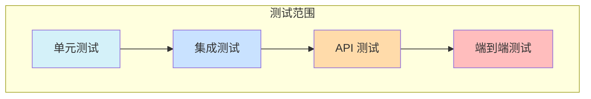

# 测试策略

本文档概述了 RhythmFusion 音乐推荐系统的全面测试策略，涵盖从单元测试到端到端集成测试的各个方面。

## 测试理念

RhythmFusion 在可能的情况下采用测试驱动开发（TDD）方法，注重保持高测试覆盖率和快速、可靠的测试执行。测试策略围绕以下关键原则设计：

1. **全面覆盖**：测试应用的所有层面
2. **快速反馈**：快速执行测试以支持快速开发
3. **可靠性**：测试应具有确定性，避免偶发失败
4. **隔离性**：测试之间不应相互依赖
5. **真实数据**：测试应使用逼真的测试数据

## 测试层级

RhythmFusion 在多个层级上实施测试：



### 单元测试

单元测试关注对单个函数、类和方法的隔离测试：

* **覆盖目标**：关键组件 > 90%，整体 > 80%
* **执行速度**：整个单元测试套件 < 10 秒
* **工具**：pytest、unittest.mock

### 集成测试

集成测试验证不同组件协同工作是否正确：

* **覆盖目标**：组件交互 > 75%
* **执行速度**：集成测试套件 < 60 秒
* **工具**：pytest、Django 测试客户端

### API 测试

API 测试专门针对 RESTful 接口端点进行验证：

* **覆盖目标**：所有 API 端点 100%
* **执行速度**：API 测试套件 < 120 秒
* **工具**：DRF 测试框架、pytest

### 端到端测试

端到端测试验证整个系统的用户流程是否按预期工作：

* **覆盖目标**：所有核心用户旅程
* **执行速度**：E2E 测试套件 < 5 分钟
* **工具**：Selenium、Cypress（前端）

## 测试目录结构

测试代码按以下结构组织：

```
backend/
├── app1/
│   ├── tests/
│   │   ├── __init__.py
│   │   ├── test_models.py       # 模型的单元测试
│   │   ├── test_serializers.py  # 序列化器的单元测试
│   │   ├── test_views.py        # 视图的集成测试
│   │   └── test_api.py          # API 测试
│   └── ...
├── app2/
│   ├── tests/
│   │   └── ...
│   └── ...
├── integration_tests/           # 跨应用集成测试
│   ├── __init__.py
│   ├── test_user_playlist.py
│   └── ...
└── e2e_tests/                   # 端到端测试
    ├── __init__.py
    ├── test_recommendation.py
    └── ...
```

## 单元测试

单元测试关注隔离地测试各个组件。每个 Django 应用应包含以下方面的单元测试：

* 模型
* 序列化器
* 表单
* 工具函数
* 服务

### 示例：测试模型

```python
# music/tests/test_models.py
import pytest
from music.models import Song, Artist, Genre

@pytest.mark.django_db
class TestSongModel:
    def test_song_creation(self):
        # 准备
        artist = Artist.objects.create(name="Test Artist")
        genre = Genre.objects.create(name="Test Genre")
    
        # 执行
        song = Song.objects.create(
            title="Test Song",
            artist=artist,
            genre=genre,
            duration=180
        )
    
        # 断言
        assert song.title == "Test Song"
        assert song.artist.name == "Test Artist"
        assert song.genre.name == "Test Genre"
        assert song.duration == 180
  
    def test_song_str_representation(self):
        # 准备
        artist = Artist.objects.create(name="Test Artist")
        song = Song.objects.create(title="Test Song", artist=artist)
    
        # 执行 & 断言
        assert str(song) == "Test Song by Test Artist"
```

### 示例：测试序列化器

```python
# music/tests/test_serializers.py
import pytest
from music.models import Song, Artist
from music.serializers import SongSerializer

@pytest.mark.django_db
class TestSongSerializer:
    def test_valid_song_serialization(self):
        # 准备
        artist = Artist.objects.create(name="Test Artist")
        song = Song.objects.create(
            title="Test Song",
            artist=artist,
            duration=180
        )
    
        # 执行
        serializer = SongSerializer(song)
    
        # 断言
        assert serializer.data['title'] == "Test Song"
        assert serializer.data['artist_name'] == "Test Artist"
        assert serializer.data['duration'] == 180
  
    def test_song_deserialization(self):
        # 准备
        artist = Artist.objects.create(name="Test Artist")
        valid_data = {
            'title': 'New Song',
            'artist': artist.id,
            'duration': 240
        }
    
        # 执行
        serializer = SongSerializer(data=valid_data)
    
        # 断言
        assert serializer.is_valid()
    
        # 执行 - 保存序列化器
        song = serializer.save()
    
        # 断言
        assert song.title == 'New Song'
        assert song.artist.id == artist.id
        assert song.duration == 240
```

### 模拟(Mock)

对于依赖和外部服务，使用模拟隔离被测试代码：

```python
# recommender/tests/test_recommendation.py
from unittest.mock import patch, MagicMock
from recommender.recommendation import RecommendationService

def test_recommendation_service_calls_faiss():
    # 准备
    mock_faiss = MagicMock()
    mock_faiss.search.return_value = ([0, 1, 2], [0.1, 0.2, 0.3])
  
    # 执行
    with patch('recommender.recommendation.faiss', mock_faiss):
        service = RecommendationService()
        results = service.get_similar_items([0.5, 0.5, 0.5], k=3)
  
    # 断言
    mock_faiss.search.assert_called_once()
    assert len(results) == 3
```

## 集成测试

集成测试验证组件之间的交互：

### 示例：测试视图逻辑

```python
# playlist/tests/test_views.py
import pytest
from django.urls import reverse
from rest_framework.test import APIClient
from playlist.models import Playlist
from music.models import Song
from django.contrib.auth import get_user_model

User = get_user_model()

@pytest.mark.django_db
class TestPlaylistViews:
    @pytest.fixture
    def api_client(self):
        return APIClient()
  
    @pytest.fixture
    def user(self):
        return User.objects.create_user(
            username='testuser',
            email='test@example.com',
            password='testpass123'
        )
  
    @pytest.fixture
    def playlist(self, user):
        return Playlist.objects.create(
            user=user,
            name='Test Playlist',
            description='Test Description'
        )
  
    @pytest.fixture
    def songs(self):
        return [
            Song.objects.create(title=f'Song {i}')
            for i in range(3)
        ]
  
    def test_add_song_to_playlist(self, api_client, user, playlist, songs):
        # 准备：模拟登录
        api_client.force_authenticate(user=user)
        url = reverse('playlist-add-song', args=[playlist.id])
    
        # 执行
        response = api_client.post(url, {'song_id': songs[0].id})
    
        # 断言
        assert response.status_code == 201
        assert playlist.tracks.count() == 1
        assert playlist.tracks.first().song == songs[0]
  
    def test_unauthorized_user_cannot_modify_playlist(self, api_client, playlist, songs):
        # 准备：未登录
        url = reverse('playlist-add-song', args=[playlist.id])
    
        # 执行
        response = api_client.post(url, {'song_id': songs[0].id})
    
        # 断言
        assert response.status_code == 401
        assert playlist.tracks.count() == 0
```

## API 测试

使用 Django REST Framework 的测试工具验证 API 端点：

### 示例：测试 API 端点

```python
# music/tests/test_api.py
import pytest
from django.urls import reverse
from rest_framework.test import APIClient
from music.models import Song, Genre
from django.contrib.auth import get_user_model

User = get_user_model()

@pytest.mark.django_db
class TestMusicAPI:
    @pytest.fixture
    def api_client(self):
        return APIClient()
  
    @pytest.fixture
    def admin_user(self):
        return User.objects.create_superuser(
            username='admin',
            email='admin@example.com',
            password='adminpass123'
        )
  
    @pytest.fixture
    def songs(self):
        genre = Genre.objects.create(name='Rock')
        return [
            Song.objects.create(
                title=f'Song {i}',
                genre=genre,
                duration=180 + i*30
            )
            for i in range(5)
        ]
  
    def test_list_songs(self, api_client, songs):
        # 执行
        url = reverse('song-list')
        response = api_client.get(url)
    
        # 断言
        assert response.status_code == 200
        assert len(response.data['results']) == 5
  
    def test_search_songs(self, api_client, songs):
        # 执行
        url = reverse('song-search')
        response = api_client.get(url, {'query': 'Song 3'})
    
        # 断言
        assert response.status_code == 200
        assert len(response.data['results']) == 1
        assert response.data['results'][0]['title'] == 'Song 3'
  
    def test_create_song_requires_authentication(self, api_client):
        # 执行
        url = reverse('song-list')
        data = {'title': 'New Song', 'duration': 240}
        response = api_client.post(url, data)
    
        # 断言
        assert response.status_code == 401
  
    def test_admin_can_create_song(self, api_client, admin_user):
        # 准备：以管理员身份登录
        api_client.force_authenticate(user=admin_user)
        url = reverse('song-list')
        data = {'title': 'New Song', 'duration': 240}
    
        # 执行
        response = api_client.post(url, data)
    
        # 断言
        assert response.status_code == 201
        assert response.data['title'] == 'New Song'
```

## 推荐引擎测试

推荐引擎测试需采用特定方法：

### 协同过滤测试

```python
# recommender/tests/test_collaborative_filtering.py
import pytest
import numpy as np
from scipy.sparse import csr_matrix
from recommender.collaborative_filtering import SVDRecommender

class TestSVDRecommender:
    @pytest.fixture
    def interaction_matrix(self):
        # 创建稀疏的用户-项目交互矩阵
        data = [1, 5, 4, 3, 2, 1, 5, 4]
        row = [0, 0, 0, 1, 1, 2, 2, 2]
        col = [0, 1, 3, 1, 2, 0, 2, 3]
        return csr_matrix((data, (row, col)), shape=(3, 4))
  
    def test_svd_decomposition(self, interaction_matrix):
        recommender = SVDRecommender(n_factors=2)
        recommender.fit(interaction_matrix)
        assert recommender.user_factors.shape == (3, 2)
        assert recommender.item_factors.shape == (4, 2)
  
    def test_predict_rating(self, interaction_matrix):
        recommender = SVDRecommender(n_factors=2)
        recommender.fit(interaction_matrix)
        predicted = recommender.predict(0, 0)
        assert isinstance(predicted, float)
        assert 0 <= predicted <= 5
        predicted_new = recommender.predict(0, 2)
        assert isinstance(predicted_new, float)
```

### 基于内容推荐测试

```python
# recommender/tests/test_content_based.py
import pytest
import numpy as np
from recommender.content_based import ContentFeatureExtractor

class TestContentFeatureExtractor:
    @pytest.fixture
    def songs(self):
        return [
            {
                'id': 1,
                'title': 'Rock Song',
                'artist': 'Rock Artist',
                'genre': 'Rock',
                'year': 2010
            },
            {
                'id': 2,
                'title': 'Pop Song',
                'artist': 'Pop Artist',
                'genre': 'Pop',
                'year': 2015
            }
        ]
  
    def test_extract_features(self, songs):
        extractor = ContentFeatureExtractor()
        feature_vectors = [extractor.extract_features(song) for song in songs]
        assert len(feature_vectors) == 2
        assert all(isinstance(v, np.ndarray) for v in feature_vectors)
        assert not np.array_equal(feature_vectors[0], feature_vectors[1])
```

## 测试夹具和工厂

为确保一致的测试数据，使用 pytest 夹具和 factory\_boy：

### 示例：曲目工厂

```python
# music/tests/factories.py
import factory
from music.models import Genre, Artist, Album, Song
from django.utils import timezone

class GenreFactory(factory.django.DjangoModelFactory):
    class Meta:
        model = Genre
    name = factory.Sequence(lambda n: f'Genre {n}')
    description = factory.Faker('paragraph', nb_sentences=3)

class ArtistFactory(factory.django.DjangoModelFactory):
    class Meta:
        model = Artist
    name = factory.Sequence(lambda n: f'Artist {n}')
    bio = factory.Faker('paragraph', nb_sentences=5)

class AlbumFactory(factory.django.DjangoModelFactory):
    class Meta:
        model = Album
    title = factory.Sequence(lambda n: f'Album {n}')
    artist = factory.SubFactory(ArtistFactory)
    release_date = factory.Faker('date_this_decade')

class SongFactory(factory.django.DjangoModelFactory):
    class Meta:
        model = Song
    title = factory.Sequence(lambda n: f'Song {n}')
    artist = factory.SubFactory(ArtistFactory)
    album = factory.SubFactory(AlbumFactory)
    genre = factory.SubFactory(GenreFactory)
    duration = factory.Faker('random_int', min=60, max=300)
    release_date = factory.LazyAttribute(lambda o: o.album.release_date if o.album else timezone.now().date())
```

### 在测试中使用工厂

```python
# music/tests/test_api.py
import pytest
from .factories import SongFactory, GenreFactory

@pytest.mark.django_db
class TestSongAPI:
    @pytest.fixture
    def songs(self):
        rock = GenreFactory(name='Rock')
        pop = GenreFactory(name='Pop')
        return [
            SongFactory(genre=rock, title='Rock Song 1'),
            SongFactory(genre=rock, title='Rock Song 2'),
            SongFactory(genre=pop, title='Pop Song')
        ]
  
    def test_filter_by_genre(self, api_client, songs):
        response = api_client.get('/api/music/songs/?genre=Rock')
        assert response.status_code == 200
        assert len(response.data['results']) == 2
        assert all('Rock' in song['title'] for song in response.data['results'])
```

## 端到端测试

端到端测试验证完整的用户流程：

```python
# e2e_tests/test_user_journey.py
import pytest
from selenium import webdriver
from selenium.webdriver.common.by import By
from selenium.webdriver.support.ui import WebDriverWait
from selenium.webdriver.support import expected_conditions as EC
from django.contrib.auth import get_user_model
from django.urls import reverse
from django.contrib.staticfiles.testing import StaticLiveServerTestCase
from music.tests.factories import SongFactory

User = get_user_model()

class TestUserJourney(StaticLiveServerTestCase):
    @classmethod
    def setUpClass(cls):
        super().setUpClass()
        cls.selenium = webdriver.Chrome()
        cls.selenium.implicitly_wait(10)
  
    @classmethod
    def tearDownClass(cls):
        cls.selenium.quit()
        super().tearDownClass()
  
    def setUp(self):
        self.user = User.objects.create_user(username='testuser', email='test@example.com', password='password123')
        self.songs = [SongFactory() for _ in range(10)]
  
    def test_user_can_register_login_and_create_playlist(self):
        self.selenium.get(self.live_server_url)
        self.selenium.find_element(By.LINK_TEXT, 'Sign up').click()
        self.selenium.find_element(By.ID, 'id_username').send_keys('newuser')
        self.selenium.find_element(By.ID, 'id_email').send_keys('new@example.com')
        self.selenium.find_element(By.ID, 'id_password').send_keys('newpassword123')
        self.selenium.find_element(By.XPATH, '//button[text()="Register"]').click()
        WebDriverWait(self.selenium, 10).until(
            EC.presence_of_element_located((By.CLASS_NAME, 'success-message'))
        )
        self.selenium.find_element(By.LINK_TEXT, 'Music').click()
        search_input = self.selenium.find_element(By.ID, 'search-input')
        search_input.send_keys('Song')
        self.selenium.find_element(By.ID, 'search-button').click()
        WebDriverWait(self.selenium, 10).until(
            EC.presence_of_element_located((By.CLASS_NAME, 'song-list-item'))
        )
        self.selenium.find_element(By.CSS_SELECTOR, '.song-list-item:first-child .add-to-playlist').click()
        self.selenium.find_element(By.ID, 'new-playlist-name').send_keys('My Test Playlist')
        self.selenium.find_element(By.ID, 'create-playlist-button').click()
        WebDriverWait(self.selenium, 10).until(
            EC.text_to_be_present_in_element((By.CLASS_NAME, 'success-message'), 'added to playlist')
        )
        self.selenium.find_element(By.LINK_TEXT, 'My Playlists').click()
        WebDriverWait(self.selenium, 10).until(
            EC.presence_of_element_located((By.LINK_TEXT, 'My Test Playlist'))
        )
        self.selenium.find_element(By.LINK_TEXT, 'My Test Playlist').click()
        song_elements = self.selenium.find_elements(By.CLASS_NAME, 'playlist-song-item')
        assert len(song_elements) == 1
```

## 测试覆盖率

使用 coverage.py 和 pytest-cov 跟踪覆盖率：

```bash
# 生成覆盖率报告
pytest --cov=. --cov-report=html

# 设定最低覆盖率
pytest --cov=. --cov-fail-under=80
```

覆盖率报告集成到 CI/CD 流水线，以确保覆盖率不下降。

## 测试环境

测试在专用环境中运行：

1. **测试数据库**：使用内存 SQLite
2. **模拟外部服务**：对外部服务进行模拟
3. **测试配置**：使用专门的测试设置

```python
# settings/test.py
from .base import *

DATABASES = {
    'default': {
        'ENGINE': 'django.db.backends.sqlite3',
        'NAME': ':memory:',
    }
}

# 使用更快的密码哈希器以加速测试
PASSWORD_HASHERS = [
    'django.contrib.auth.hashers.MD5PasswordHasher',
]

# 禁用非必要中间件以加速测试
MIDDLEWARE = [
    m for m in MIDDLEWARE if m not in [
        'django.middleware.csrf.CsrfViewMiddleware',
    ]
]

# 禁用缓存
CACHES = {
    'default': {
        'BACKEND': 'django.core.cache.backends.dummy.DummyCache',
    }
}
```

## 持续集成

测试在 CI/CD 流水线中自动运行：

```yaml
# .github/workflows/test.yml
name: Test

on:
  push:
    branches: [ main, develop ]
  pull_request:
    branches: [ main, develop ]

jobs:
  test:
    runs-on: ubuntu-latest
  
    services:
      redis:
        image: redis
        ports:
          - 6379:6379
  
    steps:
    - uses: actions/checkout@v2
  
    - name: Set up Python
      uses: actions/setup-python@v2
      with:
        python-version: 3.9
  
    - name: Install dependencies
      run: |
        python -m pip install --upgrade pip
        pip install -r requirements/test.txt
  
    - name: Run tests
      run: |
        pytest --cov=. --cov-report=xml
  
    - name: Upload coverage to Codecov
      uses: codecov/codecov-action@v1
      with:
        file: ./coverage.xml
```

## 测试最佳实践

RhythmFusion 项目遵循以下测试最佳实践：

1. **先写测试**：采用 TDD 方法
2. **关注行为**：测试代码做什么，而非如何实现
3. **断言有意义**：清晰表明测试目的
4. **保持测试快速**：优化以获得快速反馈
5. **使用夹具**：重用测试初始化代码
6. **测试边界情况**：考虑边界条件和错误场景
7. **避免测试依赖**：每个测试应独立运行
8. **命名一致**：保持一致的命名模式（如 `test_<功能>_<场景>`）

## 测试故障排查

常见测试问题及解决方案：

| 问题           | 解决方案                                  |
| -------------- | ----------------------------------------- |
| 测试执行过慢   | 使用 `pytest --durations=10` 找出慢测试 |
| 数据库错误     | 确保测试夹具正确清理数据库                |
| 随机失败       | 检查测试依赖或时序问题                    |
| 夹具缺失       | 检查夹具的依赖关系和作用域                |
| 测试维护成本高 | 重构测试以减少重复                        |

## 开发者测试检查清单

在提交代码审查前，开发者应确保：

* [ ] 为所有新代码编写了单元测试
* [ ] 集成测试覆盖了组件交互
* [ ] API 测试验证了端点行为
* [ ] 边界情况和错误场景已测试
* [ ] 测试覆盖率符合项目标准
* [ ] 本地环境中所有测试均已通过

## 结论

RhythmFusion 的全面测试策略确保了系统的可靠性、可维护性和正确性。通过结合单元测试、集成测试和端到端测试，项目在支持快速开发的同时保持了高质量标准。

更多测试相关信息，请参阅：

* [API 文档](../api_doc.md)（API 测试）
* [前端测试](../frontend/testing.md)（前端单元和组件测试）
* [开发指南](../development.md)（包含测试流程）
