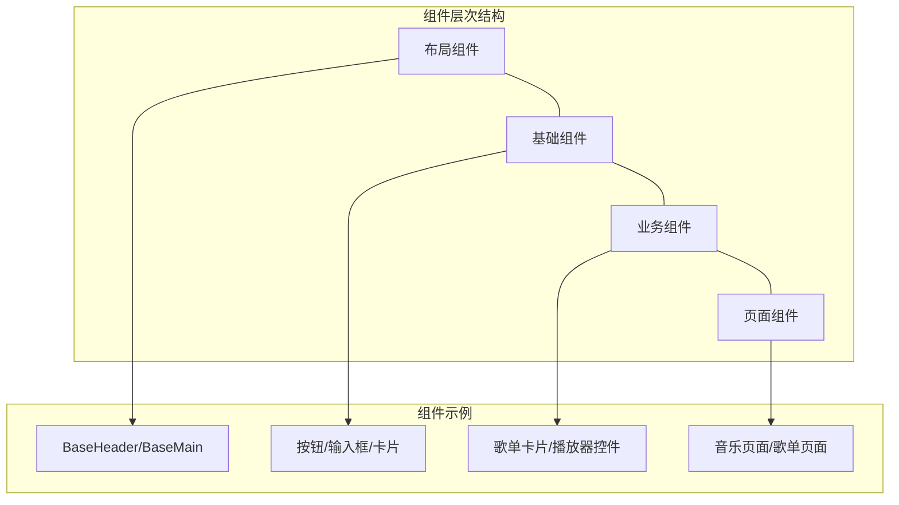
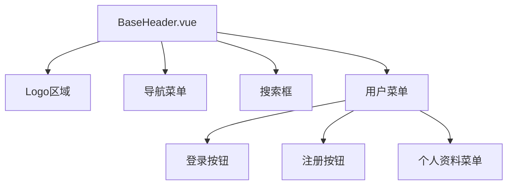
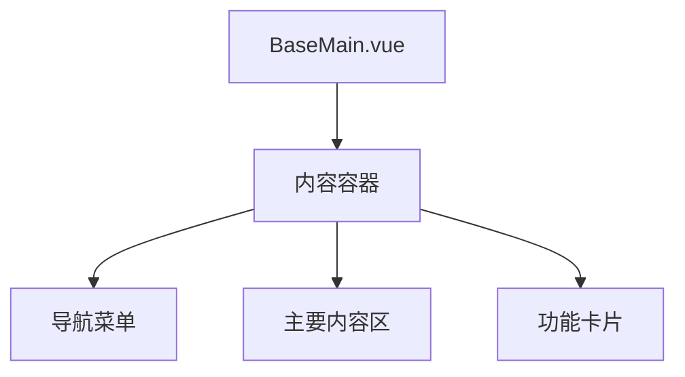
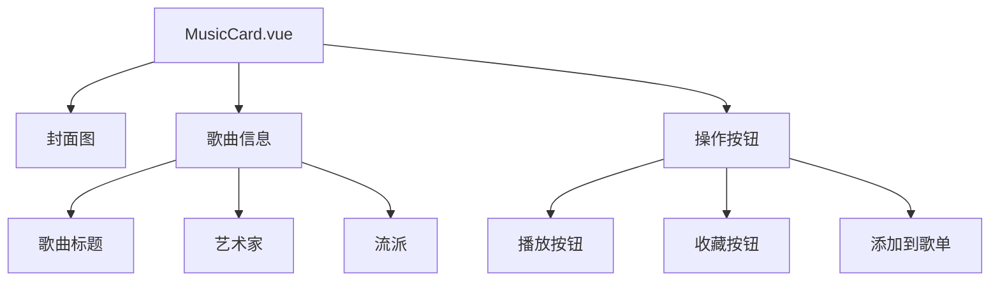
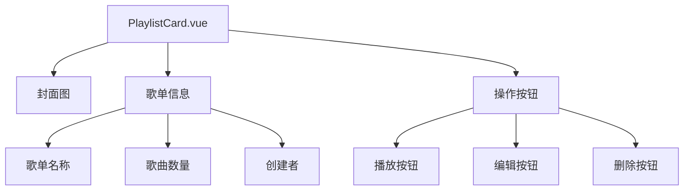
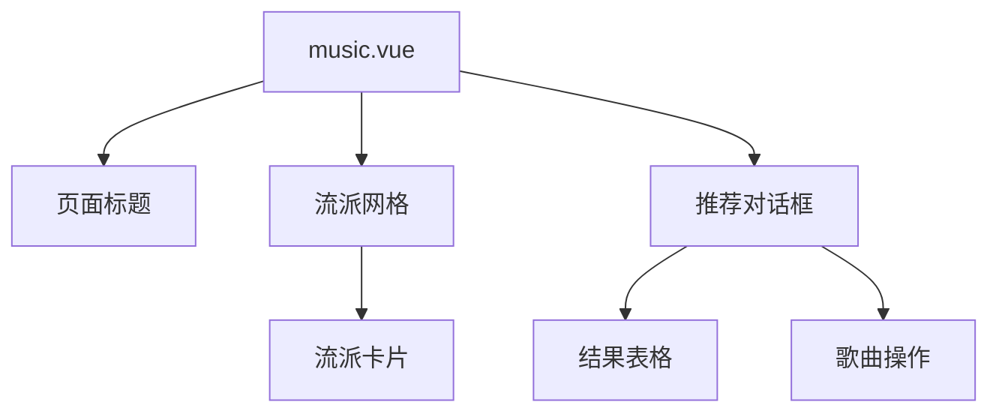
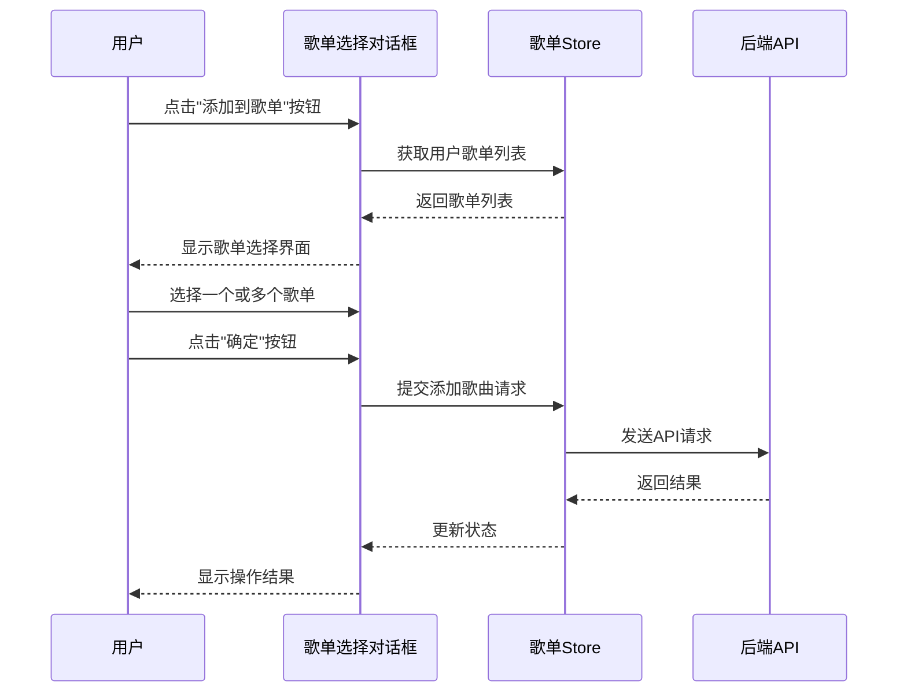

# RhythmFusion 前端组件文档

本文档详细介绍 RhythmFusion 前端的组件架构、组件分类、使用方法和最佳实践，为开发者提供使用和扩展组件系统的指南。

## 组件系统概述

RhythmFusion 前端采用基于 Vue 3 的组件化架构，组件按功能和复用性分为多个层次：



### 组件分类

* **布局组件**：提供应用的整体布局结构
* **基础组件**：提供基本UI元素，高度可复用
* **业务组件**：实现特定业务功能的组件
* **页面组件**：组合多个组件形成完整页面

## 布局组件

布局组件定义了应用的整体结构和导航系统。

### BaseHeader 组件

顶部导航栏组件，提供应用的主要导航功能、搜索和用户管理。

#### 组件结构



#### 使用示例

```vue
<template>
  <BaseHeader />
</template>

<script setup lang="ts">
import BaseHeader from '@/components/BaseHeader.vue'
</script>
```

#### 组件代码解析

BaseHeader 组件实现了顶部导航栏，包含品牌标志、导航菜单、搜索功能和用户菜单：

```vue
<template>
  <el-menu class="el-menu-demo base-layout-header" mode="horizontal" :ellipsis="false" router>
    <!-- Logo区域 -->
    <el-menu-item index="/" class="logo-item">
      <div class="logo-text">
        <span>Rhythm</span><span class="fusion-text">Fusion</span>
      </div>
    </el-menu-item>

    <!-- 导航菜单 -->
    <div class="navigation-menu header-nav">
      <el-button
        type="primary"
        class="nav-button animated-button"
        round
        @click="$router.push('/')"
      >
        Home
      </el-button>
      <el-button
        type="primary"
        class="nav-button animated-button"
        round
        @click="$router.push('/music/')"
      >
        Music
      </el-button>
    </div>

    <!-- 搜索框 -->
    <div class="search-container">
      <el-input
        v-model="input"
        placeholder="Search for songs, artists or genres..."
        @keydown.enter="handleSearch"
      >
        <template #prefix>
          <el-icon><Search /></el-icon>
        </template>
      </el-input>
      <el-button type="primary" @click="handleSearch">Search</el-button>
    </div>

    <!-- 用户菜单：登录/注册或用户下拉菜单 -->
    <div class="auth-container">
      <template v-if="!userStore.isAuthenticated">
        <el-button @click="handleLogin">Log in</el-button>
        <el-button type="primary" @click="handleRegister">Sign up</el-button>
      </template>
      <template v-else>
        <el-sub-menu index="/user" class="user-submenu">
          <template #title>
            <el-avatar :src="userAvatar" />
            <span>My Account</span>
          </template>
          <el-menu-item index="/user/profile">个人档案</el-menu-item>
          <el-menu-item index="/user/liked">收藏歌曲</el-menu-item>
          <el-menu-item @click="handleLogout">登出</el-menu-item>
        </el-sub-menu>
      </template>
    </div>
  </el-menu>

  <!-- 搜索结果对话框 -->
  <!-- 登录/注册对话框 -->
</template>
```

#### 重要属性和方法

| 属性/方法 | 类型 | 描述 |
|----------|------|------|
| input | ref\<string\> | 搜索输入框的绑定值 |
| userStore | Store | 用户状态管理 |
| isAuthenticated | computed | 判断用户是否已登录 |
| handleSearch | function | 处理搜索请求 |
| handleLogin | function | 显示登录对话框 |
| handleRegister | function | 显示注册对话框 |
| handleLogout | function | 处理用户登出 |

### BaseMain 组件

主内容区域组件，提供内容展示的布局容器。

#### 组件结构



#### 使用示例

```vue
<template>
  <BaseMain>
    <template #default>
      <h1>内容标题</h1>
      <p>内容描述</p>
    </template>
  </BaseMain>
</template>

<script setup lang="ts">
import BaseMain from '@/components/BaseMain.vue'
</script>
```

#### 组件代码解析

BaseMain 组件提供了一个渐变背景的主内容区域，可以通过插槽注入内容：

```vue
<template>
  <el-main class="base-layout-main main-gradient-bg">
    <div class="content-container">
      <div class="navigation-menu">
        <el-button
          type="primary"
          class="nav-button animated-button"
          round
          @click="$router.push('/')"
        >
          Home
        </el-button>
        <el-button
          type="primary"
          class="nav-button animated-button"
          round
          @click="$router.push('/music/')"
        >
          Music
        </el-button>
      </div>

      <!-- 默认插槽 -->
      <slot></slot>

      <!-- 功能区 -->
      <div class="features-section">
        <slot name="features">
          <!-- 默认功能卡片 -->
        </slot>
      </div>
    </div>
  </el-main>
</template>
```

## 业务组件

业务组件实现特定业务功能，封装相关的UI和逻辑。

### MusicCard 组件

音乐卡片组件，展示单首歌曲的信息和操作按钮。

#### 组件结构



#### 使用示例

```vue
<template>
  <MusicCard 
    :song="songData" 
    @play="handlePlay" 
    @like="handleLike" 
    @add-to-playlist="handleAddToPlaylist" 
  />
</template>

<script setup lang="ts">
import MusicCard from '@/components/MusicCard.vue'
import type { Song } from '@/api/modules/music'

const songData: Song = {
  id: 1,
  title: '示例歌曲',
  artist: '示例艺术家',
  genre: 'pop',
  cover_url: '/path/to/cover.jpg'
}

const handlePlay = (song: Song) => {
  console.log('播放歌曲', song)
}

const handleLike = (song: Song) => {
  console.log('收藏歌曲', song)
}

const handleAddToPlaylist = (song: Song) => {
  console.log('添加到歌单', song)
}
</script>
```

### PlaylistCard 组件

歌单卡片组件，展示歌单的基本信息和封面。

#### 组件结构



#### 属性和事件

| 属性/事件 | 类型 | 描述 |
|----------|------|------|
| playlist | Object | 歌单数据对象 |
| @play | event | 播放歌单事件 |
| @edit | event | 编辑歌单事件 |
| @delete | event | 删除歌单事件 |

## 页面组件

页面组件是完整的页面视图，通常对应一个路由。

### Music 页面组件

音乐发现页面，展示不同流派的音乐推荐。

#### 组件结构



#### 组件代码解析

Music 页面组件实现了音乐发现功能，包括流派网格和推荐结果展示：

```vue
<template>
  <el-main class="main-gradient-bg">
    <div class="content-container">
      <div class="navigation-menu">
        <el-button type="primary" round @click="$router.push('/')">Home</el-button>
        <el-button type="primary" round @click="$router.push('/music/')">Music</el-button>
      </div>

      <div class="page-header">
        <h1 class="page-title">
          <span class="title-icon"><i class="el-icon-headset"></i></span>
          发现音乐
        </h1>
        <p class="page-description">
          探索不同风格的音乐，发现属于你的专属推荐
        </p>
      </div>

      <div class="genres-grid">
        <div
          v-for="g in genres"
          :key="g.name"
          class="genre-card hover-card"
          :style="{ '--bg-image': `url(${g.image})` }"
          @click="() => selectGenre(g.name, g.code)"
        >
          <div class="card-content">
            <h3 class="genre-name">{{ g.name }}</h3>
            <p class="genre-artists">{{ g.artists }}</p>
          </div>
        </div>
      </div>
    </div>

    <!-- 推荐对话框 -->
    <el-dialog v-model="showRecommendations" :title="`${selectedGenre}风格推荐`">
      <el-table v-if="recommendationResults.length > 0" :data="recommendationResults">
        <el-table-column prop="title" label="歌曲名" />
        <el-table-column prop="artist" label="歌手" />
        <el-table-column prop="school" label="风格" />
        <el-table-column label="操作">
          <template #default="{ row }">
            <div class="song-actions">
              <el-button
                type="primary"
                circle
                size="small"
                :icon="isLiked(row.id) ? StarFilled : Star"
                @click="toggleLikeSong(row)"
              />
              <el-button
                type="success"
                circle
                size="small"
                :icon="Plus"
                @click="showAddToPlaylist(row)"
              />
            </div>
          </template>
        </el-table-column>
      </el-table>
    </el-dialog>
    
    <!-- 选择歌单对话框 -->
  </el-main>
</template>

<script setup lang="ts">
import { ref, computed } from 'vue'
import { useMusicStore } from '@/stores/music'
import { usePlaylistStore } from '@/stores/playlist'
import { useUserStore } from '@/stores/user'
import * as musicApi from '@/api/modules/music'
import { Star, StarFilled, Plus } from '@element-plus/icons-vue'

// 定义流派列表
const genres = ref([
  { name: 'Blues', code: 'blues', image: 'path/to/blues.jpg', artists: 'B.B. King, Muddy Waters' },
  { name: 'Classical', code: 'classical', image: 'path/to/classical.jpg', artists: 'Mozart, Beethoven' },
  // 更多流派...
])

// 推荐相关状态
const recommendationResults = ref([])
const showRecommendations = ref(false)
const selectedGenre = ref('')

// 选择流派，获取推荐
async function selectGenre(name, code) {
  selectedGenre.value = name
  const songs = await musicApi.recommendByGenre(code)
  recommendationResults.value = songs
  showRecommendations.value = true
}

// 歌曲操作
function isLiked(songId) { /* ... */ }
function toggleLikeSong(song) { /* ... */ }
function showAddToPlaylist(song) { /* ... */ }
</script>
```

### 主要功能和交互

1. **流派浏览**：以网格形式展示不同音乐流派
2. **推荐获取**：点击流派卡片获取该流派的推荐歌曲
3. **歌曲操作**：对推荐歌曲进行收藏、添加到歌单等操作

## 弹出式组件

### 登录/注册对话框

用户认证相关的弹出对话框组件。

#### LoginDialog 代码示例

```vue
<template>
  <el-dialog v-model="visible" title="登录" width="400px">
    <el-form :model="loginForm" label-position="top">
      <el-form-item label="用户名" required>
        <el-input v-model="loginForm.username" />
      </el-form-item>
      <el-form-item label="密码" required>
        <el-input v-model="loginForm.password" type="password" />
      </el-form-item>
    </el-form>
    <template #footer>
      <el-button @click="visible = false">取消</el-button>
      <el-button type="primary" @click="handleLogin">登录</el-button>
    </template>
  </el-dialog>
</template>

<script setup lang="ts">
import { ref } from 'vue'
import { useUserStore } from '@/stores/user'

const visible = defineModel<boolean>('visible')
const emit = defineEmits(['success'])

const userStore = useUserStore()
const loginForm = ref({
  username: '',
  password: ''
})

async function handleLogin() {
  try {
    await userStore.handleLogin(loginForm.value)
    visible.value = false
    emit('success')
  } catch (error) {
    console.error('登录失败:', error)
  }
}
</script>
```

### 添加到歌单对话框

允许用户将歌曲添加到自己的歌单中。

#### 交互流程



## 组件通信

RhythmFusion 的组件通过多种方式进行通信：

### 1. Props 和 Events

用于父子组件之间的通信：

```vue
<!-- 父组件 -->
<template>
  <SongList :songs="songs" @song-click="handleSongClick" />
</template>

<!-- 子组件 -->
<template>
  <div>
    <div v-for="song in songs" @click="$emit('song-click', song)">
      {{ song.title }}
    </div>
  </div>
</template>

<script setup lang="ts">
defineProps(['songs'])
defineEmits(['song-click'])
</script>
```

### 2. Pinia Store

用于跨组件状态管理：

```vue
<script setup lang="ts">
import { useMusicStore } from '@/stores/music'
import { usePlaylistStore } from '@/stores/playlist'

const musicStore = useMusicStore()
const playlistStore = usePlaylistStore()

// 使用 store 中的状态和方法
const likedSongs = computed(() => musicStore.likedSongs)
const userPlaylists = computed(() => playlistStore.playlists)

function handleLikeSong(song) {
  musicStore.handleLikeSong(song.id)
}
</script>
```

### 3. Provide/Inject

用于深层嵌套组件的通信：

```vue
<!-- 提供者组件 -->
<script setup lang="ts">
import { provide, ref } from 'vue'

const theme = ref('light')
provide('theme', theme)
</script>

<!-- 注入者组件 -->
<script setup lang="ts">
import { inject } from 'vue'

const theme = inject('theme', 'light')
</script>
```

## 组件复用与扩展

### 组件组合

RhythmFusion 鼓励通过组合小型组件构建复杂功能：

```vue
<template>
  <div class="playlist-detail">
    <PlaylistHeader :playlist="playlist" />
    <SongTable :songs="playlist.songs" />
    <PlaylistActions :playlist-id="playlist.id" />
  </div>
</template>
```

### 组件扩展

通过组合式函数（Composables）扩展组件功能：

```vue
<script setup lang="ts">
import { usePlaylistOperations } from '@/composables/playlist'

// 复用歌单操作逻辑
const { addSong, removeSong, reorderSongs } = usePlaylistOperations(playlistId)
</script>
```

## 最佳实践

### 组件命名规范

- 组件名称使用 PascalCase（如 `BaseHeader`、`MusicCard`）
- 页面组件放在 `pages/` 目录下
- 基础组件以 `Base` 前缀命名
- 业务组件根据功能命名

### 组件设计原则

1. **单一职责**：每个组件只负责一个功能
2. **低耦合**：组件之间保持低耦合
3. **高内聚**：相关功能放在同一组件中
4. **可复用**：设计可在多处使用的组件
5. **可测试**：组件易于单元测试

### 性能优化

- 使用 `v-memo` 缓存不经常变化的内容
- 列表渲染使用 `key` 属性提高性能
- 大型列表考虑虚拟滚动
- 计算密集操作使用 Web Worker

## 从零创建新组件

下面是创建新组件的基本步骤：

1. **创建组件文件**：在 `components/` 目录下创建 `.vue` 文件
2. **定义组件结构**：编写模板、样式和脚本
3. **导入和注册**：在需要使用的地方导入组件
4. **测试组件**：确保组件正确工作

### 示例：创建播放器控件组件

```vue
<!-- PlayerControls.vue -->
<template>
  <div class="player-controls">
    <el-button :icon="Previous" circle @click="$emit('previous')" />
    <el-button 
      :icon="isPlaying ? Pause : Play" 
      circle 
      size="large"
      @click="$emit('toggle-play')" 
    />
    <el-button :icon="Next" circle @click="$emit('next')" />
    
    <div class="progress-container">
      <el-slider 
        v-model="currentProgress" 
        :max="100"
        @change="$emit('seek', currentProgress)" 
      />
      <div class="time-display">
        {{ formatTime(currentTime) }} / {{ formatTime(duration) }}
      </div>
    </div>
    
    <div class="volume-control">
      <el-button :icon="volume > 0 ? VolumeHigh : Mute" circle @click="toggleMute" />
      <el-slider v-model="volume" :max="100" @change="$emit('volume-change', volume)" />
    </div>
  </div>
</template>

<script setup lang="ts">
import { ref, computed } from 'vue'
import { Play, Pause, Previous, Next, VolumeHigh, Mute } from '@element-plus/icons-vue'

const props = defineProps({
  playing: Boolean,
  currentTime: Number,
  duration: Number,
  volumeLevel: Number
})

const emit = defineEmits(['previous', 'next', 'toggle-play', 'seek', 'volume-change'])

const isPlaying = computed(() => props.playing)
const currentProgress = computed(() => (props.currentTime / props.duration) * 100)
const volume = ref(props.volumeLevel || 80)

function toggleMute() {
  if (volume.value > 0) {
    volume.value = 0
  } else {
    volume.value = 80
  }
  emit('volume-change', volume.value)
}

function formatTime(seconds) {
  if (!seconds) return '0:00'
  const mins = Math.floor(seconds / 60)
  const secs = Math.floor(seconds % 60)
  return `${mins}:${secs.toString().padStart(2, '0')}`
}
</script>
```

## 组件测试

推荐使用 Vitest 和 Vue Test Utils 测试组件：

```typescript
// PlayerControls.spec.ts
import { mount } from '@vue/test-utils'
import { describe, it, expect } from 'vitest'
import PlayerControls from '@/components/PlayerControls.vue'

describe('PlayerControls', () => {
  it('renders correctly', () => {
    const wrapper = mount(PlayerControls, {
      props: {
        playing: false,
        currentTime: 30,
        duration: 180,
        volumeLevel: 70
      }
    })
    
    expect(wrapper.find('.player-controls').exists()).toBe(true)
    expect(wrapper.find('.time-display').text()).toContain('0:30')
  })
  
  it('emits toggle-play event when play button is clicked', async () => {
    const wrapper = mount(PlayerControls, {
      props: { playing: false, currentTime: 0, duration: 180, volumeLevel: 70 }
    })
    
    await wrapper.findAll('button')[1].trigger('click')
    expect(wrapper.emitted('toggle-play')).toBeTruthy()
  })
})
```

## 总结

RhythmFusion 的组件系统提供了灵活、可复用的 UI 元素，支持从简单的基础组件到复杂的业务组件。通过良好的组件设计和组合，可以快速构建功能丰富的用户界面，并确保代码的可维护性和可扩展性。 