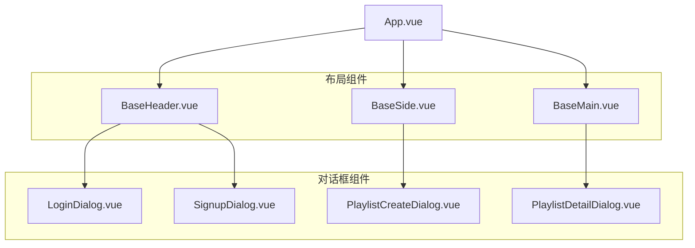

# RhythmFusion 前端组件文档

本文档详细介绍了 RhythmFusion 音乐推荐系统的前端组件结构、设计理念以及使用方法。

## 组件架构概述

RhythmFusion 采用组件化设计，将界面拆分为可复用的独立组件。组件之间通过属性传递、事件通信和状态共享实现交互。主要组件关系如下图所示：



## 核心组件详解

### 1. App.vue - 应用根组件

App.vue 是应用的根组件，负责组织整体布局结构和全局状态管理。

**核心功能**:
- 全局布局管理
- 认证状态维护
- 全局事件分发

**示例代码**:
```vue
<template>
  <div class="app-container">
    <BaseHeader />
    <div class="main-container">
      <BaseSide v-if="userStore.isLoggedIn" />
      <BaseMain />
    </div>
  </div>
</template>

<script setup lang="ts">
import { onMounted } from 'vue';
import { useUserStore } from '@/stores/user';
import BaseHeader from '@/components/BaseHeader.vue';
import BaseSide from '@/components/BaseSide.vue';
import BaseMain from '@/components/BaseMain.vue';

const userStore = useUserStore();

onMounted(() => {
  // 检查用户认证状态
  userStore.checkAuthStatus();
});
</script>
```

### 2. BaseHeader.vue - 顶部导航栏

BaseHeader 组件包含网站标志、搜索框和用户相关操作。

**核心功能**:
- 网站导航
- 搜索功能
- 用户菜单
- 登录/注册入口

**示例代码**:
```vue
<template>
  <header class="base-header">
    <div class="logo">RhythmFusion</div>
    
    <div class="search-box">
      <input 
        v-model="searchQuery" 
        @keyup.enter="handleSearch"
        placeholder="搜索歌曲、艺术家..."
      />
      <button @click="handleSearch">搜索</button>
    </div>
    
    <div class="user-section">
      <template v-if="userStore.isLoggedIn">
        <span>{{ userStore.username }}</span>
        <button @click="handleLogout">登出</button>
      </template>
      <template v-else>
        <button @click="showLoginDialog">登录</button>
        <button @click="showSignupDialog">注册</button>
      </template>
    </div>
    
    <LoginDialog v-if="isLoginVisible" @close="isLoginVisible = false" />
    <SignupDialog v-if="isSignupVisible" @close="isSignupVisible = false" />
  </header>
</template>

<script setup lang="ts">
import { ref } from 'vue';
import { useUserStore } from '@/stores/user';
import LoginDialog from '@/components/LoginDialog.vue';
import SignupDialog from '@/components/SignupDialog.vue';

const userStore = useUserStore();
const searchQuery = ref('');
const isLoginVisible = ref(false);
const isSignupVisible = ref(false);

const handleSearch = () => {
  // 执行搜索操作
};

const showLoginDialog = () => {
  isLoginVisible.value = true;
};

const showSignupDialog = () => {
  isSignupVisible.value = true;
};

const handleLogout = () => {
  userStore.logout();
};
</script>
```

### 3. BaseSide.vue - 侧边栏组件

BaseSide 组件展示用户歌单列表和导航选项。

**核心功能**:
- 歌单列表展示
- 创建新歌单
- 导航链接

**示例代码**:
```vue
<template>
  <aside class="base-side">
    <div class="playlists">
      <div class="section-header">
        <h3>我的歌单</h3>
        <button @click="showCreateDialog">新建</button>
      </div>
      
      <ul class="playlist-list">
        <li 
          v-for="playlist in playlistStore.playlists" 
          :key="playlist.id"
          @click="selectPlaylist(playlist.id)"
        >
          {{ playlist.name }}
        </li>
      </ul>
    </div>
    
    <PlaylistCreateDialog v-if="isCreateVisible" @close="isCreateVisible = false" />
  </aside>
</template>

<script setup lang="ts">
import { ref, onMounted } from 'vue';
import { usePlaylistStore } from '@/stores/playlist';
import PlaylistCreateDialog from '@/components/PlaylistCreateDialog.vue';

const playlistStore = usePlaylistStore();
const isCreateVisible = ref(false);

onMounted(() => {
  // 加载用户歌单
  playlistStore.fetchPlaylists();
});

const showCreateDialog = () => {
  isCreateVisible.value = true;
};

const selectPlaylist = (id: number) => {
  playlistStore.setCurrentPlaylist(id);
};
</script>
```

### 4. BaseMain.vue - 主内容区域

BaseMain 组件负责展示歌曲列表、播放器和主要内容。

**核心功能**:
- 歌曲列表展示
- 音乐播放控制
- 推荐内容展示

**示例代码**:
```vue
<template>
  <main class="base-main">
    <div class="current-playlist" v-if="playlistStore.currentPlaylist">
      <h2>{{ playlistStore.currentPlaylist.name }}</h2>
      
      <div class="song-list">
        <div 
          v-for="song in playlistStore.currentPlaylistSongs" 
          :key="song.id"
          class="song-item"
          @click="playSong(song)"
        >
          <div class="song-info">
            <div class="song-title">{{ song.title }}</div>
            <div class="song-artist">{{ song.artist }}</div>
          </div>
          <div class="song-actions">
            <!-- 歌曲操作按钮 -->
          </div>
        </div>
      </div>
      
      <div class="recommendations">
        <h3>推荐歌曲</h3>
        <button @click="getRecommendations">获取推荐</button>
        <!-- 推荐歌曲列表 -->
      </div>
    </div>
    
    <div class="player-controls">
      <!-- 播放器控件 -->
    </div>
    
    <PlaylistDetailDialog 
      v-if="isPlaylistDetailVisible" 
      :playlist-id="selectedPlaylistId"
      @close="isPlaylistDetailVisible = false" 
    />
  </main>
</template>

<script setup lang="ts">
import { ref, computed, watch } from 'vue';
import { usePlaylistStore } from '@/stores/playlist';
import { usePlayerStore } from '@/stores/player';
import PlaylistDetailDialog from '@/components/PlaylistDetailDialog.vue';

const playlistStore = usePlaylistStore();
const playerStore = usePlayerStore();
const isPlaylistDetailVisible = ref(false);
const selectedPlaylistId = ref(0);

const playSong = (song) => {
  playerStore.playSong(song);
};

const getRecommendations = async () => {
  if (playlistStore.currentPlaylist) {
    await playlistStore.getRecommendations(playlistStore.currentPlaylist.id);
  }
};

// 监听当前歌单变化
watch(() => playlistStore.currentPlaylistId, (newId) => {
  if (newId) {
    playlistStore.fetchPlaylistSongs(newId);
  }
});
</script>
```

### 5. LoginDialog.vue - 登录对话框

LoginDialog 组件提供用户登录界面。

**核心功能**:
- 用户凭证输入
- 表单验证
- 登录请求处理

**示例代码**:
```vue
<template>
  <div class="dialog-overlay">
    <div class="login-dialog">
      <h2>登录</h2>
      
      <form @submit.prevent="handleLogin">
        <div class="form-group">
          <label for="username">用户名</label>
          <input 
            id="username" 
            v-model="username" 
            type="text" 
            required
          />
        </div>
        
        <div class="form-group">
          <label for="password">密码</label>
          <input 
            id="password" 
            v-model="password" 
            type="password" 
            required
          />
        </div>
        
        <div class="error-message" v-if="error">{{ error }}</div>
        
        <div class="dialog-actions">
          <button type="button" @click="$emit('close')">取消</button>
          <button type="submit" :disabled="isLoading">登录</button>
        </div>
      </form>
    </div>
  </div>
</template>

<script setup lang="ts">
import { ref } from 'vue';
import { useUserStore } from '@/stores/user';

const emit = defineEmits(['close']);
const userStore = useUserStore();

const username = ref('');
const password = ref('');
const error = ref('');
const isLoading = ref(false);

const handleLogin = async () => {
  try {
    isLoading.value = true;
    await userStore.login(username.value, password.value);
    emit('close');
  } catch (err) {
    error.value = '登录失败，请检查用户名和密码';
  } finally {
    isLoading.value = false;
  }
};
</script>
```

### 6. SignupDialog.vue - 注册对话框

SignupDialog 组件提供用户注册界面。

**核心功能**:
- 用户信息输入
- 表单验证
- 注册请求处理

### 7. PlaylistCreateDialog.vue - 创建歌单对话框

PlaylistCreateDialog 组件用于创建新歌单。

**核心功能**:
- 歌单名称输入
- 可选歌曲选择
- 歌单创建请求处理

### 8. PlaylistDetailDialog.vue - 歌单详情对话框

PlaylistDetailDialog 组件展示歌单详细信息和操作选项。

**核心功能**:
- 歌单信息展示
- 歌曲管理（添加/删除）
- 获取推荐歌曲

## 组件通信模式

RhythmFusion 前端组件通过多种方式进行通信：

1. **props/emit**: 父子组件之间的数据传递和事件触发
2. **Pinia 状态**: 跨组件的状态共享和操作
3. **Provide/Inject**: 深层组件树的依赖注入
4. **Event Bus**: 特定场景下的全局事件通信

示例：使用 props 和 emit 进行组件通信

```vue
<!-- 父组件 -->
<template>
  <ChildComponent 
    :data="parentData" 
    @update="handleUpdate" 
  />
</template>

<!-- 子组件 -->
<script setup>
const props = defineProps(['data']);
const emit = defineEmits(['update']);

const updateData = () => {
  emit('update', { /* 更新的数据 */ });
};
</script>
```

## 组件样式

RhythmFusion 采用 SCSS 预处理器和 CSS 模块化，确保组件样式的封装性和可维护性。主要样式特点：

1. **响应式设计**: 使用媒体查询适配不同设备
2. **变量系统**: 统一管理颜色、字体等样式变量
3. **主题支持**: 明暗主题切换能力
4. **过渡动画**: 平滑的状态转换和交互反馈

## 组件测试

RhythmFusion 组件支持单元测试和集成测试，使用 Vitest 和 Vue Test Utils 框架。测试内容包括：

1. 组件渲染是否正确
2. 交互行为是否符合预期
3. 事件触发和处理是否正常
4. 边界条件和错误处理是否适当

## 组件最佳实践

开发 RhythmFusion 前端组件时，建议遵循以下最佳实践：

1. **单一职责**: 每个组件只负责一项特定功能
2. **可复用性**: 设计通用组件，避免重复代码
3. **可测试性**: 组件逻辑应易于测试
4. **性能考虑**: 优化组件渲染和更新逻辑
5. **适当注释**: 为复杂逻辑和接口添加清晰注释

## 组件开发指南

如果您想为 RhythmFusion 开发新组件，请遵循以下步骤：

1. 明确组件的功能和职责
2. 设计组件的接口（props、events、slots）
3. 实现组件的核心逻辑和 UI
4. 编写组件的样式和过渡效果
5. 添加适当的测试用例
6. 更新组件文档

详细的组件开发流程请参考 [前端开发指南](development.md)。 