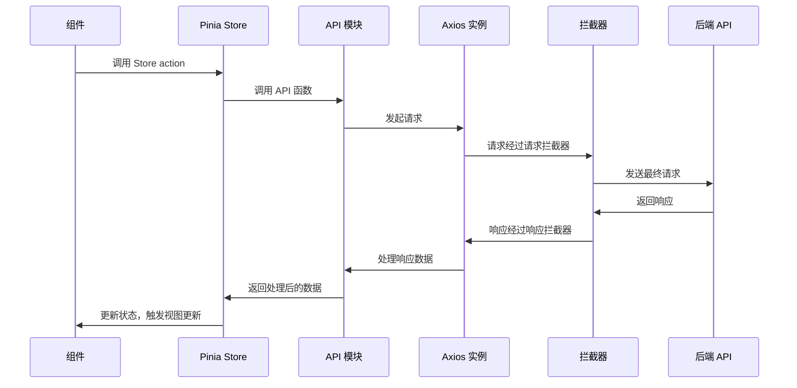

# Axios 模块详解

## 概述

RhythmFusion 前端使用 Axios 作为 HTTP 客户端与后端 API 通信。为了提高代码可维护性和复用性，项目对 Axios 进行了模块化封装，实现了请求拦截、响应处理、错误统一处理等功能。

## 模块结构

Axios 相关代码主要分布在以下目录：

```
src/
├── utils/
│   └── axios.ts             # Axios 实例创建和拦截器配置
├── api/
│   ├── index.ts             # API 模块导出
│   ├── auth.ts              # 认证相关 API
│   ├── music.ts             # 音乐相关 API
│   ├── playlist.ts          # 歌单相关 API
│   └── recommender.ts       # 推荐相关 API
└── types/
    └── api.ts               # API 相关类型定义
```

## 请求流程

从组件发出请求到后端响应的完整流程如下：



## 核心模块详解

### 1. Axios 实例创建 (src/utils/axios.ts)

```typescript
// src/utils/axios.ts
import axios, { AxiosRequestConfig, AxiosResponse, AxiosError } from 'axios';
import { useUserStore } from '@/stores/user';
import router from '@/router';

// 创建 axios 实例
const instance = axios.create({
  baseURL: import.meta.env.VITE_API_BASE_URL || 'http://localhost:8000/api',
  timeout: 15000,
  headers: {
    'Content-Type': 'application/json'
  }
});

// 请求拦截器
instance.interceptors.request.use(
  (config: AxiosRequestConfig) => {
    const userStore = useUserStore();
    
    // 如果存在访问令牌，添加到请求头
    if (userStore.accessToken) {
      config.headers = config.headers || {};
      config.headers['Authorization'] = `Bearer ${userStore.accessToken}`;
    }
    
    return config;
  },
  (error: AxiosError) => {
    return Promise.reject(error);
  }
);

// 响应拦截器
instance.interceptors.response.use(
  (response: AxiosResponse) => {
    return response.data;
  },
  async (error: AxiosError) => {
    const userStore = useUserStore();
    
    // 处理 401 错误（未授权，令牌过期）
    if (error.response?.status === 401) {
      // 尝试使用刷新令牌
      if (userStore.refreshToken) {
        try {
          // 尝试刷新令牌
          await userStore.refreshAccessToken();
          
          // 重试之前失败的请求
          const config = error.config;
          if (config) {
            return instance(config);
          }
        } catch (refreshError) {
          // 刷新令牌也失败，清除登录状态并重定向到登录页
          userStore.logout();
          router.push('/login');
        }
      } else {
        // 没有刷新令牌，清除登录状态并重定向到登录页
        userStore.logout();
        router.push('/login');
      }
    }
    
    // 其他错误处理
    return Promise.reject(error);
  }
);

export default instance;
```

### 2. API 模块封装示例 (src/api/auth.ts)

```typescript
// src/api/auth.ts
import axios from '@/utils/axios';
import type { LoginRequest, LoginResponse, RegisterRequest, UserProfile } from '@/types/api';

/**
 * 用户登录
 */
export const login = (data: LoginRequest): Promise<LoginResponse> => {
  return axios.post('/user/login/', data);
};

/**
 * 用户注册
 */
export const register = (data: RegisterRequest): Promise<UserProfile> => {
  return axios.post('/user/register/', data);
};

/**
 * 刷新访问令牌
 */
export const refreshToken = (refreshToken: string): Promise<{ access: string }> => {
  return axios.post('/user/refresh/', { refresh: refreshToken });
};

/**
 * 验证令牌
 */
export const verifyToken = (token: string): Promise<{}> => {
  return axios.post('/user/verify/', { token });
};

/**
 * 用户登出
 */
export const logout = (refreshToken: string): Promise<void> => {
  return axios.post('/user/logout/', { refresh: refreshToken });
};

/**
 * 获取用户信息
 */
export const getProfile = (): Promise<UserProfile> => {
  return axios.get('/user/profile/');
};
```

### 3. 类型定义示例 (src/types/api.ts)

```typescript
// src/types/api.ts
export interface LoginRequest {
  username: string;
  password: string;
}

export interface LoginResponse {
  access: string;
  refresh: string;
}

export interface RegisterRequest {
  username: string;
  password: string;
  email: string;
}

export interface UserProfile {
  id: number;
  username: string;
  email: string;
  first_name: string;
  last_name: string;
  bio: string;
  birth_date: string | null;
  avatar: string | null;
  created_at: string;
  updated_at: string;
}
```

## 组件中使用 API 的方式

### 直接调用 API 模块

```vue
<script setup lang="ts">
import { ref } from 'vue';
import { login } from '@/api/auth';
import router from '@/router';

const username = ref('');
const password = ref('');
const error = ref('');
const isLoading = ref(false);

const handleLogin = async () => {
  isLoading.value = true;
  error.value = '';
  
  try {
    const response = await login({
      username: username.value,
      password: password.value
    });
    
    // 存储令牌
    localStorage.setItem('access_token', response.access);
    localStorage.setItem('refresh_token', response.refresh);
    
    // 跳转到首页
    router.push('/');
  } catch (err) {
    error.value = '登录失败，请检查用户名和密码';
    console.error('Login error:', err);
  } finally {
    isLoading.value = false;
  }
};
</script>
```

### 通过 Pinia Store 调用

```vue
<script setup lang="ts">
import { ref } from 'vue';
import { useUserStore } from '@/stores/user';
import router from '@/router';

const userStore = useUserStore();

const username = ref('');
const password = ref('');
const error = ref('');

const handleLogin = async () => {
  try {
    await userStore.login(username.value, password.value);
    router.push('/');
  } catch (err) {
    error.value = '登录失败，请检查用户名和密码';
  }
};
</script>
```

## 最佳实践与优化建议

### 当前问题

1. **模块杂乱且关系不清**：Axios 相关代码分散在多个文件中，缺乏统一的组织结构
2. **错误处理不一致**：不同模块可能采用不同的错误处理方式
3. **类型定义不完整**：可能缺少完整的类型定义，导致类型安全性降低
4. **重复代码**：多个 API 模块中可能存在重复的请求逻辑
5. **测试困难**：当前结构可能不利于单元测试

### 优化建议

1. **统一 API 层架构**：
   
   ```
   src/
   ├── api/
   │   ├── client.ts           # 统一的 Axios 客户端
   │   ├── interceptors/       # 拦截器集合
   │   │   ├── auth.ts         # 认证拦截器
   │   │   ├── error.ts        # 错误处理拦截器
   │   │   └── index.ts        # 拦截器注册
   │   ├── modules/            # API 模块，按功能划分
   │   │   ├── auth.ts         # 认证相关
   │   │   ├── music.ts        # 音乐相关
   │   │   └── playlist.ts     # 歌单相关
   │   ├── types/              # API 类型定义
   │   │   ├── auth.ts         # 认证相关类型
   │   │   ├── music.ts        # 音乐相关类型
   │   │   └── common.ts       # 通用类型
   │   └── index.ts            # 导出所有 API
   ```

2. **创建 API 服务类**：为每个 API 模块创建服务类，更好地组织代码

   ```typescript
   // src/api/modules/auth.ts
   import client from '../client';
   import type { LoginRequest, LoginResponse } from '../types/auth';
   
   export class AuthService {
     static login(data: LoginRequest): Promise<LoginResponse> {
       return client.post('/user/login/', data);
     }
     
     static register(data: RegisterRequest): Promise<UserProfile> {
       return client.post('/user/register/', data);
     }
     
     // 其他方法...
   }
   
   export default AuthService;
   ```

3. **统一错误处理**：创建专门的错误处理模块

   ```typescript
   // src/api/interceptors/error.ts
   import { AxiosError } from 'axios';
   import router from '@/router';
   import { useUserStore } from '@/stores/user';
   import { useUIStore } from '@/stores/ui';
   
   export default async function errorInterceptor(error: AxiosError) {
     const userStore = useUserStore();
     const uiStore = useUIStore();
     
     const errorCode = error.response?.status;
     const errorData = error.response?.data as any;
     
     // 根据错误类型处理
     switch (errorCode) {
       case 401:
         // 处理认证错误...
         break;
       case 403:
         uiStore.showNotification('权限不足', 'error');
         break;
       // 其他错误...
     }
     
     return Promise.reject(error);
   }
   ```

4. **请求和响应转换**：统一处理请求和响应格式

   ```typescript
   // src/api/client.ts
   import axios from 'axios';
   import { setupInterceptors } from './interceptors';
   
   const client = axios.create({
     baseURL: import.meta.env.VITE_API_BASE_URL,
     timeout: 15000,
     headers: {
       'Content-Type': 'application/json'
     }
   });
   
   // 设置请求和响应转换器
   client.defaults.transformRequest = [(data) => {
     // 统一处理请求数据
     return JSON.stringify(data);
   }];
   
   client.defaults.transformResponse = [(data) => {
     // 尝试解析响应数据
     try {
       return JSON.parse(data);
     } catch (e) {
       return data;
     }
   }];
   
   // 设置拦截器
   setupInterceptors(client);
   
   export default client;
   ```

5. **API 工厂函数**：使用工厂函数减少重复代码

   ```typescript
   // src/api/factory.ts
   import client from './client';
   
   export function createCRUDAPI<T, R = T>(endpoint: string) {
     return {
       getAll: () => client.get<R[]>(endpoint),
       getById: (id: number | string) => client.get<R>(`${endpoint}/${id}`),
       create: (data: Partial<T>) => client.post<R>(endpoint, data),
       update: (id: number | string, data: Partial<T>) => 
         client.put<R>(`${endpoint}/${id}`, data),
       delete: (id: number | string) => 
         client.delete(`${endpoint}/${id}`)
     };
   }
   ```

## 结论

通过重构 Axios 模块结构，可以显著提高代码的可维护性、可测试性和可扩展性。统一的错误处理、类型定义和 API 结构将使开发体验更加流畅，减少重复代码，并提高整体代码质量。 