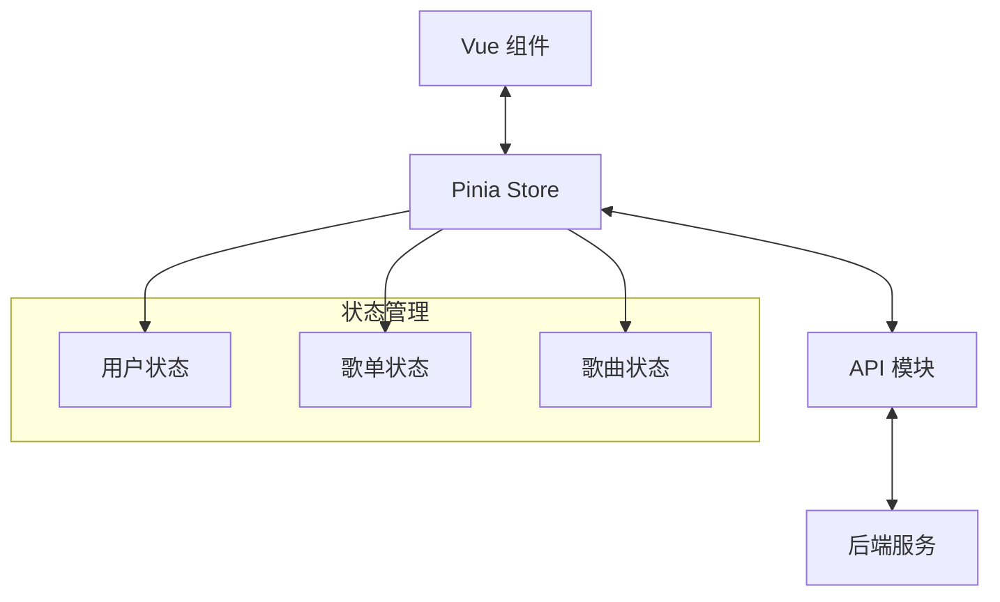

# Pinia 状态管理模块详解

## 概述

RhythmFusion 前端使用 Pinia 作为状态管理解决方案，Pinia 是 Vue 官方推荐的状态管理库，为 Vue 3 提供了类型安全、开发工具支持和模块化状态管理能力。本项目对 Pinia 进行了适当的封装和配置，实现了状态持久化、模块化管理等功能。

## 模块结构

Pinia 相关代码主要分布在以下目录：

```
src/
├── stores/
│   ├── user.ts              # 用户状态管理
│   ├── playlist.ts          # 歌单状态管理
│   └── song.ts              # 歌曲状态管理
└── main.ts                  # Pinia 初始化配置
```

## Pinia 配置

RhythmFusion 在应用入口文件中对 Pinia 进行了配置，并集成了持久化插件：

```typescript
// src/main.ts
import { createApp } from 'vue'
import { createPinia } from 'pinia'
import piniaPersist from 'pinia-plugin-persistedstate'

import App from './App.vue'
import router from './router'

// ...其他导入语句

const app = createApp(App)

// ...其他配置

const pinia = createPinia()
pinia.use(piniaPersist)  // 启用状态持久化插件
app.use(pinia)

app.use(router)

app.mount('#app')
```

## 核心模块详解

### 1. 用户状态管理 (src/stores/user.ts)

用户状态管理模块负责处理用户认证信息和令牌管理：

```typescript
// src/stores/user.ts
import { defineStore } from 'pinia'

export const useUserStore = defineStore(
  'user',
  () => {
    const accessToken = ref<string>('')
    const refreshToken = ref<string>('')

    function setTokens(access: string, refresh: string) {
      accessToken.value = access
      refreshToken.value = refresh
    }

    function clearTokens() {
      accessToken.value = ''
      refreshToken.value = ''
    }

    return {
      accessToken,
      refreshToken,
      setTokens,
      clearTokens,
    }
  },
  {
    persist: {
      key: 'user',
      storage: window.localStorage,
      paths: ['accessToken', 'refreshToken'],
    },
  },
)
```

该模块通过 Composition API 风格实现，主要特点：

1. **状态持久化**：通过 `persist` 选项配置，将认证令牌存储在 localStorage 中
2. **简洁接口**：提供 `setTokens` 和 `clearTokens` 方法管理令牌状态
3. **类型安全**：使用 TypeScript 类型确保状态和方法的类型安全

### 2. 歌单状态管理 (src/stores/playlist.ts)

歌单状态管理模块处理歌单相关的数据和操作：

```typescript
// src/stores/playlist.ts
import { defineStore } from 'pinia'
import apiMusic from '@/api/music'
import apiPlaylist from '@/api/playlist'
import type { Song, PlaylistSummary, Track } from '@/types'

export const usePlaylistStore = defineStore('playlist', {
  state: () => ({
    playlists: [] as PlaylistSummary[],        // { id, name }
    selectedSongs: [] as number[],             // 用于创建或 Add New
    currentTracks: [] as Track[],              // 当前打开歌单的曲目列表
  }),
  actions: {
    async fetchPlaylists() {
      this.playlists = await apiPlaylist.getPlaylists()
    },
    async createPlaylist(name: string) {
      const pl = await apiPlaylist.createPlaylist(name, this.selectedSongs)
      this.playlists.push(pl)
      this.selectedSongs = []
      return pl
    },
    async fetchTracks(plId: number) {
      this.currentTracks = await apiPlaylist.getTracks(plId)
    },
    async addTracks(plId: number) {
      await apiPlaylist.addTracks(plId, this.selectedSongs)
      await this.fetchTracks(plId)
      this.selectedSongs = []
    },
    async deleteTrack(plId: number, songId: number) {
      await apiPlaylist.deleteTrack(plId, songId)
      this.currentTracks = this.currentTracks.filter(t => t.id !== songId)
    },
    async recommend(plId: number) {
      return await apiPlaylist.getRecommendations(plId)
    }
  }
})
```

该模块采用 Options API 风格实现，主要特点：

1. **API 集成**：所有方法都集成了 API 调用，实现数据管理和服务调用的集中处理
2. **状态合理分类**：将歌单列表、选中歌曲和当前歌单曲目分开管理
3. **异步操作封装**：所有异步操作都封装在 actions 中，便于组件调用

### 3. 歌曲状态管理 (src/stores/song.ts)

歌曲状态管理模块负责歌曲选择逻辑：

```typescript
// stores/song.ts
export const useSongStore = defineStore('song', {
  state: () => ({
    // 只存选中列表
    selected: new Set<number>(),
  }),
  actions: {
    toggleSelect(id: number) {
      if (this.selected.has(id)) {
        this.selected.delete(id)
      } else {
        this.selected.add(id)
      }
    },
    isSelected(id: number) {
      return this.selected.has(id)
    },
  },
})
```

该模块主要特点：

1. **高效数据结构**：使用 `Set` 存储选中的歌曲 ID，确保选择操作的高效性
2. **简单接口**：提供 `toggleSelect` 和 `isSelected` 方法，便于组件调用

## 在组件中使用 Store

### 用户认证示例

```vue
<script lang="ts" setup>
import { ref } from 'vue'
import { ElMessage } from 'element-plus'
import apiAuth from '@/api/auth'
import { useUserStore } from '@/stores/user'
import { useRouter } from 'vue-router'

defineProps<{ visible: boolean }>()
const emit = defineEmits<['update:visible']>()

const username = ref('')
const password = ref('')
const loading = ref(false)

const userStore = useUserStore()
const router = useRouter()

async function login() {
  loading.value = true
  try {
    const resp = await apiAuth.login({ username: username.value, password: password.value })
    const { access, refresh } = resp.data
    userStore.setTokens(access, refresh)
    ElMessage.success('Login successful')
    emit('update:visible', false)
    router.push('/')
  } catch (err: unknown) {
    ElMessage.error(err.response?.data?.detail || 'Login failed')
  } finally {
    loading.value = false
  }
}
</script>
```

### 歌单管理示例

```vue
<script setup>
import { onMounted } from 'vue'
import { usePlaylistStore } from '@/stores/playlist'

const playlistStore = usePlaylistStore()

onMounted(async () => {
  await playlistStore.fetchPlaylists()
})

async function createNewPlaylist(name) {
  await playlistStore.createPlaylist(name)
}

async function viewPlaylist(id) {
  await playlistStore.fetchTracks(id)
}
</script>

<template>
  <div>
    <div v-for="playlist in playlistStore.playlists" :key="playlist.id">
      {{ playlist.name }}
      <button @click="viewPlaylist(playlist.id)">View</button>
    </div>
    
    <div v-if="playlistStore.currentTracks.length">
      <h3>当前歌单</h3>
      <div v-for="track in playlistStore.currentTracks" :key="track.id">
        {{ track.title }} - {{ track.artist }}
      </div>
    </div>
  </div>
</template>
```

## 状态管理架构模式

RhythmFusion 的状态管理架构遵循以下模式：



## 持久化策略

RhythmFusion 使用 `pinia-plugin-persistedstate` 插件实现状态持久化，主要策略如下：

1. **用户认证信息持久化**：用户的 access token 和 refresh token 存储在 localStorage 中
2. **选择性持久化**：通过 `paths` 选项，只持久化指定的状态字段
3. **自定义存储介质**：默认使用 localStorage，但可以根据需要切换到 sessionStorage 或自定义存储

```typescript
{
  persist: {
    key: 'user',                    // 存储键名
    storage: window.localStorage,   // 存储介质
    paths: ['accessToken', 'refreshToken'],  // 需要持久化的路径
  },
}
```

## 最佳实践与优化建议

### 当前问题

1. **store 类型不一致**：混合使用了 Options API 和 Composition API 风格
2. **缺少 getters**：未充分利用 Pinia 的 getters 功能进行派生状态计算
3. **持久化策略不完整**：只对用户数据进行了持久化配置
4. **模块之间关系不明确**：缺少 stores 之间的交互机制

### 优化建议

1. **统一编码风格**：建议统一采用 Composition API 风格，提高代码一致性

   ```typescript
   // 推荐的 Composition API 风格
   export const usePlaylistStore = defineStore('playlist', () => {
     const playlists = ref<PlaylistSummary[]>([])
     const selectedSongs = ref<number[]>([])
     const currentTracks = ref<Track[]>([])
     
     async function fetchPlaylists() {
       playlists.value = await apiPlaylist.getPlaylists()
     }
     
     // 其他方法...
     
     return {
       playlists,
       selectedSongs,
       currentTracks,
       fetchPlaylists,
       // 其他方法...
     }
   })
   ```

2. **添加 getters 计算派生状态**：利用 getters 功能计算派生状态

   ```typescript
   // 添加 getters
   const playlistCount = computed(() => playlists.value.length)
   const selectedCount = computed(() => selectedSongs.value.length)
   const hasSelectedSongs = computed(() => selectedSongs.value.length > 0)
   ```

3. **模块之间的交互机制**：允许 store 之间相互导入与使用

   ```typescript
   // 在一个 store 中使用另一个 store
   import { useUserStore } from './user'
   
   export const usePlaylistStore = defineStore('playlist', () => {
     const userStore = useUserStore()
     
     async function fetchUserPlaylists() {
       if (userStore.isLoggedIn) {
         // 获取用户歌单
       }
     }
     
     // 其他方法...
   })
   ```

4. **完善持久化策略**：为其他需要持久化的模块添加配置

   ```typescript
   export const usePlaylistStore = defineStore(
     'playlist',
     () => {
       // store 实现...
     },
     {
       persist: {
         key: 'playlist',
         storage: window.localStorage,
         paths: ['playlists'],
       },
     }
   )
   ```

## 总结

Pinia 作为 RhythmFusion 的状态管理解决方案，为应用提供了可靠、类型安全的状态管理能力。通过合理的模块划分和持久化配置，实现了用户认证、歌单管理和歌曲选择等核心功能的状态管理。

后续优化方向主要包括统一编码风格、完善 getters 设计、优化持久化策略和建立清晰的模块间交互机制，这将进一步提升代码质量和开发体验。 