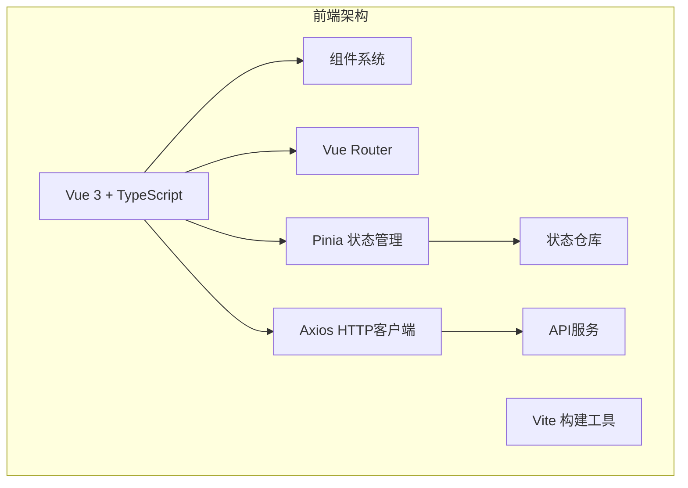
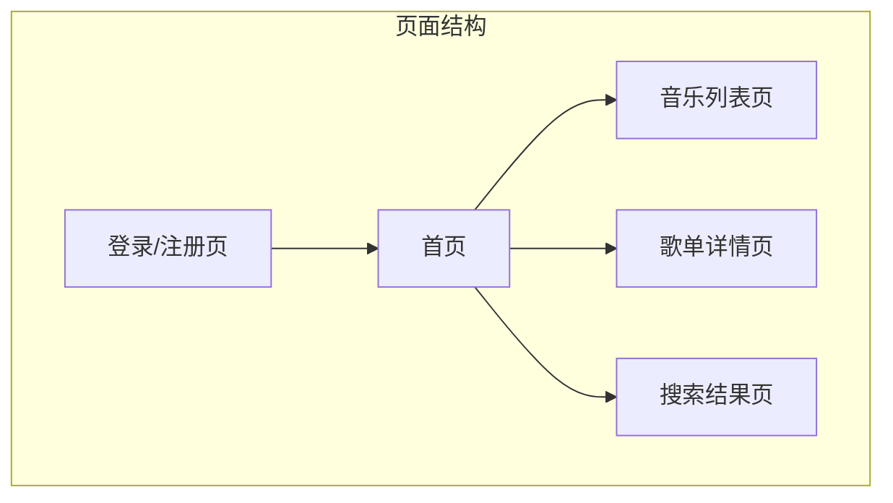

# RhythmFusion 前端文档

本文档详细介绍了 RhythmFusion 音乐推荐系统的前端架构、组件设计、状态管理以及开发指南。

## 前端架构概述

RhythmFusion 前端基于 Vue 3.5.13 和 TypeScript 构建，采用 Vite 作为构建工具，Pinia 进行状态管理，Axios 处理 HTTP 请求。整体架构遵循组件化设计，实现了响应式布局，确保在不同设备上都能提供良好的用户体验。



## 目录结构

前端项目的主要目录结构如下：

```
frontend/
├── src/                    # 源代码目录
│   ├── api/                # API 接口封装
│   ├── assets/             # 静态资源
│   ├── components/         # Vue 组件
│   ├── composables/        # 组合式函数
│   ├── pages/              # 页面组件
│   ├── router/             # 路由配置
│   ├── stores/             # Pinia 状态仓库
│   ├── styles/             # 全局样式
│   ├── types/              # TypeScript 类型定义
│   ├── utils/              # 工具函数
│   ├── App.vue             # 根组件
│   └── main.ts             # 入口文件
├── public/                 # 公共资源
├── index.html              # HTML 模板
├── vite.config.ts          # Vite 配置
├── tsconfig.json           # TypeScript 配置
└── package.json            # 项目依赖
```

## 核心功能模块

### 1. 用户界面组件

详见 [组件文档](components.md)

RhythmFusion 前端由以下核心组件构成：

- **BaseHeader**: 顶部导航栏，包含搜索框和用户菜单
- **BaseSide**: 侧边栏，显示歌单列表和导航选项
- **BaseMain**: 主内容区域，展示歌曲列表和播放器
- **LoginDialog**: 登录对话框
- **SignupDialog**: 注册对话框
- **PlaylistCreateDialog**: 创建歌单对话框
- **PlaylistDetailDialog**: 歌单详情对话框

### 2. 状态管理

详见 [状态管理文档](state.md)

使用 Pinia 管理应用状态，主要包含以下几个状态仓库：

- **userStore**: 管理用户信息和认证状态
- **playlistStore**: 管理歌单数据和操作
- **playerStore**: 管理音乐播放状态和控制
- **uiStore**: 管理 UI 相关状态（弹窗、主题等）

### 3. API 服务

详见 [API 服务文档](api.md)

使用 Axios 封装 API 请求，主要包含以下几个服务模块：

- **authAPI**: 处理用户认证相关请求
- **musicAPI**: 处理歌曲相关请求
- **playlistAPI**: 处理歌单相关请求
- **recommendAPI**: 处理推荐相关请求

## 用户界面设计

RhythmFusion 采用现代化、直观的用户界面设计，主要包含以下页面：



详细的用户界面设计和交互说明，请参考 [用户界面文档](ui.md)。

## 前端技术细节

### 1. 响应式数据管理

利用 Vue 3 的 Composition API 和响应式系统，实现高效的数据管理和视图更新：

```typescript
// 使用组合式 API 的典型组件结构
export default defineComponent({
  setup() {
    const userStore = useUserStore();
    const songs = ref([]);
    
    // 计算属性
    const filteredSongs = computed(() => 
      songs.value.filter(song => song.artist.includes(userStore.preference))
    );
    
    // 异步数据加载
    onMounted(async () => {
      try {
        songs.value = await musicAPI.getSongs();
      } catch (error) {
        console.error('Failed to fetch songs:', error);
      }
    });
    
    return {
      songs,
      filteredSongs
    };
  }
});
```

### 2. 路由管理

使用 Vue Router 进行前端路由管理，支持历史模式和路由守卫：

```typescript
// 路由配置
const routes = [
  {
    path: '/',
    component: Home,
    meta: { requiresAuth: false }
  },
  {
    path: '/playlist/:id',
    component: PlaylistDetail,
    meta: { requiresAuth: true }
  }
];

// 路由守卫
router.beforeEach((to, from, next) => {
  const userStore = useUserStore();
  
  if (to.meta.requiresAuth && !userStore.isLoggedIn) {
    next('/login');
  } else {
    next();
  }
});
```

### 3. HTTP 请求处理

使用 Axios 拦截器处理请求和响应，统一处理认证和错误：

```typescript
// Axios 配置与拦截器
const api = axios.create({
  baseURL: '/api',
  timeout: 10000,
  headers: {
    'Content-Type': 'application/json'
  }
});

// 请求拦截器
api.interceptors.request.use(config => {
  const token = localStorage.getItem('token');
  if (token) {
    config.headers.Authorization = `Token ${token}`;
  }
  return config;
});

// 响应拦截器
api.interceptors.response.use(
  response => response,
  error => {
    if (error.response && error.response.status === 401) {
      // 处理认证失败
      const userStore = useUserStore();
      userStore.logout();
      router.push('/login');
    }
    return Promise.reject(error);
  }
);
```

## 前端开发指南

如果您想参与 RhythmFusion 前端开发，请参考 [前端开发指南](development.md)，其中包含本地开发环境设置、代码规范和贡献流程等信息。

## 性能优化

RhythmFusion 前端实施了多项性能优化措施：

1. **代码分割**: 通过 Vite 实现按需加载
2. **资源预加载**: 关键资源预加载提升体验
3. **组件懒加载**: 非关键组件延迟加载
4. **状态缓存**: 利用 Pinia 持久化状态减少请求
5. **虚拟列表**: 长列表使用虚拟滚动提升性能

## 浏览器兼容性

RhythmFusion 前端支持以下现代浏览器：

- Chrome 80+
- Firefox 72+
- Safari 13+
- Edge 80+

旧版浏览器可能需要额外的 polyfill 支持。

## 目录

- [组件结构](components.md)
- [状态管理](state.md)
- [路由设计](routing.md)
- [开发者文档](dev/index.md)
  - [Axios 模块](dev/axios/index.md)
  - [Pinia 模块](dev/pinia/index.md) 