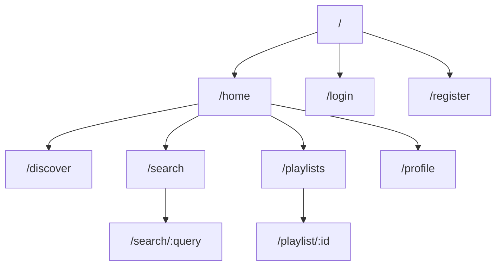

# RhythmFusion 前端路由设计

本文档详细介绍了 RhythmFusion 音乐推荐系统的前端路由设计、导航结构以及路由守卫实现。

## 路由结构概览

RhythmFusion 使用 Vue Router 管理前端路由，实现了单页应用（SPA）无刷新导航体验。整个应用的路由结构如下：



## 路由配置

路由配置位于 `src/router/index.ts` 文件中，主要路由定义如下：

```typescript
const routes: RouteRecordRaw[] = [
  {
    path: '/',
    redirect: '/home'
  },
  {
    path: '/home',
    component: () => import('../pages/HomePage.vue'),
    meta: { requiresAuth: false }
  },
  {
    path: '/login',
    component: () => import('../pages/LoginPage.vue'),
    meta: { requiresAuth: false }
  },
  {
    path: '/register',
    component: () => import('../pages/RegisterPage.vue'),
    meta: { requiresAuth: false }
  },
  {
    path: '/discover',
    component: () => import('../pages/DiscoverPage.vue'),
    meta: { requiresAuth: true }
  },
  {
    path: '/search',
    component: () => import('../pages/SearchPage.vue'),
    meta: { requiresAuth: false }
  },
  {
    path: '/search/:query',
    component: () => import('../pages/SearchResultsPage.vue'),
    meta: { requiresAuth: false },
    props: true
  },
  {
    path: '/playlists',
    component: () => import('../pages/PlaylistsPage.vue'),
    meta: { requiresAuth: true }
  },
  {
    path: '/playlist/:id',
    component: () => import('../pages/PlaylistDetailPage.vue'),
    meta: { requiresAuth: true },
    props: true
  },
  {
    path: '/profile',
    component: () => import('../pages/ProfilePage.vue'),
    meta: { requiresAuth: true }
  },
  {
    path: '/:pathMatch(.*)*',
    component: () => import('../pages/NotFoundPage.vue')
  }
];
```

## 路由元数据（Meta）

路由配置中的 `meta` 字段用于定义路由的元数据，主要包含以下信息：

- **requiresAuth**: 布尔值，表示该路由是否需要用户认证
- **title**: 字符串，表示该页面的标题
- **keepAlive**: 布尔值，表示该页面是否需要缓存

## 路由守卫

为确保访问受保护资源的安全性，系统实现了全局路由守卫：

```typescript
// 全局前置守卫
router.beforeEach((to, from, next) => {
  const userStore = useUserStore();
  
  // 检查路由是否需要认证
  if (to.meta.requiresAuth && !userStore.isLoggedIn) {
    // 未认证时重定向到登录页
    next({ 
      path: '/login', 
      query: { redirect: to.fullPath } 
    });
  } else {
    // 正常导航
    next();
  }
});

// 全局后置守卫
router.afterEach((to) => {
  // 动态设置页面标题
  if (to.meta.title) {
    document.title = `${to.meta.title} - RhythmFusion`;
  } else {
    document.title = 'RhythmFusion';
  }
  
  // 记录访问历史
  const uiStore = useUIStore();
  uiStore.addToHistory(to.fullPath);
});
```

## 路由懒加载

为提升应用性能，所有路由组件都采用了懒加载模式，仅在需要时才加载相应组件：

```typescript
{
  path: '/playlist/:id',
  component: () => import('../pages/PlaylistDetailPage.vue'),
  meta: { requiresAuth: true },
  props: true
}
```

这种模式使得初始加载更快，减少了不必要的资源消耗。

## 路由参数处理

动态路由参数通过 `:paramName` 语法定义，如 `/playlist/:id`。在组件中可以通过以下方式访问这些参数：

```typescript
// 选项式 API
export default {
  props: ['id'],
  created() {
    console.log('Playlist ID:', this.id);
  }
}

// 组合式 API
export default defineComponent({
  props: {
    id: { type: String, required: true }
  },
  setup(props) {
    const route = useRoute();
    console.log('Playlist ID:', props.id);
  
    // 路由参数变化时重新获取数据
    watch(() => props.id, (newId, oldId) => {
      if (newId !== oldId) {
        fetchPlaylistData(newId);
      }
    });
  }
});
```

## 编程式导航

除了使用 `<router-link>` 声明式导航外，还可以使用编程式导航：

```typescript
// 导航到指定路由
function goToPlaylist(playlistId) {
  router.push(`/playlist/${playlistId}`);
}

// 带查询参数的导航
function searchSongs(query) {
  router.push({
    path: '/search',
    query: { q: query }
  });
}

// 返回上一页
function goBack() {
  router.back();
}
```

## 路由过渡动画

应用使用 Vue 的 `<transition>` 组件实现路由切换动画：

```vue
<template>
  <router-view v-slot="{ Component }">
    <transition name="fade" mode="out-in">
      <keep-alive v-if="$route.meta.keepAlive">
        <component :is="Component" />
      </keep-alive>
      <component :is="Component" v-else />
    </transition>
  </router-view>
</template>

<style>
.fade-enter-active,
.fade-leave-active {
  transition: opacity 0.3s ease;
}

.fade-enter-from,
.fade-leave-to {
  opacity: 0;
}
</style>
```

## 嵌套路由

对于复杂页面，可以使用嵌套路由组织子视图：

```typescript
{
  path: '/profile',
  component: () => import('../pages/ProfilePage.vue'),
  meta: { requiresAuth: true },
  children: [
    {
      path: '',
      component: () => import('../pages/profile/ProfileOverview.vue')
    },
    {
      path: 'edit',
      component: () => import('../pages/profile/ProfileEdit.vue')
    },
    {
      path: 'settings',
      component: () => import('../pages/profile/ProfileSettings.vue')
    }
  ]
}
```

## 路由历史模式

RhythmFusion 使用 HTML5 历史模式，以实现更清晰的 URL 结构：

```typescript
const router = createRouter({
  history: createWebHistory(),
  routes
});
```

> **注意**: 使用历史模式需要服务器配置适当的回退规则，确保刷新页面时能够正确加载 SPA 入口。
