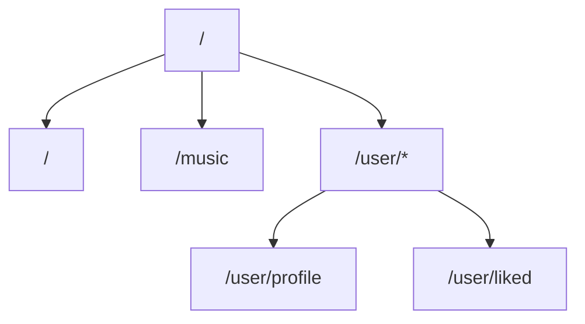

# RhythmFusion 前端路由设计

本文档详细介绍了 RhythmFusion 音乐推荐系统的前端路由设计、导航结构以及路由守卫实现。

## 路由结构概览

RhythmFusion 使用 Vue Router 4.5.0 管理前端路由，并结合 unplugin-vue-router 插件实现基于文件系统的路由自动生成，提供单页应用（SPA）无刷新导航体验。整个应用的主要路由结构如下：



## 文件系统路由

项目使用 unplugin-vue-router 插件实现基于文件系统的路由，路由配置会根据 `src/pages` 目录结构自动生成：

```
src/pages/
├── index.vue         # 对应路由：/
├── music.vue         # 对应路由：/music
└── user/
    ├── profile.vue   # 对应路由：/user/profile
    └── liked.vue     # 对应路由：/user/liked
```

## 路由配置

路由配置位于 `src/router/index.ts` 文件中，使用自动导入的路由：

```typescript
import { createRouter, createWebHistory } from 'vue-router'
import { routes, handleHotUpdate } from 'vue-router/auto-routes'

const router = createRouter({
  history: createWebHistory(import.meta.env.BASE_URL),
  routes,
})

if (import.meta.hot) {
  handleHotUpdate(router)
}

export default router
```

此配置从 `vue-router/auto-routes` 中自动导入路由配置，该文件由 unplugin-vue-router 插件在构建时生成。

## 路由元数据（Meta）

可以在页面组件中使用 `defineRouteParams` 和 `defineRouteMeta` 定义路由的元数据，主要包含以下信息：

- **requiresAuth**: 布尔值，表示该路由是否需要用户认证
- **title**: 字符串，表示该页面的标题

例如：

```vue
<script setup lang="ts">
import { defineRouteMeta } from 'vue-router/auto-routes'

defineRouteMeta({
  requiresAuth: true,
  title: '个人资料'
})
</script>
```

## 路由守卫

为确保访问受保护资源的安全性，可以实现全局路由守卫。以下是在主应用程序入口处配置守卫的示例：

```typescript
// src/main.ts
import router from './router'
import { useUserStore } from './stores/user'

// 全局前置守卫
router.beforeEach((to, from, next) => {
  const userStore = useUserStore()
  
  // 检查路由是否需要认证
  if (to.meta.requiresAuth && !userStore.isAuthenticated) {
    // 未认证时重定向到首页
    next({ 
      path: '/',
      query: { redirect: to.fullPath } 
    })
  } else {
    // 正常导航
    next()
  }
})

// 全局后置守卫
router.afterEach((to) => {
  // 动态设置页面标题
  if (to.meta.title) {
    document.title = `${to.meta.title} - RhythmFusion`
  } else {
    document.title = 'RhythmFusion'
  }
})
```

## 路由懒加载

由于使用基于文件的路由系统，所有路由组件都默认采用了懒加载模式，仅在需要时才加载相应组件，提升应用性能，减少初始加载时间。

## 路由参数处理

动态路由参数可以通过在文件名中使用方括号语法定义，如 `src/pages/playlist/[id].vue`。在组件中可以通过以下方式访问这些参数：

```typescript
// 选项式 API
export default {
  setup() {
    const route = useRoute()
    const id = computed(() => route.params.id)
    
    return { id }
  }
}

// 组合式 API
export default defineComponent({
  setup() {
    const route = useRoute()
    const id = computed(() => route.params.id as string)
    
    // 路由参数变化时重新获取数据
    watch(() => route.params.id, (newId, oldId) => {
      if (newId !== oldId) {
        fetchData(newId as string)
      }
    })
  }
})
```

## 编程式导航

除了使用 `<router-link>` 声明式导航外，还可以使用编程式导航：

```typescript
const router = useRouter()

// 导航到指定路由
function goToMusic() {
  router.push('/music')
}

// 带查询参数的导航
function searchSongs(query: string) {
  router.push({
    path: '/music',
    query: { q: query }
  })
}

// 返回上一页
function goBack() {
  router.back()
}

// 基于当前路由进行导航
function goToRelated(id: string) {
  router.push({
    name: 'playlist-id',
    params: { id }
  })
}
```

## 路由视图与命名视图

可以在一个页面中使用多个命名视图来构建复杂的布局：

```vue
<template>
  <router-view name="header"></router-view>
  <router-view></router-view>
  <router-view name="footer"></router-view>
</template>
```

对应的路由配置：

```typescript
const routes = [
  {
    path: '/music',
    components: {
      default: () => import('../pages/Music.vue'),
      header: () => import('../components/MusicHeader.vue'),
      footer: () => import('../components/PlayerControls.vue')
    }
  }
]
```

## 路由动画

使用 `<transition>` 包装 `<router-view>` 可以实现页面切换动画：

```vue
<template>
  <transition name="fade" mode="out-in">
    <router-view></router-view>
  </transition>
</template>

<style>
.fade-enter-active,
.fade-leave-active {
  transition: opacity 0.3s;
}
.fade-enter-from,
.fade-leave-to {
  opacity: 0;
}
</style>
```

## 路由权限控制

除了使用全局守卫外，还可以在各个组件层面实现更细粒度的权限控制：

```vue
<script setup lang="ts">
import { useUserStore } from '@/stores/user'
import { useRouter } from 'vue-router'
import { onMounted } from 'vue'

const userStore = useUserStore()
const router = useRouter()

onMounted(() => {
  // 检查是否有权限查看该页面
  if (!userStore.isAuthenticated) {
    router.replace('/')
  } else if (userStore.profile && !userStore.profile.canAccessFeature) {
    // 检查特定权限
    router.replace('/user/profile')
  }
})
</script>
```

## 路由错误处理

在路由守卫中可以捕获和处理导航错误：

```typescript
router.onError((error) => {
  console.error('路由错误:', error)
  // 可以重定向到错误页面或执行其他错误恢复操作
})
```
