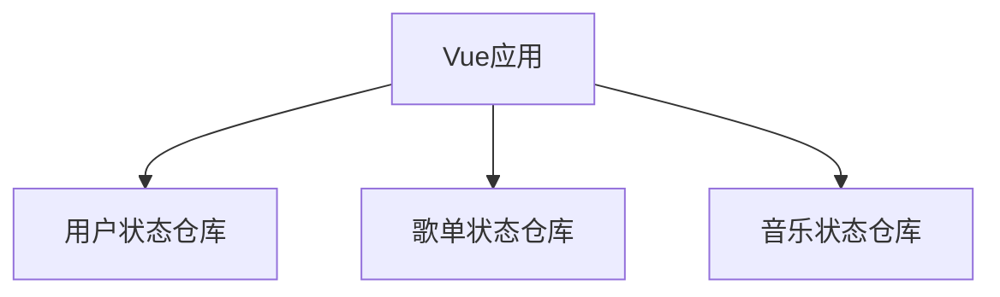

# RhythmFusion 前端状态管理

本文档详细介绍了 RhythmFusion 音乐推荐系统的前端状态管理实现，包括状态设计、Pinia 的使用以及各个状态仓库的结构和功能。

## 状态管理概述

RhythmFusion 使用 Pinia 3.0.1 作为前端状态管理解决方案，相比传统的 Vuex，Pinia 提供了更好的 TypeScript 支持、更简洁的 API 以及更好的性能表现。系统将应用状态分为多个独立的仓库（Store），每个仓库负责特定的功能域。



## 状态仓库组织

系统的状态仓库位于 `src/stores` 目录下，主要包含以下几个核心仓库：

### 1. 用户状态仓库 (useUserStore)

管理用户的登录状态、个人信息和权限控制。

```typescript
// src/stores/user.ts
import { defineStore } from 'pinia'
import { ref, computed } from 'vue'
import * as userApi from '@/api/modules/user'
import type { LoginPayload, RegisterPayload, User } from '@/api/modules/user'
import { ElMessage } from 'element-plus'

export const useUserStore = defineStore(
  'user',
  () => {
    // 初始从 localStorage 读取
    const accessToken = ref<string>(localStorage.getItem('access_token') || '')
    const refreshToken = ref<string>(localStorage.getItem('refresh_token') || '')

    // 用户资料
    const profile = ref<User | null>(null)
    const profileLoading = ref(false)

    // 登录表单数据
    const loginForm = ref<LoginPayload>({
      username: '',
      password: ''
    })
    const loginLoading = ref(false)

    // 注册表单数据
    const registerForm = ref<RegisterPayload>({
      username: '',
      email: '',
      password: ''
    })
    const registerLoading = ref(false)

    // 是否已登录
    const isAuthenticated = computed(() => !!accessToken.value)

    // 设置并持久化 tokens
    function setTokens(access: string, refresh: string) {
      // token存储逻辑
    }

    // 清除 tokens
    function clearTokens() {
      // 清除token逻辑
    }

    // 登录逻辑
    async function handleLogin() {
      // 登录实现
    }

    // 注册逻辑
    async function handleRegister() {
      // 注册实现
    }

    // 登出逻辑
    async function handleLogout() {
      // 登出实现
    }

    // 获取用户资料
    async function fetchProfile() {
      // 获取用户资料实现
    }

    // 更新用户资料
    async function updateProfile(formData: FormData) {
      // 更新用户资料实现
    }

    // 重置表单方法
    function resetLoginForm() {}
    function resetRegisterForm() {}

    return {
      accessToken,
      refreshToken,
      profile,
      profileLoading,
      loginForm,
      loginLoading,
      registerForm,
      registerLoading,
      isAuthenticated,
      handleLogin,
      handleRegister,
      handleLogout,
      fetchProfile,
      updateProfile,
      resetLoginForm,
      resetRegisterForm
    }
  }
)
```

### 2. 歌单状态仓库 (usePlaylistStore)

管理用户歌单列表、歌单详情和相关操作。

```typescript
// src/stores/playlist.ts
import { defineStore } from 'pinia'
import { ref } from 'vue'
import * as playlistApi from '@/api/modules/playlist'
import type { Playlist, Track } from '@/api/modules/playlist'
import type { Song } from '@/api/modules/music'
import { ElMessage } from 'element-plus'

export const usePlaylistStore = defineStore('playlist', () => {
  // 存储当前用户的所有歌单，key 为 playlist.id
  const playlists = ref<Record<number, Playlist>>({})

  // 存储各歌单中的曲目列表，key 为 playlist.id
  const playlistTracks = ref<Record<number, Track[]>>({})

  // "选中"功能：用于批量添加曲目，存放 song.id 列表
  const selectedSongIds = ref<number[]>([])

  // 获取所有歌单
  async function fetchPlaylists() {
    // 实现获取歌单逻辑
  }

  // 获取歌单中的曲目
  async function fetchTracks(playlistId: number) {
    // 实现获取歌曲逻辑
  }

  // 创建歌单
  async function createPlaylist(name: string) {
    // 实现创建歌单逻辑
  }

  // 添加曲目到歌单
  async function addTracks(playlistId: number) {
    // 实现添加曲目逻辑
  }

  // 添加单个歌曲到歌单
  async function addTrackToPlaylist(playlistId: number, songId: number) {
    // 实现添加单个歌曲逻辑
  }

  // 从歌单删除曲目
  async function deleteTrack(playlistId: number, songId: number) {
    // 实现删除曲目逻辑
  }

  // 获取歌单推荐
  async function recommend(playlistId: number): Promise<Song[]> {
    // 实现获取推荐逻辑
  }

  return {
    playlists,
    playlistTracks,
    selectedSongIds,
    fetchPlaylists,
    fetchTracks,
    createPlaylist,
    addTracks,
    addTrackToPlaylist,
    deleteTrack,
    recommend,
    setPlaylists,
    setPlaylistTracks,
    toggleSongSelection,
    clearSongSelection,
  }
})
```

### 3. 音乐状态仓库 (useMusicStore)

管理音乐播放、收藏和操作状态。

```typescript
// src/stores/music.ts
import { defineStore } from 'pinia'
import { ref } from 'vue'
import { likeSong, unlikeSong, getLikedSongs } from '@/api/modules/music'
import { ElMessage } from 'element-plus'
import type { Song } from '@/api/modules/music'

export const useMusicStore = defineStore('music', () => {
  // 创建歌曲时的"选中"功能，存放 song.id 列表
  const selectedSongIds = ref<number[]>([])
  // 用于歌单创建的选中歌曲缓冲区
  const playlistSongBuffer = ref<Song[]>([])
  // 用户喜欢的歌曲ID列表
  const likedSongIds = ref<number[]>([])
  // 用户喜欢的歌曲完整信息
  const likedSongs = ref<Song[]>([])
  // 操作中的歌曲ID列表（防止重复操作）
  const loadingIds = ref<number[]>([])
  // 是否正在加载喜欢的歌曲列表
  const isLoadingLikes = ref(false)

  // 喜欢/取消喜欢歌曲
  async function handleLikeSong(songId: number) {
    // 实现喜欢/取消喜欢歌曲逻辑
  }

  // 从服务器获取喜欢的歌曲列表
  async function fetchLikedSongs() {
    // 实现获取喜欢歌曲列表逻辑
  }

  // 歌曲选择与缓冲区管理
  function toggleSongSelection(songId: number) {}
  function toggleSongInBuffer(song: Song) {}
  function isSongInBuffer(songId: number): boolean {}
  function clearSongBuffer() {}
  function getSelectedSongCount(): number {}
  function getSelectedSongIds(): number[] {}
  function clearSelection() {}

  // 歌曲状态查询
  function isSongLiked(songId: number): boolean {}
  function isSongLoading(songId: number): boolean {}

  return {
    selectedSongIds,
    likedSongIds,
    likedSongs,
    loadingIds,
    isLoadingLikes,
    playlistSongBuffer,
    toggleSongSelection,
    clearSelection,
    isSongLiked,
    isSongLoading,
    handleLikeSong,
    fetchLikedSongs,
    setLikedSongs,
    toggleSongInBuffer,
    isSongInBuffer,
    clearSongBuffer,
    getSelectedSongCount,
    getSelectedSongIds
  }
})
```

## 状态仓库的使用

### 在组件中使用状态仓库

使用 Composition API 风格在组件中引用和使用状态仓库：

```vue
<script setup lang="ts">
import { useUserStore } from '@/stores/user'
import { usePlaylistStore } from '@/stores/playlist'
import { useMusicStore } from '@/stores/music'
import { onMounted } from 'vue'

// 初始化状态仓库
const userStore = useUserStore()
const playlistStore = usePlaylistStore()
const musicStore = useMusicStore()

// 在组件挂载时加载数据
onMounted(async () => {
  // 检查登录状态
  if (userStore.isAuthenticated) {
    // 加载用户资料
    await userStore.fetchProfile()
    // 加载用户歌单
    await playlistStore.fetchPlaylists()
    // 加载喜欢的歌曲
    await musicStore.fetchLikedSongs()
  }
})

// 处理登录操作
async function login() {
  const success = await userStore.handleLogin()
  if (success) {
    // 登录成功后加载用户数据
    await userStore.fetchProfile()
    await playlistStore.fetchPlaylists()
    await musicStore.fetchLikedSongs()
  }
}
</script>
```

### 状态仓库间的交互

状态仓库间的交互主要通过在组件中组合调用各个仓库的方法来实现，例如：

```typescript
// 创建歌单并添加歌曲
async function createPlaylistWithSongs() {
  const musicStore = useMusicStore()
  const playlistStore = usePlaylistStore()
  
  // 1. 创建歌单
  const playlist = await playlistStore.createPlaylist('我的新歌单')
  
  // 2. 从音乐仓库获取选中的歌曲ID
  const songIds = musicStore.getSelectedSongIds()
  
  // 3. 添加歌曲到歌单
  for (const songId of songIds) {
    await playlistStore.addTrackToPlaylist(playlist.id, songId)
  }
  
  // 4. 清空音乐仓库的选中状态
  musicStore.clearSongBuffer()
}
```

## 持久化策略

应用使用 localStorage 实现简单的状态持久化：

```typescript
// 在 userStore 中持久化 token
function setTokens(access: string, refresh: string) {
  // 存储到 localStorage
  localStorage.setItem('access_token', access)
  localStorage.setItem('refresh_token', refresh)
  
  // 更新状态
  accessToken.value = access
  refreshToken.value = refresh
}

// 在组件或应用初始化时检查并恢复状态
function initializeApp() {
  const userStore = useUserStore()
  
  // 从 localStorage 读取 token
  const accessToken = localStorage.getItem('access_token')
  const refreshToken = localStorage.getItem('refresh_token')
  
  if (accessToken && refreshToken) {
    // 恢复登录状态
    userStore.setTokens(accessToken, refreshToken)
    // 获取用户信息
    userStore.fetchProfile()
  }
}
```

## 最佳实践

1. **组合式API**: 使用 Composition API 风格定义状态仓库，提高代码可读性和类型安全。

2. **状态隔离**: 将不同领域的状态分离到不同的仓库中，避免状态混乱。

3. **计算属性**: 使用计算属性派生状态，而不是存储冗余状态。

4. **异步操作**: 在 action 中处理所有异步操作，保持状态变更的可预测性。

5. **错误处理**: 统一处理API错误，使用 ElMessage 等组件显示友好的错误提示。

6. **状态重置**: 提供明确的方法重置状态，避免状态污染。 