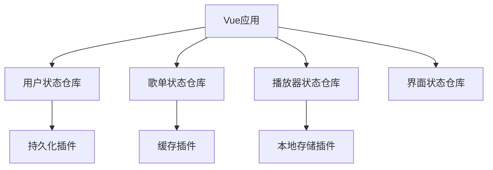
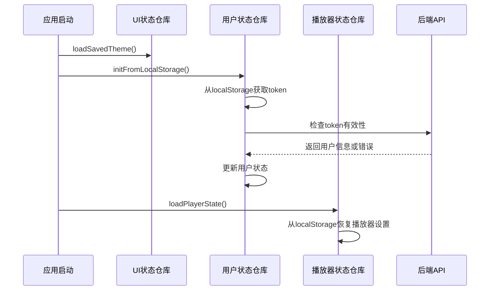

# RhythmFusion 前端状态管理

本文档详细介绍了 RhythmFusion 音乐推荐系统的前端状态管理实现，包括状态设计、Pinia 的使用以及各个状态仓库的结构和功能。

## 状态管理概述

RhythmFusion 使用 Pinia 作为前端状态管理解决方案，相比传统的 Vuex，Pinia 提供了更好的 TypeScript 支持、更简洁的 API 以及更好的性能表现。系统将应用状态分为多个独立的仓库（Store），每个仓库负责特定的功能域。



## 状态仓库组织

系统的状态仓库位于 `src/stores` 目录下，主要包含以下几个核心仓库：

### 1. 用户状态仓库 (userStore)

管理用户的登录状态、个人信息和权限控制。

```typescript
// src/stores/user.ts
import { defineStore } from 'pinia';
import { User } from '@/types/user';
import { login, logout, register, getProfile } from '@/api/auth';

export const useUserStore = defineStore('user', {
  state: () => ({
    currentUser: null as User | null,
    token: null as string | null,
    isLoading: false,
    error: null as string | null
  }),
  
  getters: {
    isLoggedIn: (state) => !!state.token,
    username: (state) => state.currentUser?.username || 'Guest',
    userAvatar: (state) => state.currentUser?.avatar || '/default-avatar.png'
  },
  
  actions: {
    async login(username: string, password: string) {
      this.isLoading = true;
      this.error = null;
      
      try {
        const response = await login(username, password);
        this.token = response.token;
        this.currentUser = response.user;
        localStorage.setItem('token', response.token);
        return true;
      } catch (err) {
        this.error = err.message || '登录失败';
        return false;
      } finally {
        this.isLoading = false;
      }
    },
    
    async logout() {
      try {
        if (this.token) {
          await logout();
        }
      } finally {
        this.token = null;
        this.currentUser = null;
        localStorage.removeItem('token');
      }
    },
    
    async fetchUserProfile() {
      if (!this.token) return;
      
      try {
        const profile = await getProfile();
        this.currentUser = profile;
      } catch (err) {
        console.error('Failed to fetch profile:', err);
        // 如果是401错误，则登出
        if (err.response?.status === 401) {
          this.logout();
        }
      }
    },
    
    initFromLocalStorage() {
      const token = localStorage.getItem('token');
      if (token) {
        this.token = token;
        this.fetchUserProfile();
      }
    }
  }
});
```

### 2. 歌单状态仓库 (playlistStore)

管理用户歌单列表、歌单详情和相关操作。

```typescript
// src/stores/playlist.ts
import { defineStore } from 'pinia';
import { Playlist, Song } from '@/types/music';
import { 
  getUserPlaylists, 
  getPlaylistDetail,
  createPlaylist,
  addSongToPlaylist,
  removeSongFromPlaylist 
} from '@/api/playlist';

export const usePlaylistStore = defineStore('playlist', {
  state: () => ({
    playlists: [] as Playlist[],
    currentPlaylist: null as Playlist | null,
    isLoading: false,
    error: null as string | null
  }),
  
  getters: {
    userPlaylists: (state) => state.playlists,
    currentPlaylistSongs: (state) => state.currentPlaylist?.songs || []
  },
  
  actions: {
    async fetchUserPlaylists() {
      this.isLoading = true;
      
      try {
        const playlists = await getUserPlaylists();
        this.playlists = playlists;
      } catch (err) {
        console.error('Failed to fetch playlists:', err);
        this.error = '获取歌单失败';
      } finally {
        this.isLoading = false;
      }
    },
    
    async fetchPlaylistDetail(id: number) {
      this.isLoading = true;
      
      try {
        const playlist = await getPlaylistDetail(id);
        this.currentPlaylist = playlist;
        
        // 更新缓存中对应的歌单
        const index = this.playlists.findIndex(p => p.id === id);
        if (index !== -1) {
          this.playlists[index] = playlist;
        }
      } catch (err) {
        console.error(`Failed to fetch playlist ${id}:`, err);
        this.error = '获取歌单详情失败';
      } finally {
        this.isLoading = false;
      }
    },
    
    async createNewPlaylist(name: string, description: string = '') {
      try {
        const newPlaylist = await createPlaylist({ name, description });
        this.playlists.push(newPlaylist);
        return newPlaylist;
      } catch (err) {
        console.error('Failed to create playlist:', err);
        this.error = '创建歌单失败';
        return null;
      }
    },
    
    async addSongToCurrentPlaylist(song: Song) {
      if (!this.currentPlaylist) return false;
      
      try {
        await addSongToPlaylist(this.currentPlaylist.id, song.id);
        
        // 更新当前歌单
        if (!this.currentPlaylist.songs.some(s => s.id === song.id)) {
          this.currentPlaylist.songs.push(song);
        }
        
        return true;
      } catch (err) {
        console.error('Failed to add song to playlist:', err);
        this.error = '添加歌曲失败';
        return false;
      }
    },
    
    async removeSongFromCurrentPlaylist(songId: number) {
      if (!this.currentPlaylist) return false;
      
      try {
        await removeSongFromPlaylist(this.currentPlaylist.id, songId);
        
        // 更新当前歌单
        this.currentPlaylist.songs = this.currentPlaylist.songs.filter(
          s => s.id !== songId
        );
        
        return true;
      } catch (err) {
        console.error('Failed to remove song from playlist:', err);
        this.error = '移除歌曲失败';
        return false;
      }
    }
  }
});
```

### 3. 播放器状态仓库 (playerStore)

管理音乐播放状态、播放列表和控制逻辑。

```typescript
// src/stores/player.ts
import { defineStore } from 'pinia';
import { Song } from '@/types/music';

export const usePlayerStore = defineStore('player', {
  state: () => ({
    currentSong: null as Song | null,
    playlist: [] as Song[],
    isPlaying: false,
    currentTime: 0,
    duration: 0,
    volume: 0.8,
    muted: false,
    repeatMode: 'none', // none, one, all
    shuffle: false
  }),
  
  getters: {
    progress: (state) => {
      if (!state.duration) return 0;
      return (state.currentTime / state.duration) * 100;
    },
    
    formattedCurrentTime: (state) => {
      return formatTime(state.currentTime);
    },
    
    formattedDuration: (state) => {
      return formatTime(state.duration);
    }
  },
  
  actions: {
    playSong(song: Song) {
      this.currentSong = song;
      this.isPlaying = true;
      
      // 将播放状态保存到本地存储
      this.savePlayerState();
    },
    
    playPlaylist(songs: Song[], startIndex: number = 0) {
      if (!songs.length) return;
      
      this.playlist = [...songs];
      this.currentSong = songs[startIndex];
      this.isPlaying = true;
      
      this.savePlayerState();
    },
    
    togglePlay() {
      this.isPlaying = !this.isPlaying;
      this.savePlayerState();
    },
    
    pause() {
      this.isPlaying = false;
    },
    
    resume() {
      if (this.currentSong) {
        this.isPlaying = true;
      }
    },
    
    nextSong() {
      if (!this.playlist.length) return;
      
      let currentIndex = this.currentSong 
        ? this.playlist.findIndex(s => s.id === this.currentSong!.id)
        : -1;
      
      if (this.shuffle) {
        // 随机播放
        let nextIndex;
        do {
          nextIndex = Math.floor(Math.random() * this.playlist.length);
        } while (nextIndex === currentIndex && this.playlist.length > 1);
        
        this.currentSong = this.playlist[nextIndex];
      } else {
        // 顺序播放
        const nextIndex = (currentIndex + 1) % this.playlist.length;
        this.currentSong = this.playlist[nextIndex];
      }
      
      this.isPlaying = true;
      this.savePlayerState();
    },
    
    prevSong() {
      if (!this.playlist.length) return;
      
      let currentIndex = this.currentSong 
        ? this.playlist.findIndex(s => s.id === this.currentSong!.id)
        : -1;
      
      if (this.shuffle) {
        // 随机播放
        let prevIndex;
        do {
          prevIndex = Math.floor(Math.random() * this.playlist.length);
        } while (prevIndex === currentIndex && this.playlist.length > 1);
        
        this.currentSong = this.playlist[prevIndex];
      } else {
        // 顺序播放，如果是第一首则循环到最后一首
        const prevIndex = currentIndex <= 0 
          ? this.playlist.length - 1
          : currentIndex - 1;
        
        this.currentSong = this.playlist[prevIndex];
      }
      
      this.isPlaying = true;
      this.savePlayerState();
    },
    
    updateCurrentTime(time: number) {
      this.currentTime = time;
    },
    
    updateDuration(duration: number) {
      this.duration = duration;
    },
    
    setVolume(volume: number) {
      this.volume = volume;
      this.savePlayerState();
    },
    
    toggleMute() {
      this.muted = !this.muted;
      this.savePlayerState();
    },
    
    toggleRepeatMode() {
      if (this.repeatMode === 'none') {
        this.repeatMode = 'all';
      } else if (this.repeatMode === 'all') {
        this.repeatMode = 'one';
      } else {
        this.repeatMode = 'none';
      }
      this.savePlayerState();
    },
    
    toggleShuffle() {
      this.shuffle = !this.shuffle;
      this.savePlayerState();
    },
    
    savePlayerState() {
      const state = {
        volume: this.volume,
        muted: this.muted,
        repeatMode: this.repeatMode,
        shuffle: this.shuffle,
        currentSongId: this.currentSong?.id
      };
      
      localStorage.setItem('playerState', JSON.stringify(state));
    },
    
    loadPlayerState() {
      const stateJson = localStorage.getItem('playerState');
      if (stateJson) {
        try {
          const state = JSON.parse(stateJson);
          this.volume = state.volume ?? 0.8;
          this.muted = state.muted ?? false;
          this.repeatMode = state.repeatMode ?? 'none';
          this.shuffle = state.shuffle ?? false;
          
          // 如果有歌曲ID，可以在加载歌曲列表后恢复当前歌曲
          // (需要在歌曲列表加载后单独处理)
        } catch (err) {
          console.error('Failed to parse player state:', err);
        }
      }
    }
  }
});

// 辅助函数
function formatTime(seconds: number): string {
  const mins = Math.floor(seconds / 60);
  const secs = Math.floor(seconds % 60);
  return `${mins}:${secs < 10 ? '0' : ''}${secs}`;
}
```

### 4. 界面状态仓库 (uiStore)

管理应用界面状态，如主题、对话框、通知等。

```typescript
// src/stores/ui.ts
import { defineStore } from 'pinia';

export const useUIStore = defineStore('ui', {
  state: () => ({
    theme: 'light',
    sidebarCollapsed: false,
    activeDialog: null as string | null,
    notification: null as {
      message: string;
      type: 'success' | 'error' | 'info' | 'warning';
    } | null,
    history: [] as string[]
  }),
  
  getters: {
    isDarkMode: (state) => state.theme === 'dark'
  },
  
  actions: {
    toggleTheme() {
      this.theme = this.theme === 'light' ? 'dark' : 'light';
      document.documentElement.setAttribute('data-theme', this.theme);
      localStorage.setItem('theme', this.theme);
    },
    
    toggleSidebar() {
      this.sidebarCollapsed = !this.sidebarCollapsed;
    },
    
    openDialog(dialogName: string) {
      this.activeDialog = dialogName;
    },
    
    closeDialog() {
      this.activeDialog = null;
    },
    
    showNotification(message: string, type: 'success' | 'error' | 'info' | 'warning' = 'info') {
      this.notification = { message, type };
      
      // 自动关闭通知
      setTimeout(() => {
        if (this.notification && this.notification.message === message) {
          this.notification = null;
        }
      }, 3000);
    },
    
    clearNotification() {
      this.notification = null;
    },
    
    addToHistory(path: string) {
      // 保存最近的10条历史记录
      this.history.unshift(path);
      if (this.history.length > 10) {
        this.history = this.history.slice(0, 10);
      }
    },
    
    loadSavedTheme() {
      const savedTheme = localStorage.getItem('theme') || 'light';
      this.theme = savedTheme;
      document.documentElement.setAttribute('data-theme', savedTheme);
    }
  }
});
```

## Pinia 插件

RhythmFusion 使用了几个 Pinia 插件来增强状态管理功能：

### 1. 持久化插件

使用 `pinia-plugin-persistedstate` 实现状态持久化：

```typescript
// src/stores/plugins/persistedState.ts
import { createPersistedState } from 'pinia-plugin-persistedstate';

export const piniaPersistedState = createPersistedState({
  key: prefix => `rhythmfusion-${prefix}`,
  storage: localStorage
});
```

配置示例：

```typescript
import { defineStore } from 'pinia';

export const useUserStore = defineStore('user', {
  state: () => ({
    // 状态...
  }),
  
  // 持久化配置
  persist: {
    paths: ['token', 'currentUser'],
    storage: localStorage
  }
});
```

### 2. 调试插件

开发环境中使用调试插件监控状态变化：

```typescript
// src/stores/plugins/debug.ts
import { PiniaPluginContext } from 'pinia';

export function piniaDebugPlugin({ store, options }: PiniaPluginContext) {
  if (process.env.NODE_ENV === 'development') {
    store.$subscribe((mutation, state) => {
      console.log(`[${options.id}] ${mutation.type}`, mutation.payload);
    });
  }
}
```

## 状态初始化流程

应用启动时，状态初始化的主要流程如下：



## 状态访问模式

在组件中访问状态仓库的常见模式：

### 选项式 API

```js
import { useUserStore } from '@/stores/user';

export default {
  computed: {
    username() {
      const userStore = useUserStore();
      return userStore.username;
    }
  },
  
  methods: {
    async handleLogin() {
      const userStore = useUserStore();
      const success = await userStore.login(this.username, this.password);
      
      if (success) {
        this.$router.push('/home');
      }
    }
  }
}
```

### 组合式 API

```js
import { defineComponent } from 'vue';
import { useUserStore } from '@/stores/user';
import { usePlaylistStore } from '@/stores/playlist';
import { storeToRefs } from 'pinia';

export default defineComponent({
  setup() {
    const userStore = useUserStore();
    const playlistStore = usePlaylistStore();
    
    // 使用 storeToRefs 保持响应性
    const { currentUser, isLoggedIn } = storeToRefs(userStore);
    const { playlists, currentPlaylist } = storeToRefs(playlistStore);
    
    // 方法可以直接引用
    const { login, logout } = userStore;
    const { fetchUserPlaylists, createNewPlaylist } = playlistStore;
    
    // 组件挂载时加载歌单
    onMounted(() => {
      if (isLoggedIn.value) {
        fetchUserPlaylists();
      }
    });
    
    return {
      // 响应式状态
      currentUser,
      isLoggedIn,
      playlists,
      currentPlaylist,
      
      // 方法
      login,
      logout,
      fetchUserPlaylists,
      createNewPlaylist
    };
  }
});
```

## 状态管理最佳实践

在 RhythmFusion 项目中使用 Pinia 状态管理时，请遵循以下最佳实践：

1. **状态隔离**: 将状态按功能域划分到不同仓库中，避免单个仓库过于庞大
2. **计算属性**: 使用 getters 派生计算值，而非在组件中重复计算
3. **异步处理**: 在 actions 中处理所有异步操作，包括 API 调用
4. **错误处理**: 妥善处理异步操作的错误，提供友好的用户反馈
5. **持久化策略**: 只持久化必要的状态，避免敏感信息泄露
6. **状态重置**: 提供清晰的状态重置机制，特别是用户登出时
7. **类型安全**: 充分利用 TypeScript 类型系统，增强代码健壮性 