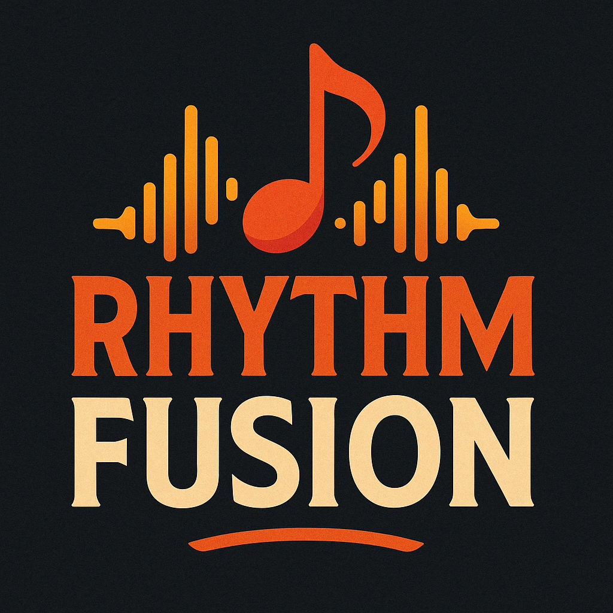
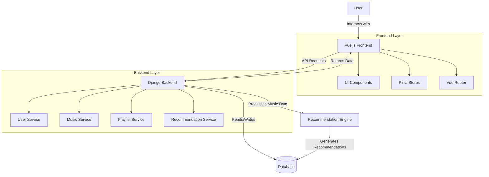

# RhythmFusion Documentation

    
    <h3>Intelligent Music Discovery & Recommendation Platform</h3>
    
Built with Vue 3 + TypeScript + Django + AI Recommendation Engine

## Documentation Overview

Welcome to the RhythmFusion Music Recommendation System documentation! This comprehensive resource is designed to help developers, administrators, and users understand, use, and extend the RhythmFusion platform. Whether you want to deploy the system, develop new features, or simply use the platform as an end user, this documentation provides all the necessary information.

RhythmFusion is a modern music recommendation system built with Django and Vue.js, offering personalized recommendations, playlist management, and music playback features. The system employs a hybrid recommendation algorithm combining collaborative filtering and content-based analysis to provide high-quality music recommendations.

[中文文档](index_zh.md)

## Documentation Structure

### Core Documentation

| Document | Description |
|----------|-------------|
| [System Architecture](architecture.md) | Detailed overview of RhythmFusion's architecture, component relationships, and data flow |
| [API Reference](api_doc.md) | Complete API reference including all endpoints, parameters, and response examples |
| [Development Guide](development.md) | Development environment setup, code standards, contribution guidelines, and workflows |
| [User Guide](user_guide.md) | Detailed instructions for system features and user interface |
| [Deployment Guide](deployment.md) | System deployment steps, environment configuration, and best practices |
| [Data Preparation](data_preparation.md) | Music data import, processing, and preparation workflows |

### Frontend Documentation

| Document | Description |
|----------|-------------|
| [Frontend Overview](frontend/index.md) | Frontend architecture, directory structure, and main technologies |
| [Component Guide](frontend/components.md) | Detailed component documentation and usage examples |
| [State Management](frontend/state.md) | Pinia store design and usage patterns |
| [Routing](frontend/routing.md) | Route structure and navigation implementation |

### Backend Documentation

| Document | Description |
|----------|-------------|
| [Backend Overview](backend/index.md) | Backend architecture, directory structure, and main technologies |
| [Data Models](backend/models.md) | Detailed database model design and relationships |
| [Recommendation System](backend/recommendation.md) | Recommendation system implementation details and algorithms |

## System Architecture Diagram

The following diagram illustrates the high-level architecture of the RhythmFusion system:

## Technology Stack

RhythmFusion uses a modern technology stack to ensure high performance, scalability, and development efficiency:

### Frontend
- Vue 3.5.13 (Composition API)
- TypeScript
- Vite 6.2.1
- Pinia State Management
- Axios HTTP Client
- SCSS Styling
- Element Plus UI Component Library

### Backend
- Django 5.0.2
- Django REST Framework
- JWT Authentication
- SQLite/MySQL Database
- Custom Recommendation Algorithms

### Recommendation System
- Collaborative Filtering (SVD)
- Content Feature Extraction
- Hybrid Recommendation Strategy
- FAISS Vector Search

## Quick Start

To quickly get started with RhythmFusion:

1. Check the [System Architecture](architecture.md) for a system overview
2. Refer to the [Development Guide](development.md) to set up your development environment
3. Or refer to the [Deployment Guide](deployment.md) for system deployment
4. Use the [User Guide](user_guide.md) to understand system functionality

## Contribution Guidelines

We welcome community contributions to the RhythmFusion project. If you'd like to contribute:

1. First, read the [Development Guide](development.md)
2. Check the Issues list on GitHub for tasks to work on
3. Follow the development workflow to submit a Pull Request
4. Ensure your code follows the project's coding standards and test requirements

## Contact

If you have any questions, suggestions, or feedback, please contact us through:

- GitHub Issues: [https://github.com/SOV710/RhythmFusion/issues](https://github.com/SOV710/RhythmFusion/issues)
- Project Maintainer: [example@email.com](mailto:example@email.com)

---

&copy; 2023-2024 RhythmFusion Team | [GNU GPL v3.0](../LICENSE) 