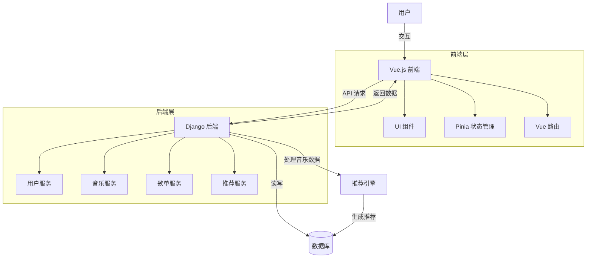

# RhythmFusion 音乐推荐系统文档

    
    <h3>智能音乐发现与推荐平台</h3>
    
基于 Vue 3 + TypeScript + Django + AI 推荐引擎构建

## 文档概述

欢迎使用 RhythmFusion 音乐推荐系统文档！本文档是一个全面的开发和用户指南，旨在帮助开发者、管理员和用户了解、使用和扩展 RhythmFusion 系统。无论您是想要部署系统、开发新功能，还是仅仅作为最终用户使用该平台，这些文档都将为您提供所需的信息。

RhythmFusion 是一个基于 Django 和 Vue.js 构建的现代化音乐推荐系统，提供个性化推荐、歌单管理及音乐播放功能，为用户创造流畅、智能的音乐体验。本系统采用混合推荐算法，结合协同过滤和内容特征分析，提供高质量的音乐推荐。

[English Documentation](index.md)

## 文档结构

### 核心文档

| 文档                         | 描述                                                   |
| ---------------------------- | ------------------------------------------------------ |
| [系统架构](architecture.md)     | 详细介绍 RhythmFusion 的整体架构设计、组件关系和数据流 |
| [API 参考](api_doc.md)          | 完整的 API 参考，包括所有端点、参数说明和响应示例      |
| [开发指南](development.md)      | 开发环境配置、代码规范、贡献指南和工作流程             |
| [用户指南](user_guide.md)       | 系统功能和用户界面的详细使用说明                       |
| [部署指南](deployment.md)       | 系统部署步骤、环境配置和最佳实践                       |
| [数据准备](data_preparation.md) | 音乐数据导入、处理和准备流程说明                       |

### 前端文档

| 文档                            | 描述                             |
| ------------------------------- | -------------------------------- |
| [前端概述](frontend/index.md)      | 前端架构、目录结构和主要技术介绍 |
| [组件指南](frontend/components.md) | 详细的组件说明和使用示例         |
| [状态管理](frontend/state.md)      | Pinia store 的设计和使用方法     |
| [路由设计](frontend/routing.md)    | 路由结构和导航实现方案           |

### 后端文档

| 文档                               | 描述                             |
| ---------------------------------- | -------------------------------- |
| [后端概述](backend/index.md)          | 后端架构、目录结构和主要技术介绍 |
| [数据模型](backend/models.md)         | 详细的数据库模型设计和关系说明   |
| [推荐系统](backend/recommendation.md) | 推荐系统实现细节和算法说明       |

## 系统架构图

以下是 RhythmFusion 系统的高级架构图：

## 技术栈

RhythmFusion 使用现代化的技术栈，确保系统的高性能、可扩展性和开发效率：

### 前端

- Vue 3.5.13 (Composition API)
- TypeScript
- Vite 6.2.1
- Pinia 状态管理
- Axios HTTP 客户端
- SCSS 样式处理
- Element Plus UI 组件库

### 后端

- Django 5.0.2
- Django REST Framework
- JWT 认证
- SQLite/MySQL 数据库
- 自定义推荐算法

### 推荐系统

- 协同过滤 (SVD)
- 内容特征提取
- 混合推荐策略
- FAISS 向量搜索

## 快速入门

如需快速开始使用 RhythmFusion：

1. 查看[系统架构](architecture.md)获取系统概览
2. 参考[开发指南](development.md)设置开发环境
3. 或者参考[部署指南](deployment.md)进行系统部署
4. 使用[用户指南](user_guide.md)了解系统功能

## 贡献指南

我们欢迎社区对 RhythmFusion 项目做出贡献。如果您想参与开发：

1. 请首先阅读[开发指南](development.md)
2. 查看 GitHub 上的 Issues 列表，寻找可以参与的任务
3. 按照开发流程提交 Pull Request
4. 确保您的代码遵循项目的编码规范和测试要求

## 联系我们

如果您有任何问题、建议或反馈，请通过以下方式联系我们：

- GitHub Issues: [https://github.com/SOV710/RhythmFusion/issues](https://github.com/SOV710/RhythmFusion/issues)
- 项目维护者: [example@email.com](mailto:example@email.com)

---

&copy; 2023-2024 RhythmFusion 团队 | [GNU GPL v3.0](../LICENSE)
