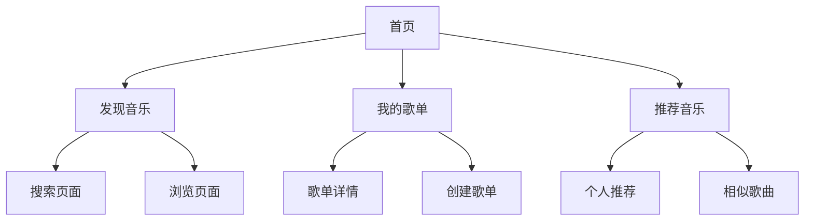

# RhythmFusion 使用教程

本文档提供了 RhythmFusion 音乐推荐系统的详细使用说明，包括账户管理、音乐播放、歌单创建和管理以及个性化推荐功能的使用方法。

## 系统概述

RhythmFusion 是一个现代化的音乐推荐系统，通过混合推荐算法为用户提供个性化的音乐体验。系统特点包括：

- 用户账户管理
- 音乐播放与控制
- 歌单创建与管理
- 个性化音乐推荐
- 音乐搜索与发现

## 开始使用

### 访问系统

RhythmFusion 系统提供 Web 界面，您可以通过以下方式访问：

- 开发环境：访问 `http://localhost:5173`
- 生产环境：访问您部署系统的域名

### 创建账户

1. 点击页面右上角的"注册"按钮
2. 填写以下信息:
   - 用户名
   - 电子邮件
   - 密码
3. 阅读并同意用户协议
4. 点击"创建账户"按钮
5. 系统将自动登录并跳转到首页

### 登录账户

1. 点击页面右上角的"登录"按钮
2. 输入您的用户名和密码
3. 点击"登录"按钮
4. 登录成功后将跳转到首页

## 界面导航

RhythmFusion 的界面主要分为以下几个部分：

### 顶部导航栏

顶部导航栏包含以下元素：

- **Logo**: 点击返回首页
- **搜索框**: 输入关键词搜索音乐
- **发现**: 浏览和发现新音乐
- **我的音乐**: 访问个人歌单和收藏
- **用户菜单**: 访问个人设置、登出等功能

### 侧边栏

侧边栏包含以下元素：

- **个人资料**: 显示用户头像和用户名
- **创建歌单**: 快速创建新歌单
- **我的歌单**: 列出所有个人歌单
- **收藏歌单**: 列出收藏的歌单

### 播放器控制栏

播放器控制栏位于页面底部，包含以下功能：

- **播放/暂停**: 控制当前歌曲播放状态
- **上一首/下一首**: 切换歌曲
- **进度条**: 显示播放进度，可拖动跳转
- **音量控制**: 调节音量大小
- **播放模式**: 切换单曲循环、列表循环和随机播放
- **歌单**: 查看当前播放列表

## 音乐播放

### 播放单曲

1. 在任意歌曲列表中找到想要播放的歌曲
2. 点击歌曲行右侧的"播放"按钮
3. 系统将立即播放该歌曲

### 播放整个歌单

1. 导航到歌单详情页面
2. 点击页面顶部的"播放全部"按钮
3. 系统将从歌单第一首歌曲开始播放

### 控制播放

播放器控制栏提供以下控制功能：

- **播放/暂停**: 点击播放按钮控制播放状态
- **上一首/下一首**: 切换到上一首/下一首歌曲
- **进度条**: 拖动进度条跳转到歌曲的特定位置
- **音量**: 点击音量图标可快速静音，拖动滑块调节音量
- **播放模式**: 点击模式图标循环切换播放模式
  - 🔁 列表循环：播放完列表后从头开始
  - 🔂 单曲循环：重复播放当前歌曲
  - 🔀 随机播放：随机顺序播放列表中的歌曲

## 歌单管理

### 创建歌单

1. 点击侧边栏的"创建歌单"按钮
2. 在弹出的对话框中输入歌单名称
3. 可选：添加歌单描述
4. 点击"创建"按钮

### 向歌单添加歌曲

方法一：从歌曲列表添加
1. 在任意歌曲列表中找到想要添加的歌曲
2. 点击歌曲右侧的"更多"按钮
3. 选择"添加到歌单"
4. 在弹出的对话框中选择目标歌单
5. 点击"添加"按钮

方法二：从歌单详情页添加
1. 导航到目标歌单详情页
2. 点击"添加歌曲"按钮
3. 在弹出的对话框中搜索或浏览歌曲
4. 选择要添加的歌曲
5. 点击"添加到歌单"按钮

### 编辑歌单

1. 导航到歌单详情页
2. 点击页面顶部的"编辑"按钮
3. 在弹出的对话框中修改歌单名称或描述
4. 点击"保存"按钮

### 删除歌单

1. 导航到歌单详情页
2. 点击页面顶部的"更多"按钮
3. 选择"删除歌单"
4. 在确认对话框中点击"确认删除"

### 从歌单移除歌曲

1. 导航到歌单详情页
2. 找到要移除的歌曲
3. 点击歌曲右侧的"移除"按钮
4. 确认移除操作

## 音乐推荐

RhythmFusion 提供多种个性化推荐方式：

### 个人推荐

系统根据您的听歌习惯自动生成个人推荐：

1. 在首页可以看到"个人推荐"区域
2. 系统会展示根据您的历史行为推荐的歌曲
3. 点击"更多"查看全部推荐

### 基于歌单的推荐

系统可以基于特定歌单生成推荐：

1. 导航到歌单详情页
2. 点击页面底部的"发现相似歌曲"按钮
3. 系统将分析歌单内容并推荐相似风格的歌曲

### 基于歌曲的推荐

系统可以基于特定歌曲生成推荐：

1. 在任意歌曲上点击"更多"按钮
2. 选择"发现相似歌曲"
3. 系统将展示与该歌曲风格相似的其他歌曲

## 音乐搜索与发现

### 搜索音乐

1. 点击顶部导航栏的搜索框
2. 输入关键词（歌名、艺术家、风格等）
3. 按回车键或点击搜索图标
4. 查看搜索结果

搜索支持以下过滤方式：
- 歌名：`title:关键词`
- 艺术家：`artist:关键词`
- 风格：`school:关键词`

### 浏览分类

1. 点击顶部导航栏的"发现"按钮
2. 在发现页面选择感兴趣的音乐分类
3. 浏览该分类下的歌曲

## 个人资料管理

### 查看个人资料

1. 点击右上角的用户头像
2. 选择"个人资料"

### 编辑个人资料

1. 导航到个人资料页面
2. 点击"编辑资料"按钮
3. 修改个人信息（如头像、个人简介等）
4. 点击"保存"按钮

### 修改密码

1. 导航到个人资料页面
2. 点击"安全设置"选项
3. 输入当前密码和新密码
4. 点击"更新密码"按钮

## 常见问题

### 无法登录

- 检查用户名和密码是否正确
- 确保网络连接正常
- 清除浏览器缓存后重试

### 音乐无法播放

- 检查网络连接
- 检查浏览器是否允许播放声音
- 刷新页面后重试

### 推荐不准确

推荐系统需要足够的用户行为数据才能提供精准推荐。继续使用系统，添加更多歌曲到您的歌单，系统推荐将逐渐变得更加准确。

## 快捷键

RhythmFusion 支持以下键盘快捷键：

| 快捷键     | 功能           |
|-----------|---------------|
| 空格      | 播放/暂停      |
| 左箭头    | 后退 5 秒      |
| 右箭头    | 前进 5 秒      |
| Ctrl+左箭头 | 上一首        |
| Ctrl+右箭头 | 下一首        |
| M         | 静音/取消静音   |
| +         | 增加音量       |
| -         | 减小音量       |
| F         | 全屏/退出全屏   |

## 联系与支持

如果您在使用 RhythmFusion 过程中遇到任何问题或有任何建议，请通过以下方式联系我们：

- 电子邮件：support@rhythmfusion.com
- GitHub Issues：[https://github.com/SOV710/RhythmFusion/issues](https://github.com/SOV710/RhythmFusion/issues) 